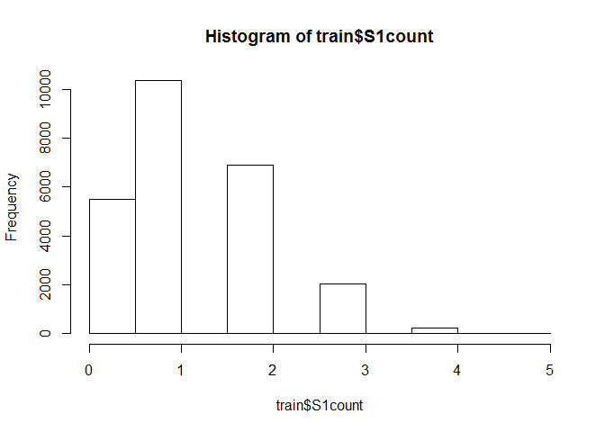
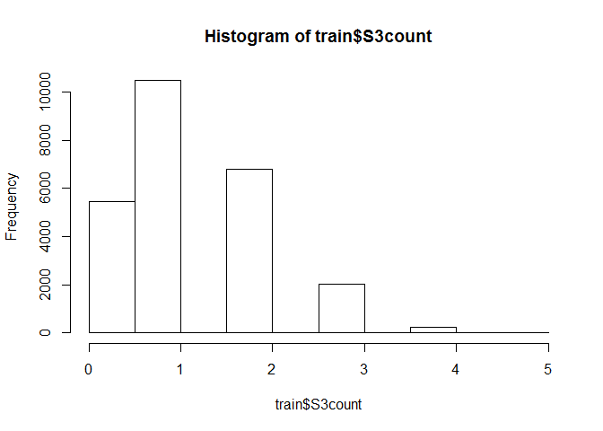
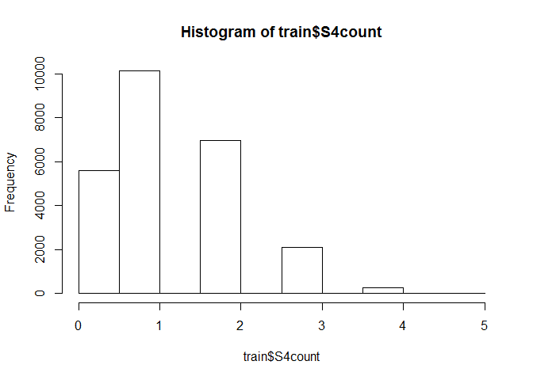
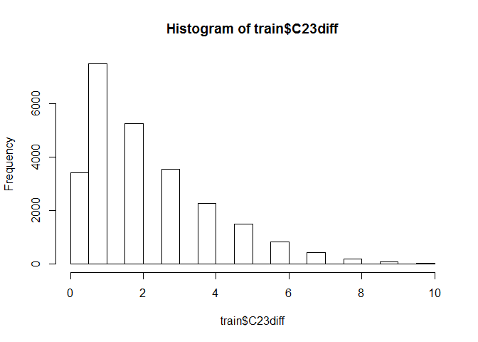
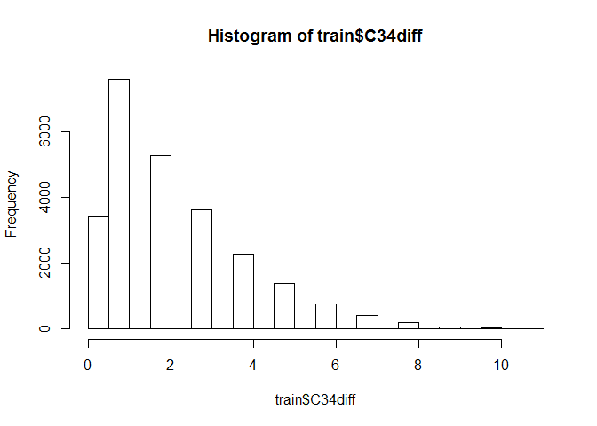
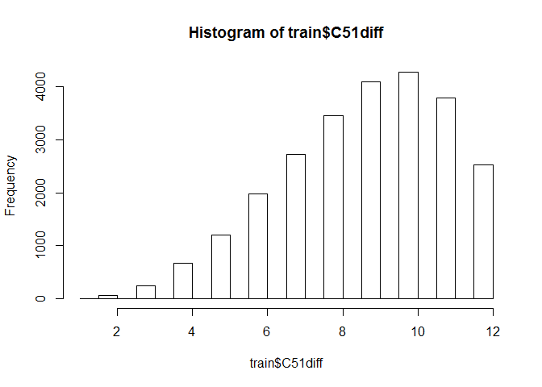

# Kaggle_0516_PokerRuleInduction
Sangyeol_lee  
Friday, May 15, 2015  
###**Poker Rule Induction** 
   + https://github.com/weedjy/kaggle-poker-rule 코드 참고
   + 아까는 python이었다면 이번에는 R로 학습. 하트,스테이드,다이아,클루버를 카운트함. S1count, S2count, S3count, S4count
   + 다음으로 각 카드의 Rank를 뺌. C12diff(절대값(C1-C2)), C23diff(절대값(C2-C3))... C51diff(절대값(C5-C1))


```r
#train 데이터 전처리
setwd("C:/Users/syleeie/Dropbox/kaggle/syleeie_poker")
train <- read.csv("train.csv", header=T)
head(train)
```

```
##   S1 C1 S2 C2 S3 C3 S4 C4 S5 C5 hand
## 1  4  9  2  1  2  2  4  7  2  8    0
## 2  1  4  3  6  1 12  3 11  2  7    0
## 3  1 11  4  1  3  7  4 11  2  1    2
## 4  2  9  2  4  3  6  1  9  4  9    3
## 5  1  8  2  4  2 11  2  2  2  1    0
## 6  2  5  1  5  2 13  2  3  3 13    2
```

```r
dim(train)
```

```
## [1] 25010    11
```

```r
str(train)
```

```
## 'data.frame':	25010 obs. of  11 variables:
##  $ S1  : int  4 1 1 2 1 2 3 4 3 2 ...
##  $ C1  : int  9 4 11 9 8 5 10 10 2 7 ...
##  $ S2  : int  2 3 4 2 2 1 4 3 4 3 ...
##  $ C2  : int  1 6 1 4 4 5 6 1 10 8 ...
##  $ S3  : int  2 1 3 3 2 2 1 2 3 4 ...
##  $ C3  : int  2 12 7 6 11 13 4 13 3 8 ...
##  $ S4  : int  4 3 4 1 2 2 2 4 4 2 ...
##  $ C4  : int  7 11 11 9 2 3 13 2 4 13 ...
##  $ S5  : int  2 2 2 4 2 3 4 4 1 2 ...
##  $ C5  : int  8 7 1 9 1 13 5 7 9 12 ...
##  $ hand: int  0 0 2 3 0 2 0 0 0 1 ...
```

```r
train$S1count <- 0
train$S2count <- 0
train$S3count <- 0
train$S4count <- 0
train$C12diff <- 0
train$C23diff <- 0
train$C34diff <- 0
train$C45diff <- 0
train$C51diff <- 0

train[train$S1==1,12] <- train[train$S1==1,12] + 1
train[train$S2==1,12] <- train[train$S2==1,12] + 1
train[train$S3==1,12] <- train[train$S3==1,12] + 1
train[train$S4==1,12] <- train[train$S4==1,12] + 1
train[train$S5==1,12] <- train[train$S5==1,12] + 1

train[train$S1==2,13] <- train[train$S1==2,13] + 1
train[train$S2==2,13] <- train[train$S2==2,13] + 1
train[train$S3==2,13] <- train[train$S3==2,13] + 1
train[train$S4==2,13] <- train[train$S4==2,13] + 1
train[train$S5==2,13] <- train[train$S5==2,13] + 1

train[train$S1==3,14] <- train[train$S1==3,14] + 1
train[train$S2==3,14] <- train[train$S2==3,14] + 1
train[train$S3==3,14] <- train[train$S3==3,14] + 1
train[train$S4==3,14] <- train[train$S4==3,14] + 1
train[train$S5==3,14] <- train[train$S5==3,14] + 1

train[train$S1==4,15] <- train[train$S1==4,15] + 1
train[train$S2==4,15] <- train[train$S2==4,15] + 1
train[train$S3==4,15] <- train[train$S3==4,15] + 1
train[train$S4==4,15] <- train[train$S4==4,15] + 1
train[train$S5==4,15] <- train[train$S5==4,15] + 1

summary(train)
```

```
##        S1              C1               S2              C2        
##  Min.   :1.000   Min.   : 1.000   Min.   :1.000   Min.   : 1.000  
##  1st Qu.:2.000   1st Qu.: 4.000   1st Qu.:1.000   1st Qu.: 4.000  
##  Median :3.000   Median : 7.000   Median :2.000   Median : 7.000  
##  Mean   :2.509   Mean   : 6.995   Mean   :2.498   Mean   : 7.014  
##  3rd Qu.:4.000   3rd Qu.:10.000   3rd Qu.:4.000   3rd Qu.:10.000  
##  Max.   :4.000   Max.   :13.000   Max.   :4.000   Max.   :13.000  
##        S3             C3               S4              C4        
##  Min.   :1.00   Min.   : 1.000   Min.   :1.000   Min.   : 1.000  
##  1st Qu.:2.00   1st Qu.: 4.000   1st Qu.:1.000   1st Qu.: 4.000  
##  Median :3.00   Median : 7.000   Median :2.000   Median : 7.000  
##  Mean   :2.51   Mean   : 7.014   Mean   :2.496   Mean   : 6.942  
##  3rd Qu.:4.00   3rd Qu.:10.000   3rd Qu.:3.000   3rd Qu.:10.000  
##  Max.   :4.00   Max.   :13.000   Max.   :4.000   Max.   :13.000  
##        S5              C5              hand           S1count    
##  Min.   :1.000   Min.   : 1.000   Min.   :0.0000   Min.   :0.00  
##  1st Qu.:1.000   1st Qu.: 4.000   1st Qu.:0.0000   1st Qu.:1.00  
##  Median :3.000   Median : 7.000   Median :1.0000   Median :1.00  
##  Mean   :2.497   Mean   : 6.963   Mean   :0.6212   Mean   :1.25  
##  3rd Qu.:3.000   3rd Qu.:10.000   3rd Qu.:1.0000   3rd Qu.:2.00  
##  Max.   :4.000   Max.   :13.000   Max.   :9.0000   Max.   :5.00  
##     S2count         S3count         S4count         C12diff     C23diff 
##  Min.   :0.000   Min.   :0.000   Min.   :0.000   Min.   :0   Min.   :0  
##  1st Qu.:1.000   1st Qu.:1.000   1st Qu.:1.000   1st Qu.:0   1st Qu.:0  
##  Median :1.000   Median :1.000   Median :1.000   Median :0   Median :0  
##  Mean   :1.246   Mean   :1.247   Mean   :1.257   Mean   :0   Mean   :0  
##  3rd Qu.:2.000   3rd Qu.:2.000   3rd Qu.:2.000   3rd Qu.:0   3rd Qu.:0  
##  Max.   :5.000   Max.   :5.000   Max.   :5.000   Max.   :0   Max.   :0  
##     C34diff     C45diff     C51diff 
##  Min.   :0   Min.   :0   Min.   :0  
##  1st Qu.:0   1st Qu.:0   1st Qu.:0  
##  Median :0   Median :0   Median :0  
##  Mean   :0   Mean   :0   Mean   :0  
##  3rd Qu.:0   3rd Qu.:0   3rd Qu.:0  
##  Max.   :0   Max.   :0   Max.   :0
```

```r
hist(train$S1count)
```

 

```r
hist(train$S2count)
```

 

```r
hist(train$S3count)
```

 

```r
hist(train$S4count)
```

 

```r
train2 <- train[,c("C1", "C2", "C3", "C4", "C5")]
train3 <- t(apply(train2,1,sort))
train$C12diff <- abs(train3[,1] - train3[,2])
train$C23diff <- abs(train3[,2] - train3[,3])
train$C34diff <- abs(train3[,3] - train3[,4])
train$C45diff <- abs(train3[,4] - train3[,5])
train$C51diff <- abs(train3[,5] - train3[,1])

hist(train$C12diff)
```

 

```r
hist(train$C23diff)
```

 

```r
hist(train$C34diff)
```

 

```r
hist(train$C45diff)
```

 

```r
hist(train$C51diff)
```

 

```r
train$hand <- as.factor(train$hand)
train$S1 <- NULL
train$S2 <- NULL
train$S3 <- NULL
train$S4 <- NULL
train$S5 <- NULL
train$C1 <- NULL
train$C2 <- NULL
train$C3 <- NULL
train$C4 <- NULL
train$C5 <- NULL
head(train)
```

```
##   hand S1count S2count S3count S4count C12diff C23diff C34diff C45diff
## 1    0       0       3       0       2       1       5       1       1
## 2    0       2       1       2       0       2       1       4       1
## 3    2       1       1       1       2       0       6       4       0
## 4    3       1       2       1       1       2       3       0       0
## 5    0       1       4       0       0       1       2       4       3
## 6    2       1       3       1       0       2       0       8       0
##   C51diff
## 1       8
## 2       8
## 3      10
## 4       5
## 5      10
## 6      10
```

```r
summary(train)
```

```
##       hand          S1count        S2count         S3count     
##  0      :12493   Min.   :0.00   Min.   :0.000   Min.   :0.000  
##  1      :10599   1st Qu.:1.00   1st Qu.:1.000   1st Qu.:1.000  
##  2      : 1206   Median :1.00   Median :1.000   Median :1.000  
##  3      :  513   Mean   :1.25   Mean   :1.246   Mean   :1.247  
##  4      :   93   3rd Qu.:2.00   3rd Qu.:2.000   3rd Qu.:2.000  
##  5      :   54   Max.   :5.00   Max.   :5.000   Max.   :5.000  
##  (Other):   52                                                 
##     S4count         C12diff          C23diff          C34diff      
##  Min.   :0.000   Min.   : 0.000   Min.   : 0.000   Min.   : 0.000  
##  1st Qu.:1.000   1st Qu.: 1.000   1st Qu.: 1.000   1st Qu.: 1.000  
##  Median :1.000   Median : 2.000   Median : 2.000   Median : 2.000  
##  Mean   :1.257   Mean   : 2.167   Mean   : 2.228   Mean   : 2.198  
##  3rd Qu.:2.000   3rd Qu.: 3.000   3rd Qu.: 3.000   3rd Qu.: 3.000  
##  Max.   :5.000   Max.   :11.000   Max.   :10.000   Max.   :11.000  
##                                                                    
##     C45diff          C51diff      
##  Min.   : 0.000   Min.   : 1.000  
##  1st Qu.: 1.000   1st Qu.: 7.000  
##  Median : 2.000   Median : 9.000  
##  Mean   : 2.181   Mean   : 8.774  
##  3rd Qu.: 3.000   3rd Qu.:11.000  
##  Max.   :11.000   Max.   :12.000  
## 
```

```r
#test 데이터 전처리
test <- read.csv("test.csv", header=T)
test$S1count <- 0
test$S2count <- 0
test$S3count <- 0
test$S4count <- 0
test$C12diff <- 0
test$C23diff <- 0
test$C34diff <- 0
test$C45diff <- 0
test$C51diff <- 0

test[test$S1==1,12] <- test[test$S1==1,12] + 1
test[test$S2==1,12] <- test[test$S2==1,12] + 1
test[test$S3==1,12] <- test[test$S3==1,12] + 1
test[test$S4==1,12] <- test[test$S4==1,12] + 1
test[test$S5==1,12] <- test[test$S5==1,12] + 1

test[test$S1==2,13] <- test[test$S1==2,13] + 1
test[test$S2==2,13] <- test[test$S2==2,13] + 1
test[test$S3==2,13] <- test[test$S3==2,13] + 1
test[test$S4==2,13] <- test[test$S4==2,13] + 1
test[test$S5==2,13] <- test[test$S5==2,13] + 1

test[test$S1==3,14] <- test[test$S1==3,14] + 1
test[test$S2==3,14] <- test[test$S2==3,14] + 1
test[test$S3==3,14] <- test[test$S3==3,14] + 1
test[test$S4==3,14] <- test[test$S4==3,14] + 1
test[test$S5==3,14] <- test[test$S5==3,14] + 1

test[test$S1==4,15] <- test[test$S1==4,15] + 1
test[test$S2==4,15] <- test[test$S2==4,15] + 1
test[test$S3==4,15] <- test[test$S3==4,15] + 1
test[test$S4==4,15] <- test[test$S4==4,15] + 1
test[test$S5==4,15] <- test[test$S5==4,15] + 1

test2 <- test[,c("C1", "C2", "C3", "C4", "C5")]
test3 <- t(apply(test2,1,sort))
test$C12diff <- abs(test3[,1] - test3[,2])
test$C23diff <- abs(test3[,2] - test3[,3])
test$C34diff <- abs(test3[,3] - test3[,4])
test$C45diff <- abs(test3[,4] - test3[,5])
test$C51diff <- abs(test3[,5] - test3[,1])
test$S1 <- NULL
test$S2 <- NULL
test$S3 <- NULL
test$S4 <- NULL
test$S5 <- NULL
test$C1 <- NULL
test$C2 <- NULL
test$C3 <- NULL
test$C4 <- NULL
test$C5 <- NULL
head(test)
```

```
##   id S1count S2count S3count S4count C12diff C23diff C34diff C45diff
## 1  1       2       1       2       0       1       1       5       2
## 2  2       1       1       2       1       1       1       1       6
## 3  3       2       3       0       0       2       1       4       3
## 4  4       2       0       2       1       3       1       1       3
## 5  5       1       3       1       0       2       0       4       2
## 6  6       2       2       1       0       2       1       3       1
##   C51diff
## 1       9
## 2       9
## 3      10
## 4       8
## 5       8
## 6       7
```

```r
summary(test)
```

```
##        id             S1count         S2count         S3count     
##  Min.   :      1   Min.   :0.000   Min.   :0.000   Min.   :0.000  
##  1st Qu.: 250001   1st Qu.:1.000   1st Qu.:1.000   1st Qu.:1.000  
##  Median : 500001   Median :1.000   Median :1.000   Median :1.000  
##  Mean   : 500001   Mean   :1.251   Mean   :1.248   Mean   :1.252  
##  3rd Qu.: 750000   3rd Qu.:2.000   3rd Qu.:2.000   3rd Qu.:2.000  
##  Max.   :1000000   Max.   :5.000   Max.   :5.000   Max.   :5.000  
##     S4count        C12diff          C23diff          C34diff      
##  Min.   :0.00   Min.   : 0.000   Min.   : 0.000   Min.   : 0.000  
##  1st Qu.:1.00   1st Qu.: 1.000   1st Qu.: 1.000   1st Qu.: 1.000  
##  Median :1.00   Median : 2.000   Median : 2.000   Median : 2.000  
##  Mean   :1.25   Mean   : 2.174   Mean   : 2.211   Mean   : 2.212  
##  3rd Qu.:2.00   3rd Qu.: 3.000   3rd Qu.: 3.000   3rd Qu.: 3.000  
##  Max.   :5.00   Max.   :12.000   Max.   :12.000   Max.   :12.000  
##     C45diff          C51diff      
##  Min.   : 0.000   Min.   : 1.000  
##  1st Qu.: 1.000   1st Qu.: 7.000  
##  Median : 2.000   Median : 9.000  
##  Mean   : 2.175   Mean   : 8.772  
##  3rd Qu.: 3.000   3rd Qu.:11.000  
##  Max.   :12.000   Max.   :12.000
```

###**모형 생성** 
   + Knn, SVM, 로지스틱 등등 많지만 여기서 소개하는 것은 랜덤 포레스트
   + 아까는 python이었다면 이번에는 R로 학습. 하트,스테이드,다이아,클루버를 카운트함. S1count, S2count, S3count, S4count


> ####**알고리즘**
 + A random forest is a classifier that consists of many decision trees and outputs the class that is the mode of the classes output by individual trees
 + The algorithm for inducing a random forest was developed by Leo Breiman and Adele Cutler, and Random Forests is their trademark. 
 + The term came from random decision forests that was first proposed by Tin Kam Ho of Bell Labs in 1995. 
 + The method combines Breiman's bagging idea and Ho's random subspace method to construct a collection of decision trees with controlled variations.
 + Let the number of training cases be N, and the number of variables in the classifier be M. 
 + We are told the number m of input variables to be used to determine the decision at a node of the tree; m should be much less than M. 
 + Choose a training set for this tree by choosing N times with replacement from all N available training cases (i.e. take a bootstrap sample). Use the rest of the cases to estimate the error of the tree, by predicting their classes. 
 + For each node of the tree, randomly choose m variables on which to base the decision at that node. Calculate the best split based on these m variables in the training set. 
 + Each tree is fully grown and not pruned (as may be done in constructing a normal tree classifier). 


```r
#모형 생성
#set.seed(2310)
#n = nrow(train)
#idx = sample(1:n, size=floor(7.5*n/10), replace=FALSE)
#train_tr <- train[idx,]
#train_te <- train[-idx,]
library(randomForest)
```

```
## randomForest 4.6-10
## Type rfNews() to see new features/changes/bug fixes.
```

```r
rf <- randomForest(train[,-1], train[,1], xtest=test[,-1], ntree=1600, mtry=9)
predictions <- levels(train$hand)[rf$test$predicted]
r <- data.frame(predictions)
id <- 1:1000000
id <- data.frame(id)
r <- cbind(id, r)
colnames(r) <- c("id", "hand")
write.csv(r, "randomForest_1600_mtry9.csv", row.names = FALSE, col.names = TRUE)
```

```
## Warning in write.csv(r, "randomForest_1600_mtry9.csv", row.names = FALSE,
## : attempt to set 'col.names' ignored
```

```r
#rf <- randomForest(train_tr[,-1], train_tr[,1], xtest=train_te[,-1], ntree=1600, mtry=9)
#rf
#str(rf)
#rf$predict_model1 <- rf$test$predicted

#library(AUC)
#auc(sensitivity(rf$predict_model1, as.factor(train_te$hand)))
#plot(sensitivity(rf$predict_model1, as.factor(train_te$hand)))
#plot(roc(rf$predict_model1, as.factor(train_te$hand)), type="S")
#plot(roc(scsmytable_te$predict_model1, as.factor(scsmytable_te$breakaway)), add=TRUE, col="green")
```

###**추가 h2o 패키지**
   + H2O is the open source math & machine learning engine for big data that brings distribution and parallelism to powerful algorithms while keeping the widely used languages of R and JSON as an API. 
   + Classification and Regression with H2O Deep Learning
   + 자세한 내용은 http://learn.h2o.ai/
 


```r
Sys.setenv(JAVA_HOME="C:/Program Files/Java/jdk1.8.0_45")
library(h2o)
```

```
## Loading required package: statmod
## Loading required package: survival
## 
## ----------------------------------------------------------------------
## 
## Your next step is to start H2O and get a connection object (named
## 'localH2O', for example):
##     > localH2O = h2o.init()
## 
## For H2O package documentation, ask for help:
##     > ??h2o
## 
## After starting H2O, you can use the Web UI at http://localhost:54321
## For more information visit http://docs.0xdata.com
## 
## ----------------------------------------------------------------------
## 
## 
## Attaching package: 'h2o'
## 
## The following objects are masked from 'package:base':
## 
##     ifelse, max, min, strsplit, sum, tolower, toupper
```

```r
#start an H2o cluster on local pc at with 4gs of memory and access to all cores
localh2o <- h2o.init(ip="localhost",port=54321,startH2O=T,max_mem_size='6g',nthreads = -1)
```

```
## 
## H2O is not running yet, starting it now...
## 
## Note:  In case of errors look at the following log files:
##     C:\Users\syleeie\AppData\Local\Temp\RtmpU76Dbf/h2o_syleeie_started_from_r.out
##     C:\Users\syleeie\AppData\Local\Temp\RtmpU76Dbf/h2o_syleeie_started_from_r.err
## 
## 
## Successfully connected to http://localhost:54321 
## 
## R is connected to H2O cluster:
##     H2O cluster uptime:         4 seconds 350 milliseconds 
##     H2O cluster version:        2.8.4.4 
##     H2O cluster name:           H2O_started_from_R 
##     H2O cluster total nodes:    1 
##     H2O cluster total memory:   5.33 GB 
##     H2O cluster total cores:    4 
##     H2O cluster allowed cores:  4 
##     H2O cluster healthy:        TRUE
```

```r
train<-read.csv("train.csv")
test<-read.csv("test.csv")
#load train_train to the h2o cluster with the name 'dat'

train$S1<-factor(train$S1)
train$S2<-factor(train$S2)
train$S3<-factor(train$S3)
train$S4<-factor(train$S4)
train$S5<-factor(train$S5)
train$hand<-factor(train$hand)
dat_h2o <- as.h2o(localh2o,train,key='train')
```

```
## 
  |                                                                       
  |                                                                 |   0%
  |                                                                       
  |=================================================================| 100%
```

```r
test$S1<-factor(test$S1)
test$S2<-factor(test$S2)
test$S3<-factor(test$S3)
test$S4<-factor(test$S4)
test$S5<-factor(test$S5)
sol_h2o <- as.h2o(localh2o,test,key='test')
```

```
## 
  |                                                                       
  |                                                                 |   0%
  |                                                                       
  |=================================================================| 100%
```

```r
model<-h2o.deeplearning(x= 1:10,
                        classification=T,
                        y= 11,
                        data=dat_h2o,
                        activation="RectifierWithDropout",
                        hidden_dropout_ratio=c(.2,.3,.2),
                        l1=1e-5,
                        hidden = c(500,500,500),
                        epochs = 100)
```

```
## 
  |                                                                       
  |                                                                 |   0%
  |                                                                       
  |=                                                                |   2%
  |                                                                       
  |==                                                               |   3%
  |                                                                       
  |===                                                              |   5%
  |                                                                       
  |====                                                             |   6%
  |                                                                       
  |=====                                                            |   8%
  |                                                                       
  |======                                                           |   9%
  |                                                                       
  |=======                                                          |  11%
  |                                                                       
  |========                                                         |  12%
  |                                                                       
  |=========                                                        |  14%
  |                                                                       
  |==========                                                       |  15%
  |                                                                       
  |===========                                                      |  17%
  |                                                                       
  |============                                                     |  18%
  |                                                                       
  |=============                                                    |  20%
  |                                                                       
  |==============                                                   |  22%
  |                                                                       
  |===============                                                  |  23%
  |                                                                       
  |================                                                 |  25%
  |                                                                       
  |=================                                                |  26%
  |                                                                       
  |==================                                               |  28%
  |                                                                       
  |===================                                              |  29%
  |                                                                       
  |====================                                             |  31%
  |                                                                       
  |=====================                                            |  32%
  |                                                                       
  |======================                                           |  34%
  |                                                                       
  |=======================                                          |  35%
  |                                                                       
  |========================                                         |  37%
  |                                                                       
  |=========================                                        |  39%
  |                                                                       
  |==========================                                       |  40%
  |                                                                       
  |===========================                                      |  42%
  |                                                                       
  |============================                                     |  43%
  |                                                                       
  |=============================                                    |  45%
  |                                                                       
  |==============================                                   |  46%
  |                                                                       
  |===============================                                  |  48%
  |                                                                       
  |================================                                 |  49%
  |                                                                       
  |=================================                                |  51%
  |                                                                       
  |==================================                               |  52%
  |                                                                       
  |===================================                              |  54%
  |                                                                       
  |====================================                             |  55%
  |                                                                       
  |=====================================                            |  57%
  |                                                                       
  |======================================                           |  58%
  |                                                                       
  |=======================================                          |  60%
  |                                                                       
  |========================================                         |  62%
  |                                                                       
  |=========================================                        |  63%
  |                                                                       
  |==========================================                       |  65%
  |                                                                       
  |===========================================                      |  66%
  |                                                                       
  |============================================                     |  68%
  |                                                                       
  |=============================================                    |  69%
  |                                                                       
  |==============================================                   |  71%
  |                                                                       
  |===============================================                  |  72%
  |                                                                       
  |================================================                 |  74%
  |                                                                       
  |=================================================                |  75%
  |                                                                       
  |==================================================               |  77%
  |                                                                       
  |===================================================              |  78%
  |                                                                       
  |====================================================             |  80%
  |                                                                       
  |=====================================================            |  82%
  |                                                                       
  |======================================================           |  83%
  |                                                                       
  |=======================================================          |  85%
  |                                                                       
  |========================================================         |  86%
  |                                                                       
  |=========================================================        |  88%
  |                                                                       
  |==========================================================       |  89%
  |                                                                       
  |===========================================================      |  91%
  |                                                                       
  |============================================================     |  92%
  |                                                                       
  |=============================================================    |  94%
  |                                                                       
  |==============================================================   |  95%
  |                                                                       
  |===============================================================  |  97%
  |                                                                       
  |================================================================ |  99%
  |                                                                       
  |=================================================================| 100%
```

```r
model@model$confusion
```

```
##         Predicted
## Actual      0    1   2   3  4  5 6 7 8 9   Error
##   0      4947   95   0   0  0  0 0 0 0 0 0.01884
##   1       305 3869  23   1  1  0 0 0 0 0 0.07859
##   2         0   18 465   2  0  0 0 0 0 0 0.04124
##   3         0    2   4 205  0  0 0 0 0 0 0.02844
##   4         2    5   0   0 29  0 0 0 0 0 0.19444
##   5         0    0   0   0  0 18 0 0 0 0 0.00000
##   6         0    0   6   5  0  0 1 0 0 0 0.91667
##   7         0    2   0   1  0  0 0 0 0 0 1.00000
##   8         0    0   0   0  0  1 0 0 1 0 0.50000
##   9         0    0   0   0  0  0 0 0 0 1 0.00000
##   Totals 5254 3991 498 214 30 19 1 0 1 1 0.04726
```

```r
str(model@model)
```

```
## List of 5
##  $ params           :List of 60
##   ..$ start_time                   : num 1.43e+12
##   ..$ end_time                     : num 0
##   ..$ classification               : logi TRUE
##   ..$ holdout_fraction             : num 0
##   ..$ keep_cross_validation_splits : logi FALSE
##   ..$ xval_models                  : list()
##   ..$ override_with_best_model     : logi TRUE
##   ..$ expert_mode                  : logi TRUE
##   ..$ autoencoder                  : logi FALSE
##   ..$ use_all_factor_levels        : logi TRUE
##   ..$ activation                   : chr "RectifierWithDropout"
##   ..$ hidden                       : num [1:3] 500 500 500
##   ..$ epochs                       : num 100
##   ..$ train_samples_per_iteration  : num -2
##   ..$ seed                         : num 9e+18
##   ..$ adaptive_rate                : logi TRUE
##   ..$ rho                          : num 0.99
##   ..$ epsilon                      : num 1e-08
##   ..$ rate                         : num 0.005
##   ..$ rate_annealing               : num 1e-06
##   ..$ rate_decay                   : num 1
##   ..$ momentum_start               : num 0
##   ..$ momentum_ramp                : num 1e+06
##   ..$ momentum_stable              : num 0
##   ..$ nesterov_accelerated_gradient: logi TRUE
##   ..$ input_dropout_ratio          : num 0
##   ..$ hidden_dropout_ratios        : num [1:3] 0.2 0.3 0.2
##   ..$ l1                           : num 1e-05
##   ..$ l2                           : num 0
##   ..$ max_w2                       : num Inf
##   ..$ initial_weight_distribution  : chr "UniformAdaptive"
##   ..$ initial_weight_scale         : num 1
##   ..$ loss                         : chr "CrossEntropy"
##   ..$ score_interval               : num 5
##   ..$ score_training_samples       : num 10000
##   ..$ score_validation_samples     : num 0
##   ..$ score_duty_cycle             : num 0.1
##   ..$ classification_stop          : num 0
##   ..$ regression_stop              : num 1e-06
##   ..$ quiet_mode                   : logi FALSE
##   ..$ max_confusion_matrix_size    : num 20
##   ..$ max_hit_ratio_k              : num 10
##   ..$ balance_classes              : logi FALSE
##   ..$ max_after_balance_size       : num 5
##   ..$ score_validation_sampling    : chr "Uniform"
##   ..$ diagnostics                  : logi TRUE
##   ..$ variable_importances         : logi FALSE
##   ..$ fast_mode                    : logi TRUE
##   ..$ ignore_const_cols            : logi TRUE
##   ..$ force_load_balance           : logi TRUE
##   ..$ replicate_training_data      : logi FALSE
##   ..$ single_node_mode             : logi FALSE
##   ..$ shuffle_training_data        : logi FALSE
##   ..$ sparse                       : logi FALSE
##   ..$ col_major                    : logi FALSE
##   ..$ average_activation           : num 0
##   ..$ sparsity_beta                : num 0
##   ..$ max_categorical_features     : num 2.15e+09
##   ..$ reproducible                 : logi FALSE
##   ..$ nfolds                       : num 0
##  $ priorDistribution: num [1:10] 0.49952 0.42379 0.04822 0.02051 0.00372 ...
##  $ confusion        : num [1:11, 1:11] 4947 305 0 0 2 ...
##   ..- attr(*, "dimnames")=List of 2
##   .. ..$ Actual   : chr [1:11] "0" "1" "2" "3" ...
##   .. ..$ Predicted: chr [1:11] "0" "1" "2" "3" ...
##  $ train_class_error: num 0.0473
##  $ valid_class_error: num 1
```

```r
h2o_predicted<-h2o.predict(model,sol_h2o)
predicted<-as.data.frame(h2o_predicted)
sampleSubmission <- read.csv("sampleSubmission.csv")
sampleSubmission$hand <- predicted$predict
write.csv(sampleSubmission,'h2o.csv',row.names=F)
```
