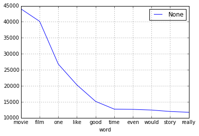

#Part 1: For Beginners - Bag of Words 캐글뽀개기 6월 이상열
##Bag of Words
- (computer science) The collection of words from an unprocessed text without regard to grammar.
- In computer vision, the bag-of-words model (BoW model) can be applied to image classification, by treating image features as words. In document classification, a bag of words is a sparse vector of occurrence counts of words; that is, a sparse histogram over the vocabulary. In computer vision, a bag of visual words is a vector of occurrence counts of a vocabulary of local image features.

##What is NLP?
- NLP (Natural Language Processing) is a set of techniques for approaching text problems. This page will help you get started with loading and cleaning the IMDB movie reviews, then applying a simple Bag of Words model to get surprisingly accurate predictions of whether a review is thumbs-up or thumbs-down.

> ###**Data Set**
 + The labeled data set consists of 50,000 IMDB movie reviews, specially selected for sentiment analysis. The sentiment of reviews is binary, meaning the IMDB rating < 5 results in a sentiment score of 0, and rating >=7 have a sentiment score of 1. No individual movie has more than 30 reviews. The 25,000 review labeled training set does not include any of the same movies as the 25,000 review test set. In addition, there are another 50,000 IMDB reviews provided without any rating labels.
 + sampleSubmission: A comma-delimited sample submission file in the correct format.
 + unlabeledTrainData.tsv : An extra training set with no labels. The tab-delimited file has a header row followed by 50,000 rows containing an id and text for each review. 
 + testData.tsv : The test set. The tab-delimited file has a header row followed by 25,000 rows containing an id and text for each review. Your task is to predict the sentiment for each one. 
 + labeledTrainData.tsv : The labeled training set. The file is tab-delimited and has a header row followed by 25,000 rows containing an id, sentiment, and text for each review.
   - Data Fields : id, sentiment(1:positive, 0:negative), review

    import pandas as pd       
    train = pd.read_csv("data/labeledTrainData.tsv", header=0, delimiter="\t", quoting=3)

    train.shape

    (25000, 3)

    train.columns.values

    array(['id', 'sentiment', 'review'], dtype=object)

    print train["review"][0]

    "With all this stuff going down at the moment with MJ i've started listening to his music, watching the odd documentary here and there, watched The Wiz and watched Moonwalker again. Maybe i just want to get a certain insight into this guy who i thought was really cool in the eighties just to maybe make up my mind whether he is guilty or innocent. Moonwalker is part biography, part feature film which i remember going to see at the cinema when it was originally released. Some of it has subtle messages about MJ's feeling towards the press and also the obvious message of drugs are bad m'kay.  Visually impressive but of course this is all about Michael Jackson so unless you remotely like MJ in anyway then you are going to hate this and find it boring. Some may call MJ an egotist for consenting to the making of this movie BUT MJ and most of his fans would say that he made it for the fans which if true is really nice of him.  The actual feature film bit when it finally starts is only on for 20 minutes or so excluding the Smooth Criminal sequence and Joe Pesci is convincing as a psychopathic all powerful drug lord. Why he wants MJ dead so bad is beyond me. Because MJ overheard his plans? Nah, Joe Pesci's character ranted that he wanted people to know it is he who is supplying drugs etc so i dunno, maybe he just hates MJ's music.  Lots of cool things in this like MJ turning into a car and a robot and the whole Speed Demon sequence. Also, the director must have had the patience of a saint when it came to filming the kiddy Bad sequence as usually directors hate working with one kid let alone a whole bunch of them performing a complex dance scene.  Bottom line, this movie is for people who like MJ on one level or another (which i think is most people). If not, then stay away. It does try and give off a wholesome message and ironically MJ's bestest buddy in this movie is a girl! Michael Jackson is truly one of the most talented people ever to grace this planet but is he guilty? Well, with all the attention i've gave this subject....hmmm well i don't know because people can be different behind closed doors, i know this for a fact. He is either an extremely nice but stupid guy or one of the most sickest liars. I hope he is not the latter."
    

##Data Cleaning and Text Preprocessing
- Removing HTML Markup: The BeautifulSoup Package
- First, we'll remove the HTML tags. For this purpose, we'll use the Beautiful Soup library. If you don't have Beautiful soup installed, do:

    # Import BeautifulSoup into your workspacefrom bs4 import BeautifulSoup
    from bs4 import BeautifulSoup  

    # Initialize the BeautifulSoup object on a single movie review     
    example1 = BeautifulSoup(train["review"][0])

    # Print the raw review and then the output of get_text(), for # comparison
    print train["review"][0]

    "With all this stuff going down at the moment with MJ i've started listening to his music, watching the odd documentary here and there, watched The Wiz and watched Moonwalker again. Maybe i just want to get a certain insight into this guy who i thought was really cool in the eighties just to maybe make up my mind whether he is guilty or innocent. Moonwalker is part biography, part feature film which i remember going to see at the cinema when it was originally released. Some of it has subtle messages about MJ's feeling towards the press and also the obvious message of drugs are bad m'kay.  Visually impressive but of course this is all about Michael Jackson so unless you remotely like MJ in anyway then you are going to hate this and find it boring. Some may call MJ an egotist for consenting to the making of this movie BUT MJ and most of his fans would say that he made it for the fans which if true is really nice of him.  The actual feature film bit when it finally starts is only on for 20 minutes or so excluding the Smooth Criminal sequence and Joe Pesci is convincing as a psychopathic all powerful drug lord. Why he wants MJ dead so bad is beyond me. Because MJ overheard his plans? Nah, Joe Pesci's character ranted that he wanted people to know it is he who is supplying drugs etc so i dunno, maybe he just hates MJ's music.  Lots of cool things in this like MJ turning into a car and a robot and the whole Speed Demon sequence. Also, the director must have had the patience of a saint when it came to filming the kiddy Bad sequence as usually directors hate working with one kid let alone a whole bunch of them performing a complex dance scene.  Bottom line, this movie is for people who like MJ on one level or another (which i think is most people). If not, then stay away. It does try and give off a wholesome message and ironically MJ's bestest buddy in this movie is a girl! Michael Jackson is truly one of the most talented people ever to grace this planet but is he guilty? Well, with all the attention i've gave this subject....hmmm well i don't know because people can be different behind closed doors, i know this for a fact. He is either an extremely nice but stupid guy or one of the most sickest liars. I hope he is not the latter."
    

    print example1.get_text()

    "With all this stuff going down at the moment with MJ i've started listening to his music, watching the odd documentary here and there, watched The Wiz and watched Moonwalker again. Maybe i just want to get a certain insight into this guy who i thought was really cool in the eighties just to maybe make up my mind whether he is guilty or innocent. Moonwalker is part biography, part feature film which i remember going to see at the cinema when it was originally released. Some of it has subtle messages about MJ's feeling towards the press and also the obvious message of drugs are bad m'kay.Visually impressive but of course this is all about Michael Jackson so unless you remotely like MJ in anyway then you are going to hate this and find it boring. Some may call MJ an egotist for consenting to the making of this movie BUT MJ and most of his fans would say that he made it for the fans which if true is really nice of him.The actual feature film bit when it finally starts is only on for 20 minutes or so excluding the Smooth Criminal sequence and Joe Pesci is convincing as a psychopathic all powerful drug lord. Why he wants MJ dead so bad is beyond me. Because MJ overheard his plans? Nah, Joe Pesci's character ranted that he wanted people to know it is he who is supplying drugs etc so i dunno, maybe he just hates MJ's music.Lots of cool things in this like MJ turning into a car and a robot and the whole Speed Demon sequence. Also, the director must have had the patience of a saint when it came to filming the kiddy Bad sequence as usually directors hate working with one kid let alone a whole bunch of them performing a complex dance scene.Bottom line, this movie is for people who like MJ on one level or another (which i think is most people). If not, then stay away. It does try and give off a wholesome message and ironically MJ's bestest buddy in this movie is a girl! Michael Jackson is truly one of the most talented people ever to grace this planet but is he guilty? Well, with all the attention i've gave this subject....hmmm well i don't know because people can be different behind closed doors, i know this for a fact. He is either an extremely nice but stupid guy or one of the most sickest liars. I hope he is not the latter."
    

##Dealing with Punctuation, Numbers and Stopwords: NLTK and regular expressions
- When considering how to clean the text, we should think about the data problem we are trying to solve. For many problems, it makes sense to remove punctuation. On the other hand, in this case, we are tackling a sentiment analysis problem, and it is possible that "!!!" or ":-(" could carry sentiment, and should be treated as words. In this tutorial, for simplicity, we remove the punctuation altogether, but it is something you can play with on your own.
 
- Similarly, in this tutorial we will remove numbers, but there are other ways of dealing with them that make just as much sense. For example, we could treat them as words, or replace them all with a placeholder string such as "NUM".
 
- To remove punctuation and numbers, we will use a package for dealing with regular expressions, called re. The package comes built-in with Python; no need to install anything. For a detailed description of how regular expressions work, see the package documentation. Now, try the following:

    import re
    # Use regular expressions to do a find-and-replace
    letters_only = re.sub("[^a-zA-Z]",  " ", example1.get_text() )      
    print letters_only

     With all this stuff going down at the moment with MJ i ve started listening to his music  watching the odd documentary here and there  watched The Wiz and watched Moonwalker again  Maybe i just want to get a certain insight into this guy who i thought was really cool in the eighties just to maybe make up my mind whether he is guilty or innocent  Moonwalker is part biography  part feature film which i remember going to see at the cinema when it was originally released  Some of it has subtle messages about MJ s feeling towards the press and also the obvious message of drugs are bad m kay Visually impressive but of course this is all about Michael Jackson so unless you remotely like MJ in anyway then you are going to hate this and find it boring  Some may call MJ an egotist for consenting to the making of this movie BUT MJ and most of his fans would say that he made it for the fans which if true is really nice of him The actual feature film bit when it finally starts is only on for    minutes or so excluding the Smooth Criminal sequence and Joe Pesci is convincing as a psychopathic all powerful drug lord  Why he wants MJ dead so bad is beyond me  Because MJ overheard his plans  Nah  Joe Pesci s character ranted that he wanted people to know it is he who is supplying drugs etc so i dunno  maybe he just hates MJ s music Lots of cool things in this like MJ turning into a car and a robot and the whole Speed Demon sequence  Also  the director must have had the patience of a saint when it came to filming the kiddy Bad sequence as usually directors hate working with one kid let alone a whole bunch of them performing a complex dance scene Bottom line  this movie is for people who like MJ on one level or another  which i think is most people   If not  then stay away  It does try and give off a wholesome message and ironically MJ s bestest buddy in this movie is a girl  Michael Jackson is truly one of the most talented people ever to grace this planet but is he guilty  Well  with all the attention i ve gave this subject    hmmm well i don t know because people can be different behind closed doors  i know this for a fact  He is either an extremely nice but stupid guy or one of the most sickest liars  I hope he is not the latter  
    

    lower_case = letters_only.lower()

    print lower_case

     with all this stuff going down at the moment with mj i ve started listening to his music  watching the odd documentary here and there  watched the wiz and watched moonwalker again  maybe i just want to get a certain insight into this guy who i thought was really cool in the eighties just to maybe make up my mind whether he is guilty or innocent  moonwalker is part biography  part feature film which i remember going to see at the cinema when it was originally released  some of it has subtle messages about mj s feeling towards the press and also the obvious message of drugs are bad m kay visually impressive but of course this is all about michael jackson so unless you remotely like mj in anyway then you are going to hate this and find it boring  some may call mj an egotist for consenting to the making of this movie but mj and most of his fans would say that he made it for the fans which if true is really nice of him the actual feature film bit when it finally starts is only on for    minutes or so excluding the smooth criminal sequence and joe pesci is convincing as a psychopathic all powerful drug lord  why he wants mj dead so bad is beyond me  because mj overheard his plans  nah  joe pesci s character ranted that he wanted people to know it is he who is supplying drugs etc so i dunno  maybe he just hates mj s music lots of cool things in this like mj turning into a car and a robot and the whole speed demon sequence  also  the director must have had the patience of a saint when it came to filming the kiddy bad sequence as usually directors hate working with one kid let alone a whole bunch of them performing a complex dance scene bottom line  this movie is for people who like mj on one level or another  which i think is most people   if not  then stay away  it does try and give off a wholesome message and ironically mj s bestest buddy in this movie is a girl  michael jackson is truly one of the most talented people ever to grace this planet but is he guilty  well  with all the attention i ve gave this subject    hmmm well i don t know because people can be different behind closed doors  i know this for a fact  he is either an extremely nice but stupid guy or one of the most sickest liars  i hope he is not the latter  
    

    words = lower_case.split()               

    words

    [u'with',
     u'all',
     u'this',
     u'stuff',
     u'going',
     u'down',
     u'at',
     u'the',
     u'moment',
     u'with',
     u'mj',
     u'i',
     u've',
     u'started',
     u'listening',
     u'to',
     u'his',
     u'music',
     u'watching',
     u'the',
     u'odd',
     u'documentary',
     u'here',
     u'and',
     u'there',
     u'watched',
     u'the',
     u'wiz',
     u'and',
     u'watched',
     u'moonwalker',
     u'again',
     u'maybe',
     u'i',
     u'just',
     u'want',
     u'to',
     u'get',
     u'a',
     u'certain',
     u'insight',
     u'into',
     u'this',
     u'guy',
     u'who',
     u'i',
     u'thought',
     u'was',
     u'really',
     u'cool',
     u'in',
     u'the',
     u'eighties',
     u'just',
     u'to',
     u'maybe',
     u'make',
     u'up',
     u'my',
     u'mind',
     u'whether',
     u'he',
     u'is',
     u'guilty',
     u'or',
     u'innocent',
     u'moonwalker',
     u'is',
     u'part',
     u'biography',
     u'part',
     u'feature',
     u'film',
     u'which',
     u'i',
     u'remember',
     u'going',
     u'to',
     u'see',
     u'at',
     u'the',
     u'cinema',
     u'when',
     u'it',
     u'was',
     u'originally',
     u'released',
     u'some',
     u'of',
     u'it',
     u'has',
     u'subtle',
     u'messages',
     u'about',
     u'mj',
     u's',
     u'feeling',
     u'towards',
     u'the',
     u'press',
     u'and',
     u'also',
     u'the',
     u'obvious',
     u'message',
     u'of',
     u'drugs',
     u'are',
     u'bad',
     u'm',
     u'kay',
     u'visually',
     u'impressive',
     u'but',
     u'of',
     u'course',
     u'this',
     u'is',
     u'all',
     u'about',
     u'michael',
     u'jackson',
     u'so',
     u'unless',
     u'you',
     u'remotely',
     u'like',
     u'mj',
     u'in',
     u'anyway',
     u'then',
     u'you',
     u'are',
     u'going',
     u'to',
     u'hate',
     u'this',
     u'and',
     u'find',
     u'it',
     u'boring',
     u'some',
     u'may',
     u'call',
     u'mj',
     u'an',
     u'egotist',
     u'for',
     u'consenting',
     u'to',
     u'the',
     u'making',
     u'of',
     u'this',
     u'movie',
     u'but',
     u'mj',
     u'and',
     u'most',
     u'of',
     u'his',
     u'fans',
     u'would',
     u'say',
     u'that',
     u'he',
     u'made',
     u'it',
     u'for',
     u'the',
     u'fans',
     u'which',
     u'if',
     u'true',
     u'is',
     u'really',
     u'nice',
     u'of',
     u'him',
     u'the',
     u'actual',
     u'feature',
     u'film',
     u'bit',
     u'when',
     u'it',
     u'finally',
     u'starts',
     u'is',
     u'only',
     u'on',
     u'for',
     u'minutes',
     u'or',
     u'so',
     u'excluding',
     u'the',
     u'smooth',
     u'criminal',
     u'sequence',
     u'and',
     u'joe',
     u'pesci',
     u'is',
     u'convincing',
     u'as',
     u'a',
     u'psychopathic',
     u'all',
     u'powerful',
     u'drug',
     u'lord',
     u'why',
     u'he',
     u'wants',
     u'mj',
     u'dead',
     u'so',
     u'bad',
     u'is',
     u'beyond',
     u'me',
     u'because',
     u'mj',
     u'overheard',
     u'his',
     u'plans',
     u'nah',
     u'joe',
     u'pesci',
     u's',
     u'character',
     u'ranted',
     u'that',
     u'he',
     u'wanted',
     u'people',
     u'to',
     u'know',
     u'it',
     u'is',
     u'he',
     u'who',
     u'is',
     u'supplying',
     u'drugs',
     u'etc',
     u'so',
     u'i',
     u'dunno',
     u'maybe',
     u'he',
     u'just',
     u'hates',
     u'mj',
     u's',
     u'music',
     u'lots',
     u'of',
     u'cool',
     u'things',
     u'in',
     u'this',
     u'like',
     u'mj',
     u'turning',
     u'into',
     u'a',
     u'car',
     u'and',
     u'a',
     u'robot',
     u'and',
     u'the',
     u'whole',
     u'speed',
     u'demon',
     u'sequence',
     u'also',
     u'the',
     u'director',
     u'must',
     u'have',
     u'had',
     u'the',
     u'patience',
     u'of',
     u'a',
     u'saint',
     u'when',
     u'it',
     u'came',
     u'to',
     u'filming',
     u'the',
     u'kiddy',
     u'bad',
     u'sequence',
     u'as',
     u'usually',
     u'directors',
     u'hate',
     u'working',
     u'with',
     u'one',
     u'kid',
     u'let',
     u'alone',
     u'a',
     u'whole',
     u'bunch',
     u'of',
     u'them',
     u'performing',
     u'a',
     u'complex',
     u'dance',
     u'scene',
     u'bottom',
     u'line',
     u'this',
     u'movie',
     u'is',
     u'for',
     u'people',
     u'who',
     u'like',
     u'mj',
     u'on',
     u'one',
     u'level',
     u'or',
     u'another',
     u'which',
     u'i',
     u'think',
     u'is',
     u'most',
     u'people',
     u'if',
     u'not',
     u'then',
     u'stay',
     u'away',
     u'it',
     u'does',
     u'try',
     u'and',
     u'give',
     u'off',
     u'a',
     u'wholesome',
     u'message',
     u'and',
     u'ironically',
     u'mj',
     u's',
     u'bestest',
     u'buddy',
     u'in',
     u'this',
     u'movie',
     u'is',
     u'a',
     u'girl',
     u'michael',
     u'jackson',
     u'is',
     u'truly',
     u'one',
     u'of',
     u'the',
     u'most',
     u'talented',
     u'people',
     u'ever',
     u'to',
     u'grace',
     u'this',
     u'planet',
     u'but',
     u'is',
     u'he',
     u'guilty',
     u'well',
     u'with',
     u'all',
     u'the',
     u'attention',
     u'i',
     u've',
     u'gave',
     u'this',
     u'subject',
     u'hmmm',
     u'well',
     u'i',
     u'don',
     u't',
     u'know',
     u'because',
     u'people',
     u'can',
     u'be',
     u'different',
     u'behind',
     u'closed',
     u'doors',
     u'i',
     u'know',
     u'this',
     u'for',
     u'a',
     u'fact',
     u'he',
     u'is',
     u'either',
     u'an',
     u'extremely',
     u'nice',
     u'but',
     u'stupid',
     u'guy',
     u'or',
     u'one',
     u'of',
     u'the',
     u'most',
     u'sickest',
     u'liars',
     u'i',
     u'hope',
     u'he',
     u'is',
     u'not',
     u'the',
     u'latter']

    import nltk
    nltk.download()

    showing info http://www.nltk.org/nltk_data/
    

    True

##Natural Language Toolkit(NLTK)
- Finally, we need to decide how to deal with frequently occurring words that don't carry much meaning. Such words are called "stop words"; in English they include words such as "a", "and", "is", and "the". Conveniently, there are Python packages that come with stop word lists built in. Let's import a stop word list from the Python Natural Language Toolkit (NLTK). You'll need to install the library if you don't already have it on your computer; you'll also need to install the data packages that come with it, as follows:
- Don't worry about the "u" before each word; it just indicates that Python is internally representing each word as a unicode string.
- There are many other things we could do to the data - For example, Porter Stemming and Lemmatizing (both available in NLTK) would allow us to treat "messages", "message", and "messaging" as the same word, which could certainly be useful. However, for simplicity, the tutorial will stop here.

    from nltk.corpus import stopwords

    # Remove stop words from "words"
    words = [w for w in words if not w in stopwords.words("english")]
    print words

    [u'stuff', u'going', u'moment', u'mj', u've', u'started', u'listening', u'music', u'watching', u'odd', u'documentary', u'watched', u'wiz', u'watched', u'moonwalker', u'maybe', u'want', u'get', u'certain', u'insight', u'guy', u'thought', u'really', u'cool', u'eighties', u'maybe', u'make', u'mind', u'whether', u'guilty', u'innocent', u'moonwalker', u'part', u'biography', u'part', u'feature', u'film', u'remember', u'going', u'see', u'cinema', u'originally', u'released', u'subtle', u'messages', u'mj', u'feeling', u'towards', u'press', u'also', u'obvious', u'message', u'drugs', u'bad', u'm', u'kay', u'visually', u'impressive', u'course', u'michael', u'jackson', u'unless', u'remotely', u'like', u'mj', u'anyway', u'going', u'hate', u'find', u'boring', u'may', u'call', u'mj', u'egotist', u'consenting', u'making', u'movie', u'mj', u'fans', u'would', u'say', u'made', u'fans', u'true', u'really', u'nice', u'actual', u'feature', u'film', u'bit', u'finally', u'starts', u'minutes', u'excluding', u'smooth', u'criminal', u'sequence', u'joe', u'pesci', u'convincing', u'psychopathic', u'powerful', u'drug', u'lord', u'wants', u'mj', u'dead', u'bad', u'beyond', u'mj', u'overheard', u'plans', u'nah', u'joe', u'pesci', u'character', u'ranted', u'wanted', u'people', u'know', u'supplying', u'drugs', u'etc', u'dunno', u'maybe', u'hates', u'mj', u'music', u'lots', u'cool', u'things', u'like', u'mj', u'turning', u'car', u'robot', u'whole', u'speed', u'demon', u'sequence', u'also', u'director', u'must', u'patience', u'saint', u'came', u'filming', u'kiddy', u'bad', u'sequence', u'usually', u'directors', u'hate', u'working', u'one', u'kid', u'let', u'alone', u'whole', u'bunch', u'performing', u'complex', u'dance', u'scene', u'bottom', u'line', u'movie', u'people', u'like', u'mj', u'one', u'level', u'another', u'think', u'people', u'stay', u'away', u'try', u'give', u'wholesome', u'message', u'ironically', u'mj', u'bestest', u'buddy', u'movie', u'girl', u'michael', u'jackson', u'truly', u'one', u'talented', u'people', u'ever', u'grace', u'planet', u'guilty', u'well', u'attention', u've', u'gave', u'subject', u'hmmm', u'well', u'know', u'people', u'different', u'behind', u'closed', u'doors', u'know', u'fact', u'either', u'extremely', u'nice', u'stupid', u'guy', u'one', u'sickest', u'liars', u'hope', u'latter']
    

    def review_to_words( raw_review ):
        # Function to convert a raw review to a string of words    
        # The input is a single string (a raw movie review), and  he output is a single string (a preprocessed movie review)    
        #
        # 1. Remove HTML
        review_text = BeautifulSoup(raw_review).get_text()     
        #    
        # 2. Remove non-letters        
        letters_only = re.sub("[^a-zA-Z]", " ", review_text)     
        #    
        # 3. Convert to lower case, split into individual words
        words = letters_only.lower().split()                                 
        #   
        # 4. In Python, searching a set is much faster than searching    
        #   a list, so convert the stop words to a set
        stops = set(stopwords.words("english"))                      
        #     
        # 5. Remove stop words
        meaningful_words = [w for w in words if not w in stops]       
        #    
        # 6. Join the words back into one string separated by space,     
        # and return the result.
        return( " ".join( meaningful_words )) 

    clean_review = review_to_words( train["review"][0] )
    print clean_review

    stuff going moment mj ve started listening music watching odd documentary watched wiz watched moonwalker maybe want get certain insight guy thought really cool eighties maybe make mind whether guilty innocent moonwalker part biography part feature film remember going see cinema originally released subtle messages mj feeling towards press also obvious message drugs bad m kay visually impressive course michael jackson unless remotely like mj anyway going hate find boring may call mj egotist consenting making movie mj fans would say made fans true really nice actual feature film bit finally starts minutes excluding smooth criminal sequence joe pesci convincing psychopathic powerful drug lord wants mj dead bad beyond mj overheard plans nah joe pesci character ranted wanted people know supplying drugs etc dunno maybe hates mj music lots cool things like mj turning car robot whole speed demon sequence also director must patience saint came filming kiddy bad sequence usually directors hate working one kid let alone whole bunch performing complex dance scene bottom line movie people like mj one level another think people stay away try give wholesome message ironically mj bestest buddy movie girl michael jackson truly one talented people ever grace planet guilty well attention ve gave subject hmmm well know people different behind closed doors know fact either extremely nice stupid guy one sickest liars hope latter
    

    # Get the number of reviews based on the dataframe column size
    num_reviews = train["review"].size
    
    # Initialize an empty list to hold the clean reviews
    clean_train_reviews = []
    
    # Loop over each review; create an index i that goes from 0 to the length# of the movie review list 
    for i in xrange( 0, num_reviews ):
        # Call our function for each one, and add the result to the list of    # clean reviews
        clean_train_reviews.append( review_to_words( train["review"][i] ) )

    print "Cleaning and parsing the training set movie reviews...\n"
    clean_train_reviews = []
    for i in xrange( 0, num_reviews ):
        # If the index is evenly divisible by 1000, print a message
        if( (i+1)%1000 == 0 ):
            print "Review %d of %d\n" % ( i+1, num_reviews )                                                                    
        clean_train_reviews.append( review_to_words( train["review"][i] ))

    Cleaning and parsing the training set movie reviews...
    
    Review 1000 of 25000
    
    Review 2000 of 25000
    
    Review 3000 of 25000
    
    Review 4000 of 25000
    
    Review 5000 of 25000
    
    Review 6000 of 25000
    
    Review 7000 of 25000
    
    Review 8000 of 25000
    
    Review 9000 of 25000
    
    Review 10000 of 25000
    
    Review 11000 of 25000
    
    Review 12000 of 25000
    
    Review 13000 of 25000
    
    Review 14000 of 25000
    
    Review 15000 of 25000
    
    Review 16000 of 25000
    
    Review 17000 of 25000
    
    Review 18000 of 25000
    
    Review 19000 of 25000
    
    Review 20000 of 25000
    
    Review 21000 of 25000
    
    Review 22000 of 25000
    
    Review 23000 of 25000
    
    Review 24000 of 25000
    
    Review 25000 of 25000
    
    

##Creating Features from a Bag of Words (Using scikit-learn)
- Now that we have our training reviews tidied up, how do we convert them to some kind of numeric representation for machine learning? One common approach is called a Bag of Words. The Bag of Words model learns a vocabulary from all of the documents, then models each document by counting the number of times each word appears. For example, consider the following two sentences:
- Sentence 1: "The cat sat on the hat"
- Sentence 2: "The dog ate the cat and the hat"
- From these two sentences, our vocabulary is as follows: { the, cat, sat, on, hat, dog, ate, and }
- To get our bags of words, we count the number of times each word occurs in each sentence. In Sentence 1, "the" appears twice, and "cat", "sat", "on", and "hat" each appear once, so the feature vector for Sentence 1 is:
- { the, cat, sat, on, hat, dog, ate, and }
- Sentence 1: { 2, 1, 1, 1, 1, 0, 0, 0 }
- Similarly, the features for Sentence 2 are: { 3, 1, 0, 0, 1, 1, 1, 1}
- In the IMDB data, we have a very large number of reviews, which will give us a large vocabulary. To limit the size of the feature vectors, we should choose some maximum vocabulary size. Below, we use the 5000 most frequent words (remembering that stop words have already been removed).

    print "Creating the bag of words...\n"
    from sklearn.feature_extraction.text import CountVectorizer
    # Initialize the "CountVectorizer" object, which is scikit-learn's
    # bag of words tool.  
    vectorizer = CountVectorizer(analyzer = "word",  tokenizer = None,  preprocessor = None, stop_words = None, max_features = 5000)
    # fit_transform() does two functions: First, it fits the model# and learns the vocabulary; second, it transforms our training data
    # into feature vectors. The input to fit_transform should be a list of 
    # strings.
    train_data_features = vectorizer.fit_transform(clean_train_reviews)
    # Numpy arrays are easy to work with, so convert the result to an 
    # array
    train_data_features = train_data_features.toarray()

    Creating the bag of words...
    
    

    print train_data_features.shape

    (25000L, 5000L)
    

    vocab = vectorizer.get_feature_names()
    print vocab

    [u'abandoned', u'abc', u'abilities', u'ability', u'able', u'abraham', u'absence', u'absent', u'absolute', u'absolutely', u'absurd', u'abuse', u'abusive', u'abysmal', u'academy', u'accent', u'accents', u'accept', u'acceptable', u'accepted', u'access', u'accident', u'accidentally', u'accompanied', u'accomplished', u'according', u'account', u'accuracy', u'accurate', u'accused', u'achieve', u'achieved', u'achievement', u'acid', u'across', u'act', u'acted', u'acting', u'action', u'actions', u'activities', u'actor', u'actors', u'actress', u'actresses', u'acts', u'actual', u'actually', u'ad', u'adam', u'adams', u'adaptation', u'adaptations', u'adapted', u'add', u'added', u'adding', u'addition', u'adds', u'adequate', u'admire', u'admit', u'admittedly', u'adorable', u'adult', u'adults', u'advance', u'advanced', u'advantage', u'adventure', u'adventures', u'advertising', u'advice', u'advise', u'affair', u'affect', u'affected', u'afford', u'aforementioned', u'afraid', u'africa', u'african', u'afternoon', u'afterwards', u'age', u'aged', u'agent', u'agents', u'ages', u'aging', u'ago', u'agree', u'agreed', u'agrees', u'ah', u'ahead', u'aid', u'aids', u'aim', u'aimed', u'ain', u'air', u'aired', u'airplane', u'airport', u'aka', u'akshay', u'al', u'alan', u'alas', u'albeit', u'albert', u'album', u'alcohol', u'alcoholic', u'alec', u'alert', u'alex', u'alexander', u'alfred', u'alice', u'alicia', u'alien', u'aliens', u'alike', u'alison', u'alive', u'allen', u'allow', u'allowed', u'allowing', u'allows', u'almost', u'alone', u'along', u'alongside', u'already', u'alright', u'also', u'alternate', u'although', u'altman', u'altogether', u'always', u'amanda', u'amateur', u'amateurish', u'amazed', u'amazing', u'amazingly', u'ambiguous', u'ambitious', u'america', u'american', u'americans', u'amitabh', u'among', u'amongst', u'amount', u'amounts', u'amusing', u'amy', u'analysis', u'ancient', u'anderson', u'andre', u'andrew', u'andrews', u'andy', u'angel', u'angela', u'angeles', u'angels', u'anger', u'angle', u'angles', u'angry', u'animal', u'animals', u'animated', u'animation', u'anime', u'ann', u'anna', u'anne', u'annie', u'annoyed', u'annoying', u'another', u'answer', u'answers', u'anthony', u'anti', u'antics', u'antonioni', u'antwone', u'anybody', u'anymore', u'anyone', u'anything', u'anyway', u'anyways', u'anywhere', u'apart', u'apartment', u'ape', u'apes', u'appalling', u'apparent', u'apparently', u'appeal', u'appealing', u'appear', u'appearance', u'appearances', u'appeared', u'appearing', u'appears', u'appreciate', u'appreciated', u'appreciation', u'approach', u'appropriate', u'april', u'area', u'areas', u'aren', u'arguably', u'argue', u'argument', u'arm', u'armed', u'arms', u'army', u'arnold', u'around', u'arrested', u'arrival', u'arrive', u'arrived', u'arrives', u'arrogant', u'art', u'arthur', u'artificial', u'artist', u'artistic', u'artists', u'arts', u'ashamed', u'ashley', u'asian', u'aside', u'ask', u'asked', u'asking', u'asks', u'asleep', u'aspect', u'aspects', u'ass', u'assassin', u'assault', u'assigned', u'assistant', u'associated', u'assume', u'assumed', u'astaire', u'astonishing', u'atlantis', u'atmosphere', u'atmospheric', u'atrocious', u'attached', u'attack', u'attacked', u'attacks', u'attempt', u'attempted', u'attempting', u'attempts', u'attend', u'attention', u'attitude', u'attitudes', u'attorney', u'attracted', u'attraction', u'attractive', u'audience', u'audiences', u'audio', u'aunt', u'austen', u'austin', u'australia', u'australian', u'authentic', u'author', u'authority', u'available', u'average', u'avoid', u'avoided', u'awake', u'award', u'awards', u'aware', u'away', u'awe', u'awesome', u'awful', u'awfully', u'awkward', u'babe', u'baby', u'bacall', u'back', u'backdrop', u'background', u'backgrounds', u'bad', u'badly', u'bag', u'baker', u'bakshi', u'balance', u'baldwin', u'ball', u'ballet', u'balls', u'band', u'bands', u'bang', u'bank', u'banned', u'bar', u'barbara', u'bare', u'barely', u'bargain', u'barry', u'barrymore', u'base', u'baseball', u'based', u'basement', u'basic', u'basically', u'basis', u'basketball', u'bat', u'bath', u'bathroom', u'batman', u'battle', u'battles', u'bay', u'bbc', u'beach', u'bear', u'bears', u'beast', u'beat', u'beaten', u'beating', u'beats', u'beatty', u'beautiful', u'beautifully', u'beauty', u'became', u'become', u'becomes', u'becoming', u'bed', u'bedroom', u'beer', u'began', u'begin', u'beginning', u'begins', u'behave', u'behavior', u'behind', u'beings', u'bela', u'belief', u'beliefs', u'believable', u'believe', u'believed', u'believes', u'believing', u'bell', u'belong', u'belongs', u'beloved', u'belushi', u'ben', u'beneath', u'benefit', u'bergman', u'berlin', u'besides', u'best', u'bet', u'bette', u'better', u'bettie', u'betty', u'beyond', u'bible', u'big', u'bigger', u'biggest', u'biko', u'bill', u'billed', u'billy', u'bin', u'biography', u'bird', u'birds', u'birth', u'birthday', u'bit', u'bite', u'bits', u'bitter', u'bizarre', u'black', u'blade', u'blah', u'blair', u'blake', u'blame', u'bland', u'blank', u'blast', u'blatant', u'bleak', u'blend', u'blew', u'blind', u'blob', u'block', u'blockbuster', u'blond', u'blonde', u'blood', u'bloody', u'blow', u'blowing', u'blown', u'blows', u'blue', u'blues', u'blunt', u'bo', u'board', u'boat', u'bob', u'bobby', u'bodies', u'body', u'bold', u'boll', u'bollywood', u'bomb', u'bond', u'bone', u'bonus', u'book', u'books', u'boom', u'boot', u'border', u'bore', u'bored', u'boredom', u'boring', u'born', u'borrowed', u'boss', u'bother', u'bothered', u'bottle', u'bottom', u'bought', u'bound', u'bourne', u'box', u'boxing', u'boy', u'boyfriend', u'boyle', u'boys', u'brad', u'brady', u'brain', u'brains', u'branagh', u'brand', u'brando', u'brave', u'brazil', u'break', u'breaking', u'breaks', u'breasts', u'breath', u'breathtaking', u'brenda', u'brian', u'bride', u'bridge', u'brief', u'briefly', u'bright', u'brilliance', u'brilliant', u'brilliantly', u'bring', u'bringing', u'brings', u'britain', u'british', u'broad', u'broadcast', u'broadway', u'broke', u'broken', u'brooklyn', u'brooks', u'brosnan', u'brother', u'brothers', u'brought', u'brown', u'bruce', u'brutal', u'brutality', u'brutally', u'buck', u'bucks', u'bud', u'buddies', u'buddy', u'budget', u'buff', u'buffalo', u'buffs', u'bug', u'bugs', u'build', u'building', u'buildings', u'builds', u'built', u'bull', u'bullet', u'bullets', u'bumbling', u'bunch', u'buried', u'burn', u'burned', u'burning', u'burns', u'burt', u'burton', u'bus', u'bush', u'business', u'businessman', u'buster', u'busy', u'butler', u'butt', u'button', u'buy', u'buying', u'cabin', u'cable', u'cage', u'cagney', u'caine', u'cake', u'caliber', u'california', u'call', u'called', u'calling', u'calls', u'calm', u'came', u'cameo', u'cameos', u'camera', u'cameras', u'cameron', u'camp', u'campbell', u'campy', u'canada', u'canadian', u'candy', u'cannibal', u'cannot', u'cant', u'capable', u'capital', u'captain', u'captivating', u'capture', u'captured', u'captures', u'capturing', u'car', u'card', u'cardboard', u'cards', u'care', u'cared', u'career', u'careers', u'careful', u'carefully', u'carell', u'cares', u'caring', u'carl', u'carla', u'carol', u'carpenter', u'carradine', u'carrey', u'carrie', u'carried', u'carries', u'carry', u'carrying', u'cars', u'carter', u'cartoon', u'cartoons', u'cary', u'case', u'cases', u'cash', u'cassidy', u'cast', u'casting', u'castle', u'cat', u'catch', u'catches', u'catching', u'catchy', u'category', u'catherine', u'catholic', u'cats', u'caught', u'cause', u'caused', u'causes', u'causing', u'cave', u'cd', u'celebrity', u'cell', u'celluloid', u'center', u'centered', u'centers', u'central', u'century', u'certain', u'certainly', u'cg', u'cgi', u'chain', u'chair', u'challenge', u'challenging', u'championship', u'chan', u'chance', u'chances', u'change', u'changed', u'changes', u'changing', u'channel', u'channels', u'chaos', u'chaplin', u'chapter', u'character', u'characterization', u'characters', u'charge', u'charisma', u'charismatic', u'charles', u'charlie', u'charlotte', u'charm', u'charming', u'chase', u'chased', u'chases', u'chasing', u'che', u'cheap', u'cheated', u'cheating', u'check', u'checked', u'checking', u'cheek', u'cheese', u'cheesy', u'chemistry', u'chess', u'chest', u'chicago', u'chick', u'chicken', u'chicks', u'chief', u'child', u'childhood', u'childish', u'children', u'chilling', u'china', u'chinese', u'choice', u'choices', u'choose', u'chooses', u'choreographed', u'choreography', u'chorus', u'chose', u'chosen', u'chris', u'christ', u'christian', u'christianity', u'christians', u'christmas', u'christopher', u'christy', u'chuck', u'church', u'cia', u'cinderella', u'cinema', u'cinematic', u'cinematographer', u'cinematography', u'circle', u'circumstances', u'cities', u'citizen', u'city', u'civil', u'civilization', u'claim', u'claimed', u'claims', u'claire', u'clark', u'class', u'classes', u'classic', u'classical', u'classics', u'claus', u'clean', u'clear', u'clearly', u'clever', u'cleverly', u'clich', u'cliche', u'cliff', u'climactic', u'climax', u'clint', u'clip', u'clips', u'clock', u'close', u'closed', u'closely', u'closer', u'closest', u'closet', u'closing', u'clothes', u'clothing', u'clown', u'club', u'clue', u'clues', u'clumsy', u'co', u'coach', u'coast', u'code', u'coffee', u'coherent', u'cold', u'cole', u'collection', u'college', u'colonel', u'color', u'colorful', u'colors', u'colour', u'columbo', u'com', u'combat', u'combination', u'combine', u'combined', u'come', u'comedian', u'comedic', u'comedies', u'comedy', u'comes', u'comfort', u'comfortable', u'comic', u'comical', u'comics', u'coming', u'command', u'comment', u'commentary', u'commented', u'comments', u'commercial', u'commercials', u'commit', u'committed', u'common', u'communist', u'community', u'companies', u'companion', u'company', u'compare', u'compared', u'comparing', u'comparison', u'compassion', u'compelled', u'compelling', u'competent', u'competition', u'complain', u'complaint', u'complete', u'completely', u'complex', u'complexity', u'complicated', u'composed', u'composer', u'computer', u'con', u'conceived', u'concept', u'concern', u'concerned', u'concerning', u'concerns', u'concert', u'conclusion', u'condition', u'conditions', u'confess', u'confidence', u'conflict', u'conflicts', u'confrontation', u'confused', u'confusing', u'confusion', u'connect', u'connected', u'connection', u'connery', u'consequences', u'conservative', u'consider', u'considerable', u'considered', u'considering', u'consistent', u'consistently', u'consists', u'conspiracy', u'constant', u'constantly', u'constructed', u'construction', u'contact', u'contain', u'contained', u'contains', u'contemporary', u'content', u'contest', u'context', u'continue', u'continued', u'continues', u'continuity', u'contract', u'contrary', u'contrast', u'contrived', u'control', u'controversial', u'conventional', u'conversation', u'conversations', u'convey', u'convince', u'convinced', u'convincing', u'convincingly', u'convoluted', u'cook', u'cool', u'cooper', u'cop', u'copies', u'cops', u'copy', u'core', u'corner', u'corny', u'corporate', u'corpse', u'correct', u'correctly', u'corrupt', u'corruption', u'cost', u'costs', u'costume', u'costumes', u'could', u'couldn', u'count', u'counter', u'countless', u'countries', u'country', u'countryside', u'couple', u'couples', u'courage', u'course', u'court', u'cousin', u'cover', u'covered', u'covers', u'cowboy', u'cox', u'crack', u'cracking', u'craft', u'crafted', u'craig', u'crap', u'crappy', u'crash', u'craven', u'crawford', u'crazed', u'crazy', u'create', u'created', u'creates', u'creating', u'creation', u'creative', u'creativity', u'creator', u'creators', u'creature', u'creatures', u'credibility', u'credible', u'credit', u'credits', u'creep', u'creepy', u'crew', u'cried', u'crime', u'crimes', u'criminal', u'criminals', u'cringe', u'crisis', u'critic', u'critical', u'criticism', u'critics', u'crocodile', u'cross', u'crowd', u'crucial', u'crude', u'cruel', u'cruise', u'crush', u'cry', u'crying', u'crystal', u'cuba', u'cube', u'cult', u'cultural', u'culture', u'cup', u'cure', u'curiosity', u'curious', u'current', u'currently', u'curse', u'curtis', u'cusack', u'cut', u'cute', u'cuts', u'cutting', u'cynical', u'da', u'dad', u'daddy', u'daily', u'dalton', u'damage', u'damme', u'damn', u'damon', u'dan', u'dana', u'dance', u'dancer', u'dancers', u'dances', u'dancing', u'danes', u'danger', u'dangerous', u'daniel', u'danny', u'dare', u'daring', u'dark', u'darker', u'darkness', u'darren', u'date', u'dated', u'dating', u'daughter', u'daughters', u'dave', u'david', u'davies', u'davis', u'dawn', u'dawson', u'day', u'days', u'de', u'dead', u'deadly', u'deaf', u'deal', u'dealing', u'deals', u'dealt', u'dean', u'dear', u'death', u'deaths', u'debut', u'decade', u'decades', u'deceased', u'decent', u'decide', u'decided', u'decides', u'decision', u'decisions', u'dedicated', u'dee', u'deep', u'deeper', u'deeply', u'defeat', u'defend', u'defense', u'defined', u'definite', u'definitely', u'definition', u'degree', u'del', u'deliberately', u'delight', u'delightful', u'deliver', u'delivered', u'delivering', u'delivers', u'delivery', u'demand', u'demands', u'demented', u'demise', u'demon', u'demons', u'deniro', u'dennis', u'dentist', u'denzel', u'department', u'depicted', u'depicting', u'depiction', u'depicts', u'depressed', u'depressing', u'depression', u'depth', u'der', u'derek', u'descent', u'describe', u'described', u'describes', u'description', u'desert', u'deserve', u'deserved', u'deserves', u'design', u'designed', u'designs', u'desire', u'desired', u'despair', u'desperate', u'desperately', u'desperation', u'despite', u'destiny', u'destroy', u'destroyed', u'destroying', u'destruction', u'detail', u'detailed', u'details', u'detective', u'determined', u'develop', u'developed', u'developing', u'development', u'develops', u'device', u'devil', u'devoid', u'devoted', u'dialog', u'dialogs', u'dialogue', u'dialogues', u'diamond', u'diana', u'diane', u'dick', u'dickens', u'didn', u'die', u'died', u'dies', u'difference', u'differences', u'different', u'difficult', u'dig', u'digital', u'dignity', u'dimension', u'dimensional', u'din', u'dinner', u'dinosaur', u'dinosaurs', u'dire', u'direct', u'directed', u'directing', u'direction', u'directions', u'directly', u'director', u'directorial', u'directors', u'directs', u'dirty', u'disagree', u'disappear', u'disappeared', u'disappoint', u'disappointed', u'disappointing', u'disappointment', u'disaster', u'disbelief', u'disc', u'discover', u'discovered', u'discovers', u'discovery', u'discuss', u'discussion', u'disease', u'disgusting', u'disjointed', u'dislike', u'disliked', u'disney', u'display', u'displayed', u'displays', u'distance', u'distant', u'distinct', u'distracting', u'distribution', u'disturbed', u'disturbing', u'divorce', u'dixon', u'doc', u'doctor', u'documentaries', u'documentary', u'doesn', u'dog', u'dogs', u'doll', u'dollar', u'dollars', u'dolls', u'dolph', u'domestic', u'domino', u'donald', u'done', u'donna', u'doo', u'doom', u'doomed', u'door', u'doors', u'dorothy', u'double', u'doubt', u'doubts', u'douglas', u'downey', u'downhill', u'downright', u'dozen', u'dozens', u'dr', u'dracula', u'drag', u'dragged', u'dragon', u'drags', u'drake', u'drama', u'dramas', u'dramatic', u'draw', u'drawing', u'drawn', u'draws', u'dreadful', u'dream', u'dreams', u'dreary', u'dreck', u'dress', u'dressed', u'dressing', u'drew', u'drink', u'drinking', u'drive', u'drivel', u'driven', u'driver', u'drives', u'driving', u'drop', u'dropped', u'dropping', u'drops', u'drug', u'drugs', u'drunk', u'drunken', u'dry', u'dub', u'dubbed', u'dubbing', u'dud', u'dude', u'due', u'duke', u'dull', u'dumb', u'duo', u'dust', u'dutch', u'duty', u'dvd', u'dying', u'dynamic', u'eager', u'ear', u'earl', u'earlier', u'early', u'earned', u'ears', u'earth', u'ease', u'easier', u'easily', u'east', u'eastern', u'eastwood', u'easy', u'eat', u'eaten', u'eating', u'eccentric', u'ed', u'eddie', u'edgar', u'edge', u'edgy', u'edie', u'edited', u'editing', u'edition', u'editor', u'education', u'educational', u'edward', u'eerie', u'effect', u'effective', u'effectively', u'effects', u'effort', u'efforts', u'ego', u'eight', u'eighties', u'either', u'elaborate', u'elderly', u'elegant', u'element', u'elements', u'elephant', u'elizabeth', u'ellen', u'elm', u'else', u'elsewhere', u'elvira', u'elvis', u'em', u'embarrassed', u'embarrassing', u'embarrassment', u'emily', u'emma', u'emotion', u'emotional', u'emotionally', u'emotions', u'empathy', u'emperor', u'emphasis', u'empire', u'empty', u'en', u'encounter', u'encounters', u'end', u'endearing', u'ended', u'ending', u'endings', u'endless', u'ends', u'endure', u'enemies', u'enemy', u'energy', u'engage', u'engaged', u'engaging', u'england', u'english', u'enjoy', u'enjoyable', u'enjoyed', u'enjoying', u'enjoyment', u'enjoys', u'enormous', u'enough', u'ensemble', u'ensues', u'enter', u'enterprise', u'enters', u'entertain', u'entertained', u'entertaining', u'entertainment', u'enthusiasm', u'entire', u'entirely', u'entry', u'environment', u'epic', u'episode', u'episodes', u'equal', u'equally', u'equipment', u'equivalent', u'er', u'era', u'eric', u'erotic', u'errors', u'escape', u'escaped', u'escapes', u'especially', u'essence', u'essential', u'essentially', u'established', u'estate', u'et', u'etc', u'ethan', u'eugene', u'europe', u'european', u'eva', u'eve', u'even', u'evening', u'event', u'events', u'eventually', u'ever', u'every', u'everybody', u'everyday', u'everyone', u'everything', u'everywhere', u'evidence', u'evident', u'evil', u'ex', u'exact', u'exactly', u'exaggerated', u'examination', u'example', u'examples', u'excellent', u'except', u'exception', u'exceptional', u'exceptionally', u'excessive', u'exchange', u'excited', u'excitement', u'exciting', u'excuse', u'executed', u'execution', u'executive', u'exercise', u'exist', u'existed', u'existence', u'existent', u'exists', u'exotic', u'expect', u'expectations', u'expected', u'expecting', u'expedition', u'expensive', u'experience', u'experienced', u'experiences', u'experiment', u'experimental', u'experiments', u'expert', u'explain', u'explained', u'explaining', u'explains', u'explanation', u'explicit', u'exploitation', u'exploration', u'explore', u'explored', u'explosion', u'explosions', u'exposed', u'exposure', u'express', u'expressed', u'expression', u'expressions', u'extended', u'extent', u'extra', u'extraordinary', u'extras', u'extreme', u'extremely', u'eye', u'eyed', u'eyes', u'eyre', u'fabulous', u'face', u'faced', u'faces', u'facial', u'facing', u'fact', u'factor', u'factory', u'facts', u'fail', u'failed', u'failing', u'fails', u'failure', u'fair', u'fairly', u'fairy', u'faith', u'faithful', u'fake', u'falk', u'fall', u'fallen', u'falling', u'falls', u'false', u'fame', u'familiar', u'families', u'family', u'famous', u'fan', u'fancy', u'fans', u'fantastic', u'fantasy', u'far', u'farce', u'fare', u'farm', u'farrell', u'fascinated', u'fascinating', u'fashion', u'fashioned', u'fast', u'faster', u'fat', u'fatal', u'fate', u'father', u'fault', u'faults', u'favor', u'favorite', u'favorites', u'favourite', u'fay', u'fbi', u'fear', u'fears', u'feature', u'featured', u'features', u'featuring', u'fed', u'feed', u'feel', u'feeling', u'feelings', u'feels', u'feet', u'felix', u'fell', u'fellow', u'felt', u'female', u'feminist', u'femme', u'fest', u'festival', u'fetched', u'fever', u'fi', u'fianc', u'fiction', u'fictional', u'fido', u'field', u'fields', u'fifteen', u'fight', u'fighter', u'fighting', u'fights', u'figure', u'figured', u'figures', u'files', u'fill', u'filled', u'film', u'filmed', u'filming', u'filmmaker', u'filmmakers', u'films', u'final', u'finale', u'finally', u'financial', u'find', u'finding', u'finds', u'fine', u'finest', u'finger', u'finish', u'finished', u'fire', u'fired', u'firm', u'first', u'firstly', u'fish', u'fisher', u'fit', u'fits', u'fitting', u'five', u'fix', u'flash', u'flashback', u'flashbacks', u'flat', u'flaw', u'flawed', u'flawless', u'flaws', u'flesh', u'flick', u'flicks', u'flies', u'flight', u'floating', u'floor', u'flop', u'florida', u'flow', u'fly', u'flying', u'flynn', u'focus', u'focused', u'focuses', u'focusing', u'folk', u'folks', u'follow', u'followed', u'following', u'follows', u'fond', u'fonda', u'food', u'fool', u'fooled', u'foot', u'footage', u'football', u'forbidden', u'force', u'forced', u'forces', u'ford', u'foreign', u'forest', u'forever', u'forget', u'forgettable', u'forgive', u'forgot', u'forgotten', u'form', u'format', u'former', u'forms', u'formula', u'formulaic', u'forth', u'fortunately', u'fortune', u'forty', u'forward', u'foster', u'fought', u'foul', u'found', u'four', u'fourth', u'fox', u'frame', u'france', u'franchise', u'francis', u'francisco', u'franco', u'frank', u'frankenstein', u'frankie', u'frankly', u'freak', u'fred', u'freddy', u'free', u'freedom', u'freeman', u'french', u'frequent', u'frequently', u'fresh', u'friday', u'friend', u'friendly', u'friends', u'friendship', u'frightening', u'front', u'frustrated', u'frustrating', u'frustration', u'fu', u'fulci', u'full', u'fuller', u'fully', u'fun', u'funeral', u'funnier', u'funniest', u'funny', u'furious', u'furthermore', u'fury', u'future', u'futuristic', u'fx', u'gabriel', u'gadget', u'gag', u'gags', u'gain', u'game', u'games', u'gandhi', u'gang', u'gangster', u'gangsters', u'garbage', u'garbo', u'garden', u'gary', u'gas', u'gave', u'gay', u'gem', u'gender', u'gene', u'general', u'generally', u'generated', u'generation', u'generations', u'generic', u'generous', u'genius', u'genre', u'genres', u'gentle', u'gentleman', u'genuine', u'genuinely', u'george', u'gerard', u'german', u'germans', u'germany', u'get', u'gets', u'getting', u'ghost', u'ghosts', u'giallo', u'giant', u'gift', u'gifted', u'ginger', u'girl', u'girlfriend', u'girls', u'give', u'given', u'gives', u'giving', u'glad', u'glass', u'glasses', u'glenn', u'glimpse', u'global', u'glorious', u'glory', u'glover', u'go', u'goal', u'god', u'godfather', u'godzilla', u'goes', u'going', u'gold', u'goldberg', u'golden', u'gone', u'gonna', u'good', u'goodness', u'goofy', u'gordon', u'gore', u'gorgeous', u'gory', u'got', u'gothic', u'gotta', u'gotten', u'government', u'grab', u'grabs', u'grace', u'grade', u'gradually', u'graham', u'grand', u'grandfather', u'grandmother', u'grant', u'granted', u'graphic', u'graphics', u'grasp', u'gratuitous', u'grave', u'gray', u'grayson', u'great', u'greater', u'greatest', u'greatly', u'greatness', u'greed', u'greedy', u'greek', u'green', u'greg', u'gregory', u'grew', u'grey', u'grief', u'griffith', u'grim', u'grinch', u'gripping', u'gritty', u'gross', u'ground', u'group', u'groups', u'grow', u'growing', u'grown', u'grows', u'gruesome', u'guarantee', u'guard', u'guess', u'guessed', u'guessing', u'guest', u'guide', u'guilt', u'guilty', u'gun', u'gundam', u'guns', u'guts', u'guy', u'guys', u'ha', u'hadn', u'hair', u'hal', u'half', u'halfway', u'hall', u'halloween', u'ham', u'hamilton', u'hamlet', u'hammer', u'hand', u'handed', u'handful', u'handle', u'handled', u'hands', u'handsome', u'hang', u'hanging', u'hank', u'hanks', u'happen', u'happened', u'happening', u'happens', u'happily', u'happiness', u'happy', u'hard', u'hardcore', u'harder', u'hardly', u'hardy', u'harm', u'harris', u'harry', u'harsh', u'hart', u'hartley', u'harvey', u'hasn', u'hat', u'hate', u'hated', u'hates', u'hatred', u'haunted', u'haunting', u'haven', u'hawke', u'hbo', u'head', u'headed', u'heads', u'health', u'hear', u'heard', u'hearing', u'heart', u'hearted', u'hearts', u'heat', u'heaven', u'heavily', u'heavy', u'heck', u'heights', u'held', u'helen', u'helicopter', u'hell', u'hello', u'help', u'helped', u'helping', u'helps', u'hence', u'henry', u'hero', u'heroes', u'heroic', u'heroine', u'heston', u'hey', u'hidden', u'hide', u'hideous', u'hiding', u'high', u'higher', u'highest', u'highlight', u'highlights', u'highly', u'hilarious', u'hilariously', u'hill', u'hills', u'hint', u'hints', u'hip', u'hippie', u'hire', u'hired', u'historical', u'historically', u'history', u'hit', u'hitchcock', u'hitler', u'hits', u'hitting', u'ho', u'hoffman', u'hold', u'holding', u'holds', u'hole', u'holes', u'holiday', u'hollow', u'holly', u'hollywood', u'holmes', u'holy', u'homage', u'home', u'homeless', u'homer', u'homosexual', u'honest', u'honestly', u'honesty', u'hong', u'honor', u'hood', u'hook', u'hooked', u'hop', u'hope', u'hoped', u'hopefully', u'hopeless', u'hopes', u'hoping', u'hopper', u'horrendous', u'horrible', u'horribly', u'horrid', u'horrific', u'horrifying', u'horror', u'horrors', u'horse', u'horses', u'hospital', u'host', u'hot', u'hotel', u'hour', u'hours', u'house', u'household', u'houses', u'howard', u'however', u'hudson', u'huge', u'hugh', u'huh', u'human', u'humanity', u'humans', u'humble', u'humor', u'humorous', u'humour', u'hundred', u'hundreds', u'hung', u'hunt', u'hunter', u'hunters', u'hunting', u'hurt', u'hurts', u'husband', u'husbands', u'hyde', u'hype', u'hysterical', u'ian', u'ice', u'icon', u'idea', u'ideal', u'ideas', u'identify', u'identity', u'idiot', u'idiotic', u'idiots', u'ignorant', u'ignore', u'ignored', u'ii', u'iii', u'ill', u'illegal', u'illness', u'illogical', u'im', u'image', u'imagery', u'images', u'imagination', u'imaginative', u'imagine', u'imagined', u'imdb', u'imitation', u'immediate', u'immediately', u'immensely', u'impact', u'implausible', u'importance', u'important', u'importantly', u'impossible', u'impress', u'impressed', u'impression', u'impressive', u'improve', u'improved', u'improvement', u'inability', u'inane', u'inappropriate', u'incident', u'include', u'included', u'includes', u'including', u'incoherent', u'incompetent', u'incomprehensible', u'increasingly', u'incredible', u'incredibly', u'indeed', u'independent', u'india', u'indian', u'indians', u'indie', u'individual', u'individuals', u'inducing', u'indulgent', u'industry', u'inept', u'inevitable', u'inevitably', u'infamous', u'inferior', u'influence', u'influenced', u'information', u'ingredients', u'initial', u'initially', u'inner', u'innocence', u'innocent', u'innovative', u'insane', u'inside', u'insight', u'inspector', u'inspiration', u'inspired', u'inspiring', u'installment', u'instance', u'instant', u'instantly', u'instead', u'instinct', u'insult', u'insulting', u'integrity', u'intellectual', u'intelligence', u'intelligent', u'intended', u'intense', u'intensity', u'intent', u'intention', u'intentionally', u'intentions', u'interaction', u'interest', u'interested', u'interesting', u'interests', u'international', u'internet', u'interpretation', u'interview', u'interviews', u'intimate', u'intrigue', u'intrigued', u'intriguing', u'introduce', u'introduced', u'introduces', u'introduction', u'invasion', u'invented', u'inventive', u'investigate', u'investigation', u'invisible', u'involve', u'involved', u'involvement', u'involves', u'involving', u'iran', u'iraq', u'ireland', u'irish', u'iron', u'ironic', u'ironically', u'irony', u'irrelevant', u'irritating', u'island', u'isn', u'isolated', u'israel', u'issue', u'issues', u'italian', u'italy', u'jack', u'jackie', u'jackson', u'jail', u'jake', u'james', u'jamie', u'jane', u'japan', u'japanese', u'jason', u'jaw', u'jaws', u'jay', u'jazz', u'jealous', u'jean', u'jeff', u'jeffrey', u'jennifer', u'jenny', u'jeremy', u'jerk', u'jerry', u'jesse', u'jessica', u'jesus', u'jet', u'jewish', u'jim', u'jimmy', u'joan', u'job', u'jobs', u'joe', u'joel', u'joey', u'john', u'johnny', u'johnson', u'join', u'joined', u'joke', u'jokes', u'jon', u'jonathan', u'jones', u'joseph', u'josh', u'journalist', u'journey', u'joy', u'jr', u'judge', u'judging', u'judy', u'julia', u'julian', u'julie', u'jump', u'jumped', u'jumping', u'jumps', u'june', u'jungle', u'junior', u'junk', u'justice', u'justify', u'justin', u'juvenile', u'kane', u'kansas', u'kapoor', u'karen', u'karloff', u'kate', u'kay', u'keaton', u'keep', u'keeping', u'keeps', u'keith', u'kelly', u'ken', u'kennedy', u'kenneth', u'kept', u'kevin', u'key', u'khan', u'kick', u'kicked', u'kicking', u'kicks', u'kid', u'kidding', u'kidnapped', u'kids', u'kill', u'killed', u'killer', u'killers', u'killing', u'killings', u'kills', u'kim', u'kind', u'kinda', u'kinds', u'king', u'kingdom', u'kirk', u'kiss', u'kissing', u'kitchen', u'knew', u'knife', u'knock', u'know', u'knowing', u'knowledge', u'known', u'knows', u'kong', u'korean', u'kubrick', u'kudos', u'kumar', u'kung', u'kurosawa', u'kurt', u'kyle', u'la', u'lab', u'lack', u'lacked', u'lacking', u'lackluster', u'lacks', u'ladies', u'lady', u'laid', u'lake', u'lame', u'land', u'landing', u'landscape', u'landscapes', u'lane', u'language', u'large', u'largely', u'larger', u'larry', u'last', u'lasted', u'late', u'lately', u'later', u'latest', u'latin', u'latter', u'laugh', u'laughable', u'laughably', u'laughed', u'laughing', u'laughs', u'laughter', u'laura', u'laurel', u'law', u'lawrence', u'laws', u'lawyer', u'lay', u'lazy', u'le', u'lead', u'leader', u'leading', u'leads', u'league', u'learn', u'learned', u'learning', u'learns', u'least', u'leave', u'leaves', u'leaving', u'led', u'lee', u'left', u'leg', u'legacy', u'legal', u'legend', u'legendary', u'legs', u'lemmon', u'lena', u'length', u'lengthy', u'leo', u'leon', u'leonard', u'les', u'lesbian', u'leslie', u'less', u'lesser', u'lesson', u'lessons', u'let', u'lets', u'letter', u'letters', u'letting', u'level', u'levels', u'lewis', u'li', u'liberal', u'library', u'lie', u'lies', u'life', u'lifestyle', u'lifetime', u'light', u'lighting', u'lights', u'likable', u'like', u'liked', u'likely', u'likes', u'likewise', u'liking', u'lily', u'limited', u'limits', u'lincoln', u'linda', u'line', u'liners', u'lines', u'link', u'lion', u'lips', u'lisa', u'list', u'listed', u'listen', u'listening', u'lit', u'literally', u'literature', u'little', u'live', u'lived', u'lively', u'lives', u'living', u'll', u'lloyd', u'load', u'loaded', u'loads', u'local', u'location', u'locations', u'locked', u'logan', u'logic', u'logical', u'lol', u'london', u'lone', u'lonely', u'long', u'longer', u'look', u'looked', u'looking', u'looks', u'loose', u'loosely', u'lord', u'los', u'lose', u'loser', u'losers', u'loses', u'losing', u'loss', u'lost', u'lot', u'lots', u'lou', u'loud', u'louis', u'louise', u'lousy', u'lovable', u'love', u'loved', u'lovely', u'lover', u'lovers', u'loves', u'loving', u'low', u'lower', u'lowest', u'loyal', u'loyalty', u'lucas', u'luck', u'luckily', u'lucky', u'lucy', u'ludicrous', u'lugosi', u'luke', u'lumet', u'lundgren', u'lust', u'lying', u'lynch', u'lyrics', u'macarthur', u'machine', u'machines', u'macy', u'mad', u'made', u'madness', u'madonna', u'mafia', u'magazine', u'maggie', u'magic', u'magical', u'magnificent', u'maid', u'mail', u'main', u'mainly', u'mainstream', u'maintain', u'major', u'majority', u'make', u'maker', u'makers', u'makes', u'makeup', u'making', u'male', u'mall', u'malone', u'man', u'manage', u'managed', u'manager', u'manages', u'manhattan', u'maniac', u'manipulative', u'mankind', u'mann', u'manner', u'mansion', u'many', u'map', u'march', u'margaret', u'maria', u'marie', u'mario', u'marion', u'mark', u'market', u'marketing', u'marks', u'marriage', u'married', u'marry', u'mars', u'marshall', u'martial', u'martin', u'marty', u'marvelous', u'mary', u'mask', u'masks', u'mass', u'massacre', u'masses', u'massive', u'master', u'masterful', u'masterpiece', u'masterpieces', u'masters', u'match', u'matched', u'matches', u'mate', u'material', u'matrix', u'matt', u'matter', u'matters', u'matthau', u'matthew', u'mature', u'max', u'may', u'maybe', u'mayor', u'mclaglen', u'mean', u'meaning', u'meaningful', u'meaningless', u'means', u'meant', u'meanwhile', u'measure', u'meat', u'mechanical', u'media', u'medical', u'mediocre', u'medium', u'meet', u'meeting', u'meets', u'mel', u'melodrama', u'melodramatic', u'melting', u'member', u'members', u'memorable', u'memories', u'memory', u'men', u'menace', u'menacing', u'mental', u'mentally', u'mention', u'mentioned', u'mentioning', u'mentions', u'mere', u'merely', u'merit', u'merits', u'meryl', u'mess', u'message', u'messages', u'messed', u'met', u'metal', u'metaphor', u'method', u'methods', u'mexican', u'mexico', u'mgm', u'michael', u'michelle', u'mickey', u'mid', u'middle', u'midnight', u'might', u'mighty', u'miike', u'mike', u'mild', u'mildly', u'mildred', u'mile', u'miles', u'military', u'milk', u'mill', u'miller', u'million', u'millionaire', u'millions', u'min', u'mind', u'minded', u'mindless', u'minds', u'mine', u'mini', u'minimal', u'minimum', u'minor', u'minute', u'minutes', u'miracle', u'mirror', u'miscast', u'miserable', u'miserably', u'misery', u'miss', u'missed', u'misses', u'missing', u'mission', u'mistake', u'mistaken', u'mistakes', u'mistress', u'mitchell', u'mix', u'mixed', u'mixture', u'miyazaki', u'mm', u'mob', u'model', u'models', u'modern', u'modesty', u'molly', u'mom', u'moment', u'moments', u'mon', u'money', u'monk', u'monkey', u'monkeys', u'monster', u'monsters', u'montage', u'montana', u'month', u'months', u'mood', u'moody', u'moon', u'moore', u'moral', u'morality', u'morgan', u'morning', u'moronic', u'morris', u'mostly', u'mother', u'motion', u'motivation', u'motivations', u'motives', u'mountain', u'mountains', u'mouse', u'mouth', u'move', u'moved', u'movement', u'movements', u'moves', u'movie', u'movies', u'moving', u'mr', u'mrs', u'ms', u'mst', u'mtv', u'much', u'multi', u'multiple', u'mummy', u'mundane', u'murder', u'murdered', u'murderer', u'murderous', u'murders', u'murphy', u'murray', u'museum', u'music', u'musical', u'musicals', u'muslim', u'must', u'myers', u'mysteries', u'mysterious', u'mystery', u'nail', u'naive', u'naked', u'name', u'named', u'namely', u'names', u'nancy', u'narration', u'narrative', u'narrator', u'nasty', u'nathan', u'nation', u'national', u'native', u'natural', u'naturally', u'nature', u'navy', u'nazi', u'nazis', u'nd', u'near', u'nearby', u'nearly', u'neat', u'necessarily', u'necessary', u'neck', u'ned', u'need', u'needed', u'needless', u'needs', u'negative', u'neighbor', u'neighborhood', u'neighbors', u'neil', u'neither', u'nelson', u'neo', u'nephew', u'nerd', u'nervous', u'network', u'never', u'nevertheless', u'new', u'newly', u'newman', u'news', u'newspaper', u'next', u'nice', u'nicely', u'nicholas', u'nicholson', u'nick', u'nicole', u'night', u'nightmare', u'nightmares', u'nights', u'nine', u'ninja', u'niro', u'noble', u'nobody', u'noir', u'noise', u'nominated', u'nomination', u'non', u'none', u'nonetheless', u'nonsense', u'nonsensical', u'normal', u'normally', u'norman', u'north', u'nose', u'nostalgia', u'nostalgic', u'notable', u'notably', u'notch', u'note', u'noted', u'notes', u'nothing', u'notice', u'noticed', u'notion', u'notorious', u'novak', u'novel', u'novels', u'nowadays', u'nowhere', u'nuclear', u'nude', u'nudity', u'number', u'numbers', u'numerous', u'nurse', u'nuts', u'nyc', u'object', u'objective', u'obnoxious', u'obscure', u'obsessed', u'obsession', u'obvious', u'obviously', u'occasion', u'occasional', u'occasionally', u'occur', u'occurred', u'occurs', u'ocean', u'odd', u'oddly', u'odds', u'offended', u'offensive', u'offer', u'offered', u'offering', u'offers', u'office', u'officer', u'officers', u'official', u'often', u'oh', u'oil', u'ok', u'okay', u'old', u'older', u'oliver', u'olivier', u'ollie', u'omen', u'one', u'ones', u'online', u'onto', u'open', u'opened', u'opening', u'opens', u'opera', u'operation', u'opinion', u'opinions', u'opportunities', u'opportunity', u'opposed', u'opposite', u'orange', u'order', u'ordered', u'orders', u'ordinary', u'original', u'originality', u'originally', u'orleans', u'orson', u'oscar', u'oscars', u'othello', u'others', u'otherwise', u'ought', u'outcome', u'outer', u'outfit', u'outrageous', u'outside', u'outstanding', u'overacting', u'overall', u'overcome', u'overdone', u'overlook', u'overlooked', u'overly', u'overrated', u'overwhelming', u'owen', u'owner', u'oz', u'pace', u'paced', u'pacing', u'pacino', u'pack', u'package', u'packed', u'page', u'paid', u'pain', u'painful', u'painfully', u'paint', u'painted', u'painting', u'pair', u'pal', u'palace', u'palance', u'palma', u'paltrow', u'pamela', u'pan', u'panic', u'pants', u'paper', u'par', u'parallel', u'paranoia', u'parent', u'parents', u'paris', u'park', u'parker', u'parody', u'part', u'particular', u'particularly', u'parties', u'partly', u'partner', u'parts', u'party', u'pass', u'passable', u'passed', u'passes', u'passing', u'passion', u'passionate', u'past', u'pat', u'path', u'pathetic', u'patience', u'patient', u'patients', u'patrick', u'paul', u'paulie', u'pay', u'paying', u'pays', u'peace', u'peak', u'pearl', u'people', u'peoples', u'per', u'perfect', u'perfection', u'perfectly', u'perform', u'performance', u'performances', u'performed', u'performer', u'performers', u'performing', u'performs', u'perhaps', u'period', u'perry', u'person', u'persona', u'personal', u'personalities', u'personality', u'personally', u'persons', u'perspective', u'pet', u'pete', u'peter', u'peters', u'petty', u'pg', u'phantom', u'phil', u'philip', u'philosophical', u'philosophy', u'phone', u'phony', u'photo', u'photographed', u'photographer', u'photography', u'photos', u'physical', u'physically', u'piano', u'pick', u'picked', u'picking', u'picks', u'picture', u'pictures', u'pie', u'piece', u'pieces', u'pierce', u'pig', u'pile', u'pilot', u'pin', u'pink', u'pit', u'pitch', u'pitt', u'pity', u'place', u'placed', u'places', u'plague', u'plain', u'plan', u'plane', u'planet', u'planned', u'planning', u'plans', u'plant', u'plastic', u'plausible', u'play', u'played', u'player', u'players', u'playing', u'plays', u'pleasant', u'pleasantly', u'please', u'pleased', u'pleasure', u'plenty', u'plight', u'plot', u'plots', u'plus', u'poem', u'poetic', u'poetry', u'poignant', u'point', u'pointed', u'pointless', u'points', u'pokemon', u'polanski', u'police', u'polished', u'political', u'politically', u'politics', u'pool', u'poor', u'poorly', u'pop', u'popcorn', u'pops', u'popular', u'popularity', u'population', u'porn', u'porno', u'portion', u'portrait', u'portray', u'portrayal', u'portrayed', u'portraying', u'portrays', u'position', u'positive', u'possessed', u'possibilities', u'possibility', u'possible', u'possibly', u'post', u'poster', u'pot', u'potential', u'potentially', u'poverty', u'powell', u'power', u'powerful', u'powers', u'practically', u'practice', u'praise', u'pre', u'precious', u'predictable', u'prefer', u'pregnant', u'premise', u'prepared', u'prequel', u'presence', u'present', u'presentation', u'presented', u'presents', u'president', u'press', u'pressure', u'preston', u'presumably', u'pretend', u'pretending', u'pretentious', u'pretty', u'prevent', u'preview', u'previous', u'previously', u'prey', u'price', u'priceless', u'pride', u'priest', u'primarily', u'primary', u'prime', u'prince', u'princess', u'principal', u'print', u'prior', u'prison', u'prisoner', u'prisoners', u'private', u'prize', u'pro', u'probably', u'problem', u'problems', u'proceedings', u'proceeds', u'process', u'produce', u'produced', u'producer', u'producers', u'producing', u'product', u'production', u'productions', u'professional', u'professor', u'profound', u'program', u'progress', u'progresses', u'project', u'projects', u'prom', u'promise', u'promised', u'promises', u'promising', u'proof', u'propaganda', u'proper', u'properly', u'property', u'props', u'prostitute', u'protagonist', u'protagonists', u'protect', u'proud', u'prove', u'proved', u'proves', u'provide', u'provided', u'provides', u'providing', u'provoking', u'pseudo', u'psychiatrist', u'psychic', u'psycho', u'psychological', u'psychotic', u'public', u'pull', u'pulled', u'pulling', u'pulls', u'pulp', u'punch', u'punishment', u'punk', u'puppet', u'purchase', u'purchased', u'pure', u'purely', u'purple', u'purpose', u'purposes', u'pursuit', u'push', u'pushed', u'pushing', u'put', u'puts', u'putting', u'qualities', u'quality', u'queen', u'quest', u'question', u'questionable', u'questions', u'quick', u'quickly', u'quiet', u'quinn', u'quirky', u'quit', u'quite', u'quote', u'quotes', u'rabbit', u'race', u'rachel', u'racial', u'racism', u'racist', u'radio', u'rage', u'rain', u'raines', u'raise', u'raised', u'raising', u'ralph', u'rambo', u'ramones', u'ran', u'random', u'randomly', u'randy', u'range', u'rangers', u'rank', u'ranks', u'rap', u'rape', u'raped', u'rare', u'rarely', u'rat', u'rate', u'rated', u'rather', u'rating', u'ratings', u'rats', u'rave', u'raw', u'ray', u'raymond', u'rd', u're', u'reach', u'reached', u'reaches', u'reaching', u'react', u'reaction', u'reactions', u'read', u'reader', u'reading', u'reads', u'ready', u'real', u'realise', u'realism', u'realistic', u'reality', u'realize', u'realized', u'realizes', u'realizing', u'really', u'reason', u'reasonable', u'reasonably', u'reasons', u'rebel', u'recall', u'receive', u'received', u'receives', u'recent', u'recently', u'recognition', u'recognize', u'recognized', u'recommend', u'recommended', u'record', u'recorded', u'recording', u'red', u'redeeming', u'redemption', u'reduced', u'reed', u'reel', u'reference', u'references', u'reflect', u'reflection', u'refreshing', u'refuses', u'regard', u'regarding', u'regardless', u'regret', u'regular', u'reid', u'relate', u'related', u'relation', u'relations', u'relationship', u'relationships', u'relative', u'relatively', u'relatives', u'release', u'released', u'relevant', u'relief', u'relies', u'religion', u'religious', u'remain', u'remaining', u'remains', u'remake', u'remarkable', u'remarkably', u'remarks', u'remember', u'remembered', u'remind', u'reminded', u'reminds', u'reminiscent', u'remote', u'remotely', u'removed', u'rendition', u'rent', u'rental', u'rented', u'renting', u'repeat', u'repeated', u'repeatedly', u'repetitive', u'replaced', u'report', u'reporter', u'represent', u'represented', u'represents', u'reputation', u'required', u'requires', u'rescue', u'research', u'resemblance', u'resemble', u'resembles', u'resident', u'resist', u'resolution', u'resort', u'resources', u'respect', u'respected', u'respectively', u'response', u'responsibility', u'responsible', u'rest', u'restaurant', u'restored', u'result', u'resulting', u'results', u'retarded', u'retired', u'return', u'returned', u'returning', u'returns', u'reunion', u'reveal', u'revealed', u'revealing', u'reveals', u'revelation', u'revenge', u'review', u'reviewer', u'reviewers', u'reviews', u'revolution', u'revolutionary', u'revolves', u'rex', u'reynolds', u'rich', u'richard', u'richards', u'richardson', u'rick', u'rid', u'ridden', u'ride', u'ridiculous', u'ridiculously', u'riding', u'right', u'rights', u'ring', u'rings', u'rip', u'ripped', u'rise', u'rises', u'rising', u'risk', u'rita', u'ritter', u'rival', u'river', u'riveting', u'road', u'rob', u'robbery', u'robbins', u'robert', u'roberts', u'robin', u'robinson', u'robot', u'robots', u'rochester', u'rock', u'rocket', u'rocks', u'rocky', u'roger', u'rogers', u'role', u'roles', u'roll', u'rolled', u'rolling', u'roman', u'romance', u'romantic', u'romero', u'romp', u'ron', u'room', u'rooms', u'rooney', u'root', u'roots', u'rose', u'ross', u'roth', u'rotten', u'rough', u'round', u'routine', u'row', u'roy', u'royal', u'rubber', u'rubbish', u'ruby', u'ruin', u'ruined', u'ruins', u'rukh', u'rule', u'rules', u'run', u'running', u'runs', u'rural', u'rush', u'rushed', u'russell', u'russia', u'russian', u'ruth', u'ruthless', u'ryan', u'sabrina', u'sacrifice', u'sad', u'sadistic', u'sadly', u'sadness', u'safe', u'safety', u'saga', u'said', u'sake', u'sally', u'sam', u'samurai', u'san', u'sandler', u'sandra', u'santa', u'sappy', u'sarah', u'sat', u'satan', u'satire', u'satisfied', u'satisfy', u'satisfying', u'saturday', u'savage', u'save', u'saved', u'saves', u'saving', u'saw', u'say', u'saying', u'says', u'scale', u'scare', u'scarecrow', u'scared', u'scares', u'scary', u'scenario', u'scene', u'scenery', u'scenes', u'scheme', u'school', u'sci', u'science', u'scientific', u'scientist', u'scientists', u'scooby', u'scope', u'score', u'scores', u'scotland', u'scott', u'scottish', u'scream', u'screaming', u'screams', u'screen', u'screening', u'screenplay', u'screenwriter', u'script', u'scripted', u'scripts', u'scrooge', u'sea', u'seagal', u'sean', u'search', u'searching', u'season', u'seasons', u'seat', u'second', u'secondly', u'seconds', u'secret', u'secretary', u'secretly', u'secrets', u'section', u'security', u'see', u'seed', u'seeing', u'seek', u'seeking', u'seeks', u'seem', u'seemed', u'seemingly', u'seems', u'seen', u'sees', u'segment', u'segments', u'seldom', u'self', u'selfish', u'sell', u'sellers', u'selling', u'semi', u'send', u'sends', u'sense', u'senseless', u'sensitive', u'sent', u'sentence', u'sentimental', u'separate', u'september', u'sequel', u'sequels', u'sequence', u'sequences', u'serial', u'series', u'serious', u'seriously', u'serve', u'served', u'serves', u'service', u'serving', u'set', u'sets', u'setting', u'settings', u'settle', u'seven', u'seventies', u'several', u'severe', u'sex', u'sexual', u'sexuality', u'sexually', u'sexy', u'sh', u'shadow', u'shadows', u'shake', u'shakespeare', u'shaky', u'shall', u'shallow', u'shame', u'shanghai', u'shape', u'share', u'shark', u'sharp', u'shaw', u'shed', u'sheer', u'shelf', u'shelley', u'sheriff', u'shine', u'shines', u'shining', u'ship', u'ships', u'shirley', u'shirt', u'shock', u'shocked', u'shocking', u'shoes', u'shoot', u'shooting', u'shoots', u'shop', u'short', u'shortly', u'shorts', u'shot', u'shots', u'shouldn', u'show', u'showcase', u'showdown', u'showed', u'shower', u'showing', u'shown', u'shows', u'shut', u'shy', u'sick', u'sid', u'side', u'sidekick', u'sides', u'sidney', u'sight', u'sign', u'signed', u'significance', u'significant', u'signs', u'silence', u'silent', u'silly', u'silver', u'similar', u'similarities', u'similarly', u'simmons', u'simon', u'simple', u'simplicity', u'simplistic', u'simply', u'simpson', u'sin', u'sinatra', u'since', u'sincere', u'sing', u'singer', u'singers', u'singing', u'single', u'sings', u'sinister', u'sink', u'sir', u'sirk', u'sissy', u'sister', u'sisters', u'sit', u'sitcom', u'site', u'sits', u'sitting', u'situation', u'situations', u'six', u'sixties', u'size', u'skill', u'skills', u'skin', u'skip', u'sky', u'slap', u'slapstick', u'slasher', u'slaughter', u'slave', u'sleazy', u'sleep', u'sleeping', u'slice', u'slick', u'slight', u'slightest', u'slightly', u'sloppy', u'slow', u'slowly', u'small', u'smaller', u'smart', u'smile', u'smiling', u'smith', u'smoke', u'smoking', u'smooth', u'snake', u'sneak', u'snl', u'snow', u'soap', u'soccer', u'social', u'society', u'soderbergh', u'soft', u'sold', u'soldier', u'soldiers', u'sole', u'solely', u'solid', u'solo', u'solution', u'solve', u'somebody', u'somehow', u'someone', u'something', u'sometimes', u'somewhat', u'somewhere', u'son', u'song', u'songs', u'sons', u'soon', u'sophisticated', u'sorry', u'sort', u'sorts', u'soul', u'souls', u'sound', u'sounded', u'sounding', u'sounds', u'soundtrack', u'source', u'south', u'southern', u'soviet', u'space', u'spacey', u'spain', u'spanish', u'spare', u'spark', u'speak', u'speaking', u'speaks', u'special', u'specially', u'species', u'specific', u'specifically', u'spectacular', u'speech', u'speed', u'spell', u'spend', u'spending', u'spends', u'spent', u'spider', u'spielberg', u'spike', u'spin', u'spirit', u'spirited', u'spirits', u'spiritual', u'spite', u'splatter', u'splendid', u'split', u'spock', u'spoil', u'spoiled', u'spoiler', u'spoilers', u'spoke', u'spoken', u'spoof', u'spooky', u'sport', u'sports', u'spot', u'spots', u'spread', u'spring', u'spy', u'square', u'st', u'stack', u'staff', u'stage', u'staged', u'stale', u'stallone', u'stan', u'stand', u'standard', u'standards', u'standing', u'stands', u'stanley', u'stanwyck', u'star', u'stargate', u'staring', u'starred', u'starring', u'stars', u'start', u'started', u'starting', u'starts', u'state', u'stated', u'statement', u'states', u'station', u'status', u'stay', u'stayed', u'staying', u'stays', u'steal', u'stealing', u'steals', u'steel', u'stellar', u'step', u'stephen', u'steps', u'stereotype', u'stereotypes', u'stereotypical', u'steve', u'steven', u'stevens', u'stewart', u'stick', u'sticks', u'stiff', u'still', u'stiller', u'stilted', u'stinker', u'stinks', u'stock', u'stole', u'stolen', u'stomach', u'stone', u'stood', u'stooges', u'stop', u'stopped', u'stops', u'store', u'stories', u'storm', u'story', u'storyline', u'storytelling', u'straight', u'strange', u'strangely', u'stranger', u'strangers', u'streep', u'street', u'streets', u'streisand', u'strength', u'stress', u'stretch', u'stretched', u'strictly', u'strike', u'strikes', u'striking', u'string', u'strip', u'strong', u'stronger', u'strongly', u'struck', u'structure', u'struggle', u'struggles', u'struggling', u'stuart', u'stuck', u'student', u'students', u'studio', u'studios', u'study', u'stuff', u'stunned', u'stunning', u'stunt', u'stunts', u'stupid', u'stupidity', u'style', u'styles', u'stylish', u'sub', u'subject', u'subjected', u'subjects', u'subplot', u'subplots', u'subsequent', u'substance', u'subtitles', u'subtle', u'subtlety', u'succeed', u'succeeded', u'succeeds', u'success', u'successful', u'successfully', u'suck', u'sucked', u'sucks', u'sudden', u'suddenly', u'sue', u'suffer', u'suffered', u'suffering', u'suffers', u'suffice', u'suggest', u'suggested', u'suggests', u'suicide', u'suit', u'suitable', u'suited', u'suits', u'sullivan', u'sum', u'summary', u'summer', u'sun', u'sunday', u'sunshine', u'super', u'superb', u'superbly', u'superficial', u'superhero', u'superior', u'superman', u'supernatural', u'support', u'supported', u'supporting', u'suppose', u'supposed', u'supposedly', u'sure', u'surely', u'surface', u'surfing', u'surprise', u'surprised', u'surprises', u'surprising', u'surprisingly', u'surreal', u'surrounded', u'surrounding', u'survival', u'survive', u'survived', u'surviving', u'survivor', u'survivors', u'susan', u'suspect', u'suspects', u'suspend', u'suspense', u'suspenseful', u'suspicious', u'sutherland', u'swear', u'swedish', u'sweet', u'swim', u'swimming', u'switch', u'sword', u'symbolism', u'sympathetic', u'sympathy', u'synopsis', u'system', u'table', u'tacky', u'tad', u'tag', u'take', u'taken', u'takes', u'taking', u'tale', u'talent', u'talented', u'talents', u'tales', u'talk', u'talked', u'talking', u'talks', u'tall', u'tame', u'tank', u'tap', u'tape', u'tarantino', u'target', u'tarzan', u'task', u'taste', u'taught', u'taxi', u'taylor', u'tea', u'teach', u'teacher', u'teaching', u'team', u'tear', u'tears', u'tech', u'technical', u'technically', u'technicolor', u'technique', u'techniques', u'technology', u'ted', u'tedious', u'teen', u'teenage', u'teenager', u'teenagers', u'teens', u'teeth', u'television', u'tell', u'telling', u'tells', u'temple', u'ten', u'tend', u'tender', u'tends', u'tense', u'tension', u'term', u'terms', u'terrible', u'terribly', u'terrific', u'terrifying', u'territory', u'terror', u'terrorist', u'terrorists', u'terry', u'test', u'testament', u'texas', u'text', u'th', u'thank', u'thankfully', u'thanks', u'thats', u'theater', u'theaters', u'theatre', u'theatrical', u'theme', u'themes', u'theory', u'therefore', u'thick', u'thief', u'thin', u'thing', u'things', u'think', u'thinking', u'thinks', u'third', u'thirty', u'thomas', u'thompson', u'thoroughly', u'though', u'thought', u'thoughtful', u'thoughts', u'thousand', u'thousands', u'threat', u'threatening', u'three', u'threw', u'thrill', u'thriller', u'thrillers', u'thrilling', u'thrills', u'throat', u'throughout', u'throw', u'throwing', u'thrown', u'throws', u'thru', u'thugs', u'thumbs', u'thus', u'ticket', u'tie', u'tied', u'ties', u'tiger', u'tight', u'till', u'tim', u'time', u'timeless', u'times', u'timing', u'timon', u'timothy', u'tiny', u'tired', u'tiresome', u'titanic', u'title', u'titled', u'titles', u'today', u'todd', u'together', u'toilet', u'told', u'tom', u'tomatoes', u'tommy', u'tone', u'tongue', u'tonight', u'tons', u'tony', u'took', u'tooth', u'top', u'topic', u'topless', u'torn', u'torture', u'tortured', u'total', u'totally', u'touch', u'touched', u'touches', u'touching', u'tough', u'tour', u'toward', u'towards', u'town', u'toy', u'toys', u'track', u'tracks', u'tracy', u'trade', u'trademark', u'tradition', u'traditional', u'tragedy', u'tragic', u'trail', u'trailer', u'trailers', u'train', u'trained', u'training', u'transfer', u'transformation', u'transition', u'translation', u'trap', u'trapped', u'trash', u'trashy', u'travel', u'traveling', u'travels', u'travesty', u'treasure', u'treat', u'treated', u'treatment', u'treats', u'tree', u'trees', u'trek', u'tremendous', u'trial', u'tribe', u'tribute', u'trick', u'tricks', u'tried', u'tries', u'trilogy', u'trio', u'trip', u'trite', u'triumph', u'troops', u'trouble', u'troubled', u'troubles', u'truck', u'true', u'truly', u'trust', u'truth', u'try', u'trying', u'tube', u'tune', u'tunes', u'turkey', u'turn', u'turned', u'turner', u'turning', u'turns', u'tv', u'twelve', u'twenty', u'twice', u'twilight', u'twin', u'twins', u'twist', u'twisted', u'twists', u'two', u'type', u'types', u'typical', u'typically', u'ugly', u'uk', u'ultimate', u'ultimately', u'ultra', u'un', u'unable', u'unaware', u'unbearable', u'unbelievable', u'unbelievably', u'uncle', u'uncomfortable', u'unconvincing', u'underground', u'underlying', u'underrated', u'understand', u'understandable', u'understanding', u'understated', u'understood', u'undoubtedly', u'uneven', u'unexpected', u'unexpectedly', u'unfair', u'unfolds', u'unforgettable', u'unfortunate', u'unfortunately', u'unfunny', u'unhappy', u'uninspired', u'unintentional', u'unintentionally', u'uninteresting', u'union', u'unique', u'unit', u'united', u'universal', u'universe', u'university', u'unknown', u'unless', u'unlike', u'unlikely', u'unnecessary', u'unoriginal', u'unpleasant', u'unpredictable', u'unreal', u'unrealistic', u'unseen', u'unsettling', u'unusual', u'unwatchable', u'uplifting', u'upon', u'upper', u'ups', u'upset', u'urban', u'urge', u'us', u'usa', u'use', u'used', u'useful', u'useless', u'user', u'uses', u'using', u'ustinov', u'usual', u'usually', u'utter', u'utterly', u'uwe', u'vacation', u'vague', u'vaguely', u'valentine', u'valley', u'valuable', u'value', u'values', u'vampire', u'vampires', u'van', u'vance', u'variety', u'various', u'vast', u've', u'vegas', u'vehicle', u'vengeance', u'verhoeven', u'version', u'versions', u'versus', u'veteran', u'vhs', u'via', u'vice', u'vicious', u'victim', u'victims', u'victor', u'victoria', u'victory', u'video', u'videos', u'vietnam', u'view', u'viewed', u'viewer', u'viewers', u'viewing', u'viewings', u'views', u'village', u'villain', u'villains', u'vincent', u'violence', u'violent', u'virgin', u'virginia', u'virtually', u'virus', u'visible', u'vision', u'visit', u'visits', u'visual', u'visually', u'visuals', u'vivid', u'voice', u'voiced', u'voices', u'voight', u'von', u'vote', u'vs', u'vulnerable', u'wacky', u'wait', u'waited', u'waiting', u'waitress', u'wake', u'walk', u'walked', u'walken', u'walker', u'walking', u'walks', u'wall', u'wallace', u'walls', u'walsh', u'walter', u'wandering', u'wang', u'wanna', u'wannabe', u'want', u'wanted', u'wanting', u'wants', u'war', u'ward', u'warm', u'warming', u'warmth', u'warn', u'warned', u'warner', u'warning', u'warren', u'warrior', u'warriors', u'wars', u'washington', u'wasn', u'waste', u'wasted', u'wasting', u'watch', u'watchable', u'watched', u'watches', u'watching', u'water', u'waters', u'watson', u'wave', u'waves', u'way', u'wayne', u'ways', u'weak', u'weakest', u'wealth', u'wealthy', u'weapon', u'weapons', u'wear', u'wearing', u'wears', u'web', u'website', u'wedding', u'week', u'weekend', u'weeks', u'weight', u'weird', u'welcome', u'well', u'welles', u'wells', u'wendy', u'went', u'weren', u'werewolf', u'wes', u'west', u'western', u'westerns', u'wet', u'whale', u'whatever', u'whats', u'whatsoever', u'whenever', u'whereas', u'whether', u'whilst', u'white', u'whoever', u'whole', u'wholly', u'whoopi', u'whose', u'wicked', u'wide', u'widely', u'widmark', u'widow', u'wife', u'wild', u'wilderness', u'william', u'williams', u'willie', u'willing', u'willis', u'wilson', u'win', u'wind', u'window', u'winds', u'wing', u'winner', u'winning', u'wins', u'winter', u'winters', u'wisdom', u'wise', u'wish', u'wished', u'wishes', u'wishing', u'wit', u'witch', u'witches', u'within', u'without', u'witness', u'witnessed', u'witnesses', u'witty', u'wives', u'wizard', u'wolf', u'woman', u'women', u'won', u'wonder', u'wondered', u'wonderful', u'wonderfully', u'wondering', u'wonders', u'wont', u'woo', u'wood', u'wooden', u'woods', u'woody', u'word', u'words', u'wore', u'work', u'worked', u'worker', u'workers', u'working', u'works', u'world', u'worlds', u'worn', u'worried', u'worry', u'worse', u'worst', u'worth', u'worthless', u'worthwhile', u'worthy', u'would', u'wouldn', u'wound', u'wounded', u'wow', u'wrap', u'wrapped', u'wreck', u'wrestling', u'wretched', u'write', u'writer', u'writers', u'writes', u'writing', u'written', u'wrong', u'wrote', u'ww', u'wwii', u'ya', u'yard', u'yeah', u'year', u'years', u'yelling', u'yellow', u'yes', u'yesterday', u'yet', u'york', u'young', u'younger', u'youth', u'zero', u'zizek', u'zombie', u'zombies', u'zone']
    

    import numpy as np
    # Sum up the counts of each vocabulary word
    dist = np.sum(train_data_features, axis=0)
    # For each, print the vocabulary word and the number of times it appears in the training set
    for tag, count in zip(vocab, dist):
        print count, tag

    187 abandoned
    125 abc
    108 abilities
    454 ability
    1259 able
    85 abraham
    116 absence
    83 absent
    352 absolute
    1485 absolutely
    306 absurd
    192 abuse
    91 abusive
    98 abysmal
    297 academy
    485 accent
    203 accents
    300 accept
    130 acceptable
    144 accepted
    92 access
    318 accident
    200 accidentally
    88 accompanied
    124 accomplished
    296 according
    186 account
    81 accuracy
    284 accurate
    123 accused
    179 achieve
    139 achieved
    124 achievement
    90 acid
    971 across
    1251 act
    658 acted
    6490 acting
    3354 action
    311 actions
    83 activities
    2389 actor
    4486 actors
    1219 actress
    369 actresses
    394 acts
    793 actual
    4237 actually
    148 ad
    302 adam
    98 adams
    453 adaptation
    80 adaptations
    154 adapted
    810 add
    439 added
    166 adding
    347 addition
    337 adds
    113 adequate
    124 admire
    621 admit
    134 admittedly
    101 adorable
    510 adult
    376 adults
    100 advance
    90 advanced
    153 advantage
    510 adventure
    204 adventures
    91 advertising
    259 advice
    90 advise
    346 affair
    93 affect
    113 affected
    104 afford
    126 aforementioned
    343 afraid
    212 africa
    255 african
    187 afternoon
    128 afterwards
    1121 age
    233 aged
    361 agent
    94 agents
    249 ages
    111 aging
    1033 ago
    572 agree
    88 agreed
    95 agrees
    119 ah
    396 ahead
    106 aid
    96 aids
    81 aim
    120 aimed
    176 ain
    639 air
    146 aired
    92 airplane
    93 airport
    194 aka
    100 akshay
    376 al
    351 alan
    163 alas
    157 albeit
    265 albert
    84 album
    84 alcohol
    93 alcoholic
    81 alec
    94 alert
    231 alex
    121 alexander
    85 alfred
    199 alice
    79 alicia
    373 alien
    199 aliens
    152 alike
    86 alison
    463 alive
    407 allen
    308 allow
    325 allowed
    128 allowing
    252 allows
    3138 almost
    1061 alone
    1776 along
    90 alongside
    1381 already
    185 alright
    9155 also
    88 alternate
    2537 although
    114 altman
    112 altogether
    3239 always
    101 amanda
    215 amateur
    216 amateurish
    183 amazed
    1320 amazing
    174 amazingly
    80 ambiguous
    126 ambitious
    728 america
    2228 american
    365 americans
    92 amitabh
    783 among
    160 amongst
    495 amount
    90 amounts
    509 amusing
    104 amy
    88 analysis
    233 ancient
    223 anderson
    79 andre
    147 andrew
    151 andrews
    318 andy
    230 angel
    85 angela
    101 angeles
    161 angels
    191 anger
    185 angle
    206 angles
    336 angry
    342 animal
    410 animals
    516 animated
    826 animation
    240 anime
    288 ann
    251 anna
    254 anne
    117 annie
    143 annoyed
    998 annoying
    4325 another
    361 answer
    176 answers
    263 anthony
    480 anti
    113 antics
    82 antonioni
    88 antwone
    310 anybody
    333 anymore
    2630 anyone
    2949 anything
    1117 anyway
    113 anyways
    304 anywhere
    623 apart
    339 apartment
    105 ape
    113 apes
    125 appalling
    309 apparent
    917 apparently
    448 appeal
    225 appealing
    619 appear
    451 appearance
    139 appearances
    371 appeared
    141 appearing
    841 appears
    507 appreciate
    196 appreciated
    88 appreciation
    372 approach
    221 appropriate
    101 april
    337 area
    116 areas
    886 aren
    90 arguably
    111 argue
    118 argument
    152 arm
    95 armed
    175 arms
    454 army
    148 arnold
    3616 around
    126 arrested
    87 arrival
    114 arrive
    93 arrived
    162 arrives
    99 arrogant
    1293 art
    373 arthur
    94 artificial
    331 artist
    339 artistic
    182 artists
    310 arts
    158 ashamed
    89 ashley
    237 asian
    473 aside
    648 ask
    295 asked
    228 asking
    329 asks
    213 asleep
    454 aspect
    398 aspects
    267 ass
    85 assassin
    88 assault
    83 assigned
    148 assistant
    131 associated
    229 assume
    82 assumed
    132 astaire
    79 astonishing
    111 atlantis
    735 atmosphere
    148 atmospheric
    197 atrocious
    132 attached
    449 attack
    158 attacked
    158 attacks
    1050 attempt
    136 attempted
    163 attempting
    583 attempts
    83 attend
    906 attention
    237 attitude
    90 attitudes
    89 attorney
    123 attracted
    143 attraction
    352 attractive
    2199 audience
    476 audiences
    113 audio
    173 aunt
    91 austen
    82 austin
    126 australia
    206 australian
    166 authentic
    275 author
    101 authority
    388 available
    720 average
    775 avoid
    102 avoided
    106 awake
    419 award
    245 awards
    277 aware
    2775 away
    101 awe
    485 awesome
    1724 awful
    84 awfully
    248 awkward
    100 babe
    693 baby
    90 bacall
    4972 back
    105 backdrop
    619 background
    101 backgrounds
    9301 bad
    662 badly
    150 bag
    155 baker
    130 bakshi
    161 balance
    80 baldwin
    290 ball
    94 ballet
    93 balls
    529 band
    93 bands
    108 bang
    265 bank
    108 banned
    387 bar
    243 barbara
    114 bare
    483 barely
    86 bargain
    134 barry
    88 barrymore
    173 base
    215 baseball
    1430 based
    143 basement
    519 basic
    906 basically
    169 basis
    88 basketball
    168 bat
    93 bath
    114 bathroom
    432 batman
    614 battle
    136 battles
    89 bay
    189 bbc
    191 beach
    251 bear
    140 bears
    187 beast
    354 beat
    124 beaten
    138 beating
    111 beats
    113 beatty
    2177 beautiful
    436 beautifully
    655 beauty
    697 became
    1544 become
    1380 becomes
    348 becoming
    384 bed
    107 bedroom
    123 beer
    318 began
    678 begin
    1401 beginning
    795 begins
    94 behave
    261 behavior
    1280 behind
    128 beings
    94 bela
    188 belief
    92 beliefs
    711 believable
    2505 believe
    208 believed
    228 believes
    137 believing
    112 bell
    85 belong
    142 belongs
    178 beloved
    87 belushi
    616 ben
    104 beneath
    102 benefit
    96 bergman
    99 berlin
    410 besides
    6414 best
    244 bet
    155 bette
    5737 better
    163 bettie
    89 betty
    866 beyond
    134 bible
    3477 big
    268 bigger
    515 biggest
    89 biko
    633 bill
    79 billed
    375 billy
    110 bin
    82 biography
    113 bird
    116 birds
    196 birth
    137 birthday
    3054 bit
    114 bite
    295 bits
    164 bitter
    499 bizarre
    2033 black
    95 blade
    195 blah
    167 blair
    110 blake
    290 blame
    273 bland
    122 blank
    79 blast
    104 blatant
    119 bleak
    113 blend
    101 blew
    262 blind
    122 blob
    113 block
    187 blockbuster
    97 blond
    270 blonde
    1185 blood
    302 bloody
    202 blow
    108 blowing
    184 blown
    122 blows
    431 blue
    100 blues
    94 blunt
    156 bo
    250 board
    254 boat
    266 bob
    138 bobby
    217 bodies
    972 body
    102 bold
    143 boll
    169 bollywood
    235 bomb
    340 bond
    114 bone
    97 bonus
    2421 book
    505 books
    93 boom
    95 boot
    124 border
    181 bore
    529 bored
    141 boredom
    1809 boring
    385 born
    84 borrowed
    415 boss
    395 bother
    187 bothered
    91 bottle
    421 bottom
    458 bought
    179 bound
    190 bourne
    637 box
    126 boxing
    1560 boy
    399 boyfriend
    79 boyle
    618 boys
    175 brad
    109 brady
    474 brain
    109 brains
    186 branagh
    135 brand
    158 brando
    202 brave
    116 brazil
    611 break
    231 breaking
    259 breaks
    128 breasts
    177 breath
    168 breathtaking
    84 brenda
    352 brian
    136 bride
    157 bridge
    395 brief
    135 briefly
    273 bright
    129 brilliance
    1195 brilliant
    248 brilliantly
    869 bring
    216 bringing
    630 brings
    149 britain
    898 british
    115 broad
    114 broadcast
    242 broadway
    151 broke
    278 broken
    105 brooklyn
    169 brooks
    128 brosnan
    1107 brother
    557 brothers
    737 brought
    271 brown
    393 bruce
    303 brutal
    81 brutality
    90 brutally
    175 buck
    124 bucks
    83 bud
    109 buddies
    258 buddy
    1836 budget
    102 buff
    82 buffalo
    98 buffs
    119 bug
    152 bugs
    318 build
    395 building
    94 buildings
    114 builds
    236 built
    102 bull
    109 bullet
    124 bullets
    85 bumbling
    813 bunch
    126 buried
    127 burn
    114 burned
    144 burning
    183 burns
    167 burt
    152 burton
    186 bus
    136 bush
    624 business
    83 businessman
    81 buster
    162 busy
    86 butler
    123 butt
    96 button
    763 buy
    184 buying
    175 cabin
    279 cable
    296 cage
    124 cagney
    204 caine
    98 cake
    84 caliber
    189 california
    923 call
    1433 called
    176 calling
    260 calls
    86 calm
    1673 came
    259 cameo
    146 cameos
    1778 camera
    110 cameras
    123 cameron
    463 camp
    97 campbell
    179 campy
    139 canada
    226 canadian
    289 candy
    84 cannibal
    1096 cannot
    202 cant
    228 capable
    89 capital
    326 captain
    119 captivating
    287 capture
    261 captured
    216 captures
    88 capturing
    1224 car
    150 card
    131 cardboard
    99 cards
    1385 care
    121 cared
    1007 career
    107 careers
    90 careful
    134 carefully
    88 carell
    228 cares
    166 caring
    109 carl
    85 carla
    138 carol
    161 carpenter
    94 carradine
    131 carrey
    117 carrie
    163 carried
    163 carries
    326 carry
    165 carrying
    279 cars
    151 carter
    545 cartoon
    205 cartoons
    108 cary
    1533 case
    163 cases
    236 cash
    85 cassidy
    3827 cast
    621 casting
    339 castle
    547 cat
    447 catch
    106 catches
    92 catching
    91 catchy
    211 category
    142 catherine
    152 catholic
    110 cats
    555 caught
    534 cause
    237 caused
    166 causes
    107 causing
    98 cave
    97 cd
    102 celebrity
    176 cell
    107 celluloid
    232 center
    109 centered
    91 centers
    411 central
    528 century
    764 certain
    1462 certainly
    96 cg
    325 cgi
    122 chain
    157 chair
    165 challenge
    88 challenging
    81 championship
    207 chan
    1067 chance
    133 chances
    959 change
    484 changed
    386 changes
    194 changing
    442 channel
    86 channels
    105 chaos
    150 chaplin
    88 chapter
    7022 character
    123 characterization
    7154 characters
    168 charge
    138 charisma
    135 charismatic
    408 charles
    439 charlie
    98 charlotte
    407 charm
    471 charming
    438 chase
    98 chased
    143 chases
    145 chasing
    217 che
    892 cheap
    92 cheated
    103 cheating
    762 check
    80 checked
    139 checking
    114 cheek
    158 cheese
    634 cheesy
    490 chemistry
    96 chess
    93 chest
    92 chicago
    233 chick
    80 chicken
    89 chicks
    229 chief
    1320 child
    356 childhood
    117 childish
    1510 children
    169 chilling
    188 china
    337 chinese
    528 choice
    171 choices
    226 choose
    85 chooses
    99 choreographed
    115 choreography
    99 chorus
    202 chose
    232 chosen
    421 chris
    183 christ
    373 christian
    79 christianity
    92 christians
    623 christmas
    415 christopher
    97 christy
    142 chuck
    406 church
    123 cia
    233 cinderella
    1491 cinema
    412 cinematic
    101 cinematographer
    983 cinematography
    103 circle
    218 circumstances
    88 cities
    125 citizen
    1195 city
    140 civil
    93 civilization
    222 claim
    100 claimed
    205 claims
    173 claire
    204 clark
    893 class
    106 classes
    1828 classic
    88 classical
    233 classics
    80 claus
    243 clean
    786 clear
    899 clearly
    533 clever
    94 cleverly
    840 clich
    96 cliche
    112 cliff
    93 climactic
    422 climax
    110 clint
    83 clip
    162 clips
    96 clock
    1296 close
    92 closed
    140 closely
    206 closer
    94 closest
    103 closet
    177 closing
    328 clothes
    110 clothing
    107 clown
    434 club
    224 clue
    123 clues
    105 clumsy
    603 co
    102 coach
    80 coast
    241 code
    106 coffee
    109 coherent
    571 cold
    132 cole
    343 collection
    496 college
    106 colonel
    402 color
    144 colorful
    199 colors
    138 colour
    206 columbo
    218 com
    109 combat
    231 combination
    94 combine
    198 combined
    3189 come
    159 comedian
    315 comedic
    439 comedies
    3243 comedy
    2483 comes
    80 comfort
    110 comfortable
    901 comic
    171 comical
    133 comics
    1062 coming
    99 command
    653 comment
    318 commentary
    100 commented
    779 comments
    239 commercial
    116 commercials
    127 commit
    195 committed
    509 common
    103 communist
    290 community
    80 companies
    104 companion
    515 company
    325 compare
    538 compared
    96 comparing
    251 comparison
    81 compassion
    87 compelled
    385 compelling
    140 competent
    127 competition
    115 complain
    139 complaint
    1035 complete
    1889 completely
    427 complex
    90 complexity
    178 complicated
    111 composed
    82 composer
    468 computer
    180 con
    120 conceived
    520 concept
    97 concern
    269 concerned
    115 concerning
    140 concerns
    143 concert
    490 conclusion
    143 condition
    80 conditions
    81 confess
    95 confidence
    273 conflict
    93 conflicts
    79 confrontation
    377 confused
    368 confusing
    163 confusion
    117 connect
    147 connected
    258 connection
    94 connery
    123 consequences
    95 conservative
    513 consider
    97 considerable
    483 considered
    545 considering
    96 consistent
    104 consistently
    144 consists
    126 conspiracy
    291 constant
    416 constantly
    95 constructed
    91 construction
    151 contact
    156 contain
    113 contained
    411 contains
    211 contemporary
    366 content
    83 contest
    260 context
    307 continue
    128 continued
    261 continues
    212 continuity
    130 contract
    116 contrary
    224 contrast
    227 contrived
    510 control
    152 controversial
    109 conventional
    188 conversation
    110 conversations
    171 convey
    197 convince
    216 convinced
    538 convincing
    93 convincingly
    121 convoluted
    159 cook
    971 cool
    166 cooper
    620 cop
    90 copies
    301 cops
    575 copy
    259 core
    153 corner
    258 corny
    96 corporate
    127 corpse
    223 correct
    82 correctly
    133 corrupt
    100 corruption
    220 cost
    233 costs
    223 costume
    418 costumes
    7921 could
    1499 couldn
    352 count
    87 counter
    136 countless
    151 countries
    935 country
    103 countryside
    1719 couple
    93 couples
    148 courage
    2506 course
    193 court
    147 cousin
    525 cover
    212 covered
    135 covers
    212 cowboy
    132 cox
    106 crack
    79 cracking
    113 craft
    167 crafted
    122 craig
    1039 crap
    242 crappy
    201 crash
    118 craven
    82 crawford
    79 crazed
    657 crazy
    612 create
    542 created
    245 creates
    284 creating
    129 creation
    361 creative
    85 creativity
    91 creator
    127 creators
    340 creature
    214 creatures
    153 credibility
    153 credible
    530 credit
    674 credits
    91 creep
    638 creepy
    569 crew
    117 cried
    757 crime
    139 crimes
    325 criminal
    174 criminals
    107 cringe
    152 crisis
    124 critic
    175 critical
    173 criticism
    398 critics
    94 crocodile
    325 cross
    226 crowd
    86 crucial
    187 crude
    181 cruel
    128 cruise
    102 crush
    399 cry
    191 crying
    83 crystal
    109 cuba
    147 cube
    483 cult
    184 cultural
    495 culture
    124 cup
    101 cure
    124 curiosity
    262 curious
    257 current
    113 currently
    147 curse
    142 curtis
    137 cusack
    1035 cut
    581 cute
    274 cuts
    211 cutting
    154 cynical
    80 da
    491 dad
    107 daddy
    163 daily
    97 dalton
    108 damage
    84 damme
    356 damn
    89 damon
    264 dan
    83 dana
    744 dance
    149 dancer
    116 dancers
    103 dances
    529 dancing
    116 danes
    215 danger
    291 dangerous
    237 daniel
    330 danny
    138 dare
    114 daring
    1380 dark
    117 darker
    193 darkness
    83 darren
    435 date
    267 dated
    107 dating
    1138 daughter
    174 daughters
    117 dave
    1024 david
    129 davies
    354 davis
    136 dawn
    130 dawson
    2746 day
    1268 days
    730 de
    1881 dead
    201 deadly
    82 deaf
    717 deal
    267 dealing
    258 deals
    137 dealt
    188 dean
    146 dear
    1908 death
    205 deaths
    260 debut
    255 decade
    177 decades
    82 deceased
    1157 decent
    482 decide
    705 decided
    546 decides
    240 decision
    105 decisions
    99 dedicated
    82 dee
    653 deep
    177 deeper
    320 deeply
    107 defeat
    95 defend
    86 defense
    87 defined
    117 definite
    1580 definitely
    83 definition
    204 degree
    97 del
    108 deliberately
    157 delight
    274 delightful
    328 deliver
    243 delivered
    94 delivering
    356 delivers
    184 delivery
    90 demand
    113 demands
    89 demented
    79 demise
    183 demon
    192 demons
    82 deniro
    176 dennis
    152 dentist
    141 denzel
    194 department
    210 depicted
    82 depicting
    172 depiction
    90 depicts
    99 depressed
    226 depressing
    129 depression
    511 depth
    86 der
    151 derek
    89 descent
    330 describe
    233 described
    102 describes
    175 description
    250 desert
    287 deserve
    291 deserved
    591 deserves
    342 design
    206 designed
    91 designs
    304 desire
    91 desired
    86 despair
    323 desperate
    179 desperately
    104 desperation
    1364 despite
    104 destiny
    219 destroy
    178 destroyed
    94 destroying
    142 destruction
    345 detail
    108 detailed
    410 details
    460 detective
    164 determined
    252 develop
    404 developed
    102 developing
    641 development
    144 develops
    181 device
    314 devil
    104 devoid
    109 devoted
    769 dialog
    142 dialogs
    1542 dialogue
    110 dialogues
    125 diamond
    101 diana
    103 diane
    295 dick
    94 dickens
    4337 didn
    794 die
    512 died
    386 dies
    376 difference
    115 differences
    2385 different
    695 difficult
    142 dig
    126 digital
    118 dignity
    83 dimension
    255 dimensional
    82 din
    154 dinner
    99 dinosaur
    111 dinosaurs
    122 dire
    366 direct
    1204 directed
    644 directing
    1372 direction
    80 directions
    193 directly
    4444 director
    121 directorial
    675 directors
    103 directs
    334 dirty
    131 disagree
    101 disappear
    99 disappeared
    98 disappoint
    917 disappointed
    420 disappointing
    404 disappointment
    320 disaster
    175 disbelief
    119 disc
    266 discover
    267 discovered
    240 discovers
    116 discovery
    106 discuss
    118 discussion
    128 disease
    221 disgusting
    102 disjointed
    150 dislike
    79 disliked
    754 disney
    205 display
    99 displayed
    114 displays
    118 distance
    124 distant
    84 distinct
    107 distracting
    82 distribution
    107 disturbed
    484 disturbing
    102 divorce
    94 dixon
    137 doc
    625 doctor
    121 documentaries
    953 documentary
    4551 doesn
    688 dog
    199 dogs
    104 doll
    169 dollar
    200 dollars
    96 dolls
    85 dolph
    86 domestic
    98 domino
    191 donald
    3094 done
    115 donna
    123 doo
    90 doom
    104 doomed
    432 door
    125 doors
    142 dorothy
    399 double
    756 doubt
    82 doubts
    315 douglas
    79 downey
    96 downhill
    188 downright
    196 dozen
    103 dozens
    702 dr
    121 dracula
    211 drag
    138 dragged
    186 dragon
    130 drags
    89 drake
    1411 drama
    141 dramas
    667 dramatic
    198 draw
    114 drawing
    428 drawn
    118 draws
    240 dreadful
    663 dream
    436 dreams
    87 dreary
    81 dreck
    181 dress
    293 dressed
    86 dressing
    245 drew
    148 drink
    175 drinking
    448 drive
    125 drivel
    239 driven
    195 driver
    155 drives
    269 driving
    205 drop
    131 dropped
    85 dropping
    102 drops
    403 drug
    325 drugs
    292 drunk
    119 drunken
    230 dry
    96 dub
    224 dubbed
    153 dubbing
    83 dud
    182 dude
    909 due
    132 duke
    816 dull
    609 dumb
    121 duo
    91 dust
    104 dutch
    106 duty
    2344 dvd
    314 dying
    112 dynamic
    94 eager
    86 ear
    87 earl
    662 earlier
    1605 early
    100 earned
    99 ears
    928 earth
    110 ease
    132 easier
    892 easily
    170 east
    83 eastern
    138 eastwood
    802 easy
    275 eat
    90 eaten
    278 eating
    109 eccentric
    341 ed
    310 eddie
    95 edgar
    441 edge
    82 edgy
    107 edie
    262 edited
    774 editing
    89 edition
    119 editor
    97 education
    83 educational
    204 edward
    141 eerie
    633 effect
    512 effective
    187 effectively
    2204 effects
    792 effort
    254 efforts
    128 ego
    221 eight
    101 eighties
    1866 either
    118 elaborate
    119 elderly
    93 elegant
    392 element
    783 elements
    99 elephant
    175 elizabeth
    122 ellen
    84 elm
    1998 else
    139 elsewhere
    153 elvira
    154 elvis
    158 em
    163 embarrassed
    226 embarrassing
    96 embarrassment
    122 emily
    202 emma
    396 emotion
    657 emotional
    241 emotionally
    389 emotions
    84 empathy
    97 emperor
    101 emphasis
    124 empire
    274 empty
    90 en
    175 encounter
    140 encounters
    5648 end
    139 endearing
    556 ended
    2358 ending
    104 endings
    235 endless
    984 ends
    99 endure
    104 enemies
    203 enemy
    317 energy
    93 engage
    110 engaged
    312 engaging
    305 england
    986 english
    1811 enjoy
    842 enjoyable
    1245 enjoyed
    162 enjoying
    150 enjoyment
    112 enjoys
    103 enormous
    3452 enough
    149 ensemble
    88 ensues
    196 enter
    104 enterprise
    131 enters
    172 entertain
    237 entertained
    1442 entertaining
    878 entertainment
    86 enthusiasm
    1460 entire
    532 entirely
    145 entry
    175 environment
    318 epic
    1659 episode
    938 episodes
    143 equal
    432 equally
    84 equipment
    87 equivalent
    79 er
    614 era
    265 eric
    201 erotic
    108 errors
    538 escape
    110 escaped
    163 escapes
    2534 especially
    138 essence
    162 essential
    257 essentially
    164 established
    128 estate
    103 et
    1212 etc
    92 ethan
    83 eugene
    216 europe
    284 european
    140 eva
    117 eve
    12646 even
    246 evening
    373 event
    910 events
    720 eventually
    5995 ever
    3977 every
    411 everybody
    167 everyday
    2222 everyone
    2321 everything
    190 everywhere
    223 evidence
    127 evident
    1446 evil
    468 ex
    189 exact
    995 exactly
    120 exaggerated
    79 examination
    1373 example
    181 examples
    2069 excellent
    1129 except
    401 exception
    148 exceptional
    86 exceptionally
    87 excessive
    80 exchange
    230 excited
    221 excitement
    515 exciting
    419 excuse
    241 executed
    189 execution
    132 executive
    130 exercise
    300 exist
    114 existed
    259 existence
    161 existent
    161 exists
    104 exotic
    1176 expect
    404 expectations
    704 expected
    588 expecting
    81 expedition
    140 expensive
    1059 experience
    192 experienced
    200 experiences
    170 experiment
    79 experimental
    90 experiments
    176 expert
    451 explain
    285 explained
    107 explaining
    193 explains
    290 explanation
    119 explicit
    233 exploitation
    92 exploration
    118 explore
    106 explored
    112 explosion
    109 explosions
    117 exposed
    82 exposure
    189 express
    83 expressed
    169 expression
    155 expressions
    115 extended
    171 extent
    315 extra
    173 extraordinary
    228 extras
    350 extreme
    1069 extremely
    849 eye
    133 eyed
    1216 eyes
    115 eyre
    178 fabulous
    1645 face
    204 faced
    345 faces
    177 facial
    96 facing
    3523 fact
    218 factor
    142 factory
    224 facts
    285 fail
    483 failed
    119 failing
    606 fails
    247 failure
    455 fair
    587 fairly
    214 fairy
    297 faith
    178 faithful
    473 fake
    122 falk
    770 fall
    165 fallen
    383 falling
    851 falls
    193 false
    230 fame
    538 familiar
    239 families
    3200 family
    771 famous
    1911 fan
    119 fancy
    1421 fans
    798 fantastic
    649 fantasy
    2977 far
    122 farce
    210 fare
    115 farm
    89 farrell
    88 fascinated
    391 fascinating
    341 fashion
    138 fashioned
    897 fast
    100 faster
    275 fat
    124 fatal
    271 fate
    2123 father
    240 fault
    97 faults
    250 favor
    1232 favorite
    187 favorites
    329 favourite
    121 fay
    153 fbi
    538 fear
    126 fears
    791 feature
    192 featured
    643 features
    277 featuring
    82 fed
    87 feed
    2950 feel
    1145 feeling
    395 feelings
    810 feels
    236 feet
    121 felix
    346 fell
    372 fellow
    1528 felt
    944 female
    84 feminist
    80 femme
    137 fest
    399 festival
    103 fetched
    116 fever
    661 fi
    133 fianc
    476 fiction
    188 fictional
    84 fido
    290 field
    79 fields
    127 fifteen
    1148 fight
    111 fighter
    607 fighting
    285 fights
    758 figure
    187 figured
    191 figures
    80 files
    231 fill
    551 filled
    40146 film
    763 filmed
    393 filming
    334 filmmaker
    566 filmmakers
    6887 films
    1329 final
    267 finale
    1536 finally
    105 financial
    4130 find
    358 finding
    948 finds
    1324 fine
    278 finest
    97 finger
    410 finish
    302 finished
    632 fire
    133 fired
    81 firm
    9061 first
    90 firstly
    157 fish
    129 fisher
    489 fit
    215 fits
    137 fitting
    933 five
    100 fix
    149 flash
    176 flashback
    240 flashbacks
    577 flat
    140 flaw
    156 flawed
    125 flawless
    362 flaws
    247 flesh
    1258 flick
    357 flicks
    105 flies
    177 flight
    89 floating
    281 floor
    108 flop
    107 florida
    161 flow
    232 fly
    357 flying
    147 flynn
    509 focus
    203 focused
    182 focuses
    106 focusing
    116 folk
    346 folks
    785 follow
    373 followed
    564 following
    499 follows
    102 fond
    111 fonda
    332 food
    219 fool
    95 fooled
    259 foot
    651 footage
    221 football
    120 forbidden
    514 force
    660 forced
    272 forces
    304 ford
    237 foreign
    191 forest
    392 forever
    716 forget
    205 forgettable
    131 forgive
    178 forgot
    353 forgotten
    765 form
    179 format
    509 former
    100 forms
    252 formula
    98 formulaic
    190 forth
    159 fortunately
    144 fortune
    103 forty
    651 forward
    185 foster
    81 fought
    111 foul
    2572 found
    912 four
    176 fourth
    336 fox
    246 frame
    234 france
    154 franchise
    91 francis
    123 francisco
    98 franco
    457 frank
    92 frankenstein
    90 frankie
    256 frankly
    117 freak
    303 fred
    287 freddy
    697 free
    242 freedom
    188 freeman
    789 french
    87 frequent
    157 frequently
    376 fresh
    198 friday
    1442 friend
    193 friendly
    1788 friends
    283 friendship
    195 frightening
    595 front
    125 frustrated
    79 frustrating
    103 frustration
    284 fu
    114 fulci
    1779 full
    83 fuller
    426 fully
    2694 fun
    106 funeral
    173 funnier
    358 funniest
    4288 funny
    83 furious
    106 furthermore
    83 fury
    900 future
    120 futuristic
    121 fx
    90 gabriel
    110 gadget
    140 gag
    262 gags
    143 gain
    1281 game
    340 games
    121 gandhi
    421 gang
    259 gangster
    94 gangsters
    459 garbage
    103 garbo
    109 garden
    272 gary
    195 gas
    1216 gave
    609 gay
    361 gem
    90 gender
    277 gene
    765 general
    468 generally
    85 generated
    235 generation
    80 generations
    105 generic
    124 generous
    452 genius
    1254 genre
    113 genres
    116 gentle
    84 gentleman
    256 genuine
    251 genuinely
    862 george
    91 gerard
    516 german
    91 germans
    227 germany
    9310 get
    3204 gets
    1627 getting
    484 ghost
    181 ghosts
    118 giallo
    379 giant
    131 gift
    84 gifted
    107 ginger
    2853 girl
    636 girlfriend
    1211 girls
    3376 give
    1846 given
    1576 gives
    839 giving
    450 glad
    157 glass
    80 glasses
    118 glenn
    149 glimpse
    94 global
    104 glorious
    147 glory
    142 glover
    5156 go
    137 goal
    1207 god
    134 godfather
    105 godzilla
    2441 goes
    4101 going
    295 gold
    123 goldberg
    259 golden
    754 gone
    241 gonna
    15140 good
    106 goodness
    161 goofy
    245 gordon
    1038 gore
    368 gorgeous
    234 gory
    3583 got
    136 gothic
    129 gotta
    286 gotten
    424 government
    109 grab
    80 grabs
    328 grace
    462 grade
    118 gradually
    86 graham
    307 grand
    98 grandfather
    127 grandmother
    262 grant
    201 granted
    239 graphic
    169 graphics
    97 grasp
    237 gratuitous
    189 grave
    121 gray
    89 grayson
    9058 great
    174 greater
    745 greatest
    154 greatly
    82 greatness
    86 greed
    91 greedy
    113 greek
    404 green
    83 greg
    79 gregory
    250 grew
    158 grey
    79 grief
    102 griffith
    188 grim
    103 grinch
    150 gripping
    196 gritty
    179 gross
    353 ground
    1034 group
    108 groups
    224 grow
    297 growing
    252 grown
    134 grows
    163 gruesome
    91 guarantee
    165 guard
    1310 guess
    99 guessed
    151 guessing
    133 guest
    125 guide
    142 guilt
    198 guilty
    563 gun
    94 gundam
    283 guns
    143 guts
    3035 guy
    1304 guys
    184 ha
    281 hadn
    505 hair
    105 hal
    2094 half
    173 halfway
    221 hall
    244 halloween
    84 ham
    113 hamilton
    145 hamlet
    111 hammer
    1257 hand
    181 handed
    127 handful
    167 handle
    208 handled
    632 hands
    228 handsome
    143 hang
    215 hanging
    105 hank
    140 hanks
    1043 happen
    1076 happened
    383 happening
    1080 happens
    152 happily
    186 happiness
    965 happy
    2668 hard
    102 hardcore
    112 harder
    613 hardly
    177 hardy
    81 harm
    256 harris
    461 harry
    200 harsh
    106 hart
    101 hartley
    107 harvey
    376 hasn
    212 hat
    789 hate
    296 hated
    104 hates
    121 hatred
    217 haunted
    229 haunting
    813 haven
    79 hawke
    108 hbo
    1541 head
    169 headed
    291 heads
    137 health
    733 hear
    1111 heard
    231 hearing
    1328 heart
    225 hearted
    135 hearts
    128 heat
    320 heaven
    180 heavily
    492 heavy
    222 heck
    85 heights
    391 held
    152 helen
    97 helicopter
    1025 hell
    90 hello
    1895 help
    324 helped
    176 helping
    360 helps
    155 hence
    407 henry
    1056 hero
    318 heroes
    115 heroic
    291 heroine
    136 heston
    409 hey
    342 hidden
    210 hide
    103 hideous
    144 hiding
    2161 high
    289 higher
    106 highest
    202 highlight
    125 highlights
    1147 highly
    973 hilarious
    86 hilariously
    243 hill
    152 hills
    147 hint
    103 hints
    181 hip
    84 hippie
    130 hire
    188 hired
    407 historical
    86 historically
    1332 history
    1088 hit
    209 hitchcock
    305 hitler
    272 hits
    137 hitting
    126 ho
    188 hoffman
    545 hold
    209 holding
    300 holds
    167 hole
    367 holes
    148 holiday
    113 hollow
    107 holly
    1907 hollywood
    163 holmes
    113 holy
    133 homage
    1877 home
    140 homeless
    103 homer
    90 homosexual
    481 honest
    453 honestly
    99 honesty
    191 hong
    173 honor
    162 hood
    99 hook
    139 hooked
    95 hop
    1446 hope
    144 hoped
    214 hopefully
    82 hopeless
    273 hopes
    407 hoping
    98 hopper
    134 horrendous
    1201 horrible
    214 horribly
    116 horrid
    159 horrific
    95 horrifying
    3591 horror
    124 horrors
    298 horse
    145 horses
    356 hospital
    146 host
    688 hot
    396 hotel
    1188 hour
    983 hours
    2184 house
    84 household
    105 houses
    260 howard
    3537 however
    141 hudson
    944 huge
    111 hugh
    138 huh
    1596 human
    282 humanity
    319 humans
    94 humble
    1311 humor
    263 humorous
    441 humour
    149 hundred
    151 hundreds
    98 hung
    222 hunt
    239 hunter
    90 hunters
    143 hunting
    382 hurt
    99 hurts
    1026 husband
    79 husbands
    96 hyde
    134 hype
    117 hysterical
    132 ian
    282 ice
    85 icon
    2043 idea
    103 ideal
    595 ideas
    130 identify
    256 identity
    185 idiot
    145 idiotic
    118 idiots
    96 ignorant
    177 ignore
    120 ignored
    366 ii
    135 iii
    290 ill
    90 illegal
    89 illness
    98 illogical
    92 im
    379 image
    186 imagery
    472 images
    356 imagination
    140 imaginative
    737 imagine
    116 imagined
    702 imdb
    85 imitation
    80 immediate
    462 immediately
    102 immensely
    374 impact
    108 implausible
    134 importance
    931 important
    127 importantly
    496 impossible
    104 impress
    352 impressed
    405 impression
    500 impressive
    97 improve
    115 improved
    85 improvement
    79 inability
    95 inane
    90 inappropriate
    115 incident
    375 include
    272 included
    321 includes
    1052 including
    138 incoherent
    87 incompetent
    89 incomprehensible
    131 increasingly
    563 incredible
    626 incredibly
    722 indeed
    314 independent
    179 india
    405 indian
    122 indians
    181 indie
    237 individual
    126 individuals
    83 inducing
    80 indulgent
    345 industry
    175 inept
    131 inevitable
    82 inevitably
    148 infamous
    94 inferior
    211 influence
    107 influenced
    335 information
    107 ingredients
    209 initial
    178 initially
    210 inner
    154 innocence
    416 innocent
    110 innovative
    241 insane
    600 inside
    187 insight
    162 inspector
    169 inspiration
    348 inspired
    135 inspiring
    121 installment
    289 instance
    104 instant
    128 instantly
    2190 instead
    86 instinct
    213 insult
    128 insulting
    82 integrity
    176 intellectual
    327 intelligence
    534 intelligent
    388 intended
    344 intense
    158 intensity
    117 intent
    132 intention
    90 intentionally
    161 intentions
    99 interaction
    1033 interest
    649 interested
    3128 interesting
    82 interests
    266 international
    155 internet
    162 interpretation
    180 interview
    158 interviews
    88 intimate
    109 intrigue
    120 intrigued
    301 intriguing
    84 introduce
    313 introduced
    99 introduces
    168 introduction
    91 invasion
    80 invented
    97 inventive
    112 investigate
    128 investigation
    200 invisible
    99 involve
    1076 involved
    114 involvement
    224 involves
    465 involving
    93 iran
    85 iraq
    115 ireland
    195 irish
    94 iron
    162 ironic
    123 ironically
    148 irony
    85 irrelevant
    231 irritating
    535 island
    3186 isn
    98 isolated
    85 israel
    287 issue
    418 issues
    527 italian
    153 italy
    925 jack
    232 jackie
    340 jackson
    172 jail
    160 jake
    1068 james
    128 jamie
    657 jane
    292 japan
    714 japanese
    330 jason
    90 jaw
    87 jaws
    157 jay
    109 jazz
    121 jealous
    353 jean
    300 jeff
    107 jeffrey
    259 jennifer
    94 jenny
    138 jeremy
    134 jerk
    380 jerry
    130 jesse
    171 jessica
    289 jesus
    128 jet
    164 jewish
    488 jim
    274 jimmy
    302 joan
    2274 job
    185 jobs
    690 joe
    81 joel
    128 joey
    2208 john
    312 johnny
    191 johnson
    167 join
    90 joined
    623 joke
    977 jokes
    187 jon
    99 jonathan
    406 jones
    232 joseph
    83 josh
    112 journalist
    439 journey
    293 joy
    302 jr
    278 judge
    102 judging
    100 judy
    188 julia
    86 julian
    174 julie
    300 jump
    92 jumped
    125 jumping
    160 jumps
    90 june
    188 jungle
    91 junior
    190 junk
    418 justice
    98 justify
    89 justin
    110 juvenile
    135 kane
    79 kansas
    114 kapoor
    115 karen
    148 karloff
    300 kate
    91 kay
    308 keaton
    1601 keep
    276 keeping
    642 keeps
    88 keith
    429 kelly
    123 ken
    108 kennedy
    116 kenneth
    750 kept
    289 kevin
    425 key
    99 khan
    264 kick
    98 kicked
    92 kicking
    133 kicks
    1199 kid
    109 kidding
    128 kidnapped
    1844 kids
    1234 kill
    1111 killed
    1455 killer
    245 killers
    694 killing
    132 killings
    530 kills
    209 kim
    2783 kind
    275 kinda
    191 kinds
    999 king
    95 kingdom
    114 kirk
    171 kiss
    83 kissing
    118 kitchen
    897 knew
    147 knife
    139 knock
    6166 know
    447 knowing
    283 knowledge
    1080 known
    901 knows
    270 kong
    131 korean
    130 kubrick
    128 kudos
    80 kumar
    243 kung
    83 kurosawa
    149 kurt
    96 kyle
    552 la
    131 lab
    1058 lack
    121 lacked
    277 lacking
    79 lackluster
    365 lacks
    295 ladies
    848 lady
    160 laid
    250 lake
    742 lame
    362 land
    81 landing
    115 landscape
    86 landscapes
    170 lane
    529 language
    556 large
    227 largely
    143 larger
    183 larry
    2933 last
    99 lasted
    1211 late
    96 lately
    2200 later
    201 latest
    94 latin
    361 latter
    1374 laugh
    422 laughable
    82 laughably
    366 laughed
    528 laughing
    658 laughs
    244 laughter
    166 laura
    121 laurel
    510 law
    111 lawrence
    96 laws
    210 lawyer
    93 lay
    168 lazy
    143 le
    1310 lead
    248 leader
    622 leading
    750 leads
    176 league
    720 learn
    254 learned
    175 learning
    226 learns
    3112 least
    1107 leave
    683 leaves
    482 leaving
    330 led
    814 lee
    2125 left
    112 leg
    80 legacy
    87 legal
    301 legend
    192 legendary
    160 legs
    109 lemmon
    99 lena
    336 length
    89 lengthy
    96 leo
    81 leon
    111 leonard
    84 les
    205 lesbian
    173 leslie
    2002 less
    165 lesser
    256 lesson
    151 lessons
    2341 let
    334 lets
    139 letter
    95 letters
    146 letting
    963 level
    235 levels
    276 lewis
    114 li
    121 liberal
    140 library
    171 lie
    290 lies
    6628 life
    104 lifestyle
    187 lifetime
    976 light
    361 lighting
    181 lights
    382 likable
    20274 like
    1516 liked
    422 likely
    466 likes
    89 likewise
    108 liking
    132 lily
    303 limited
    99 limits
    176 lincoln
    105 linda
    1870 line
    206 liners
    1552 lines
    100 link
    166 lion
    109 lips
    186 lisa
    585 list
    125 listed
    331 listen
    187 listening
    109 lit
    468 literally
    91 literature
    6435 little
    1552 live
    382 lived
    88 lively
    1392 lives
    1063 living
    2901 ll
    139 lloyd
    116 load
    85 loaded
    100 loads
    877 local
    336 location
    263 locations
    167 locked
    79 logan
    250 logic
    122 logical
    106 lol
    460 london
    87 lone
    188 lonely
    3449 long
    477 longer
    4145 look
    1010 looked
    2483 looking
    2413 looks
    278 loose
    118 loosely
    348 lord
    123 los
    345 lose
    140 loser
    88 losers
    263 loses
    220 losing
    271 loss
    1554 lost
    3979 lot
    799 lots
    124 lou
    436 loud
    225 louis
    90 louise
    220 lousy
    144 lovable
    6453 love
    1428 loved
    424 lovely
    397 lover
    291 lovers
    404 loves
    316 loving
    1799 low
    214 lower
    92 lowest
    100 loyal
    80 loyalty
    143 lucas
    262 luck
    130 luckily
    258 lucky
    160 lucy
    176 ludicrous
    195 lugosi
    258 luke
    100 lumet
    92 lundgren
    108 lust
    146 lying
    278 lynch
    104 lyrics
    98 macarthur
    324 machine
    113 machines
    102 macy
    499 mad
    8362 made
    162 madness
    111 madonna
    131 mafia
    136 magazine
    105 maggie
    468 magic
    194 magical
    261 magnificent
    84 maid
    90 mail
    2264 main
    393 mainly
    202 mainstream
    93 maintain
    927 major
    238 majority
    8021 make
    167 maker
    490 makers
    4202 makes
    206 makeup
    2961 making
    666 male
    93 mall
    80 malone
    5982 man
    272 manage
    425 managed
    159 manager
    583 manages
    121 manhattan
    83 maniac
    88 manipulative
    89 mankind
    124 mann
    410 manner
    161 mansion
    6675 many
    84 map
    103 march
    114 margaret
    175 maria
    253 marie
    99 mario
    86 marion
    645 mark
    218 market
    84 marketing
    120 marks
    417 marriage
    590 married
    226 marry
    93 mars
    80 marshall
    328 martial
    367 martin
    90 marty
    160 marvelous
    567 mary
    221 mask
    79 masks
    161 mass
    145 massacre
    83 masses
    192 massive
    453 master
    87 masterful
    612 masterpiece
    85 masterpieces
    107 masters
    587 match
    89 matched
    101 matches
    122 mate
    760 material
    197 matrix
    226 matt
    1127 matter
    224 matters
    156 matthau
    115 matthew
    182 mature
    215 max
    3386 may
    2340 maybe
    96 mayor
    83 mclaglen
    1683 mean
    473 meaning
    144 meaningful
    108 meaningless
    761 means
    614 meant
    249 meanwhile
    104 measure
    127 meat
    85 mechanical
    305 media
    152 medical
    365 mediocre
    132 medium
    668 meet
    237 meeting
    677 meets
    119 mel
    188 melodrama
    122 melodramatic
    101 melting
    327 member
    552 members
    666 memorable
    279 memories
    306 memory
    1909 men
    100 menace
    126 menacing
    309 mental
    160 mentally
    811 mention
    564 mentioned
    85 mentioning
    85 mentions
    181 mere
    359 merely
    112 merit
    81 merits
    83 meryl
    641 mess
    829 message
    131 messages
    91 messed
    286 met
    189 metal
    81 metaphor
    103 method
    85 methods
    184 mexican
    185 mexico
    199 mgm
    1333 michael
    172 michelle
    108 mickey
    319 mid
    956 middle
    178 midnight
    2919 might
    87 mighty
    132 miike
    281 mike
    133 mild
    174 mildly
    115 mildred
    123 mile
    260 miles
    462 military
    79 milk
    104 mill
    169 miller
    397 million
    79 millionaire
    149 millions
    91 min
    1995 mind
    162 minded
    154 mindless
    185 minds
    275 mine
    213 mini
    119 minimal
    84 minimum
    400 minor
    789 minute
    2950 minutes
    94 miracle
    168 mirror
    143 miscast
    100 miserable
    124 miserably
    92 misery
    883 miss
    565 missed
    118 misses
    594 missing
    265 mission
    426 mistake
    108 mistaken
    200 mistakes
    88 mistress
    125 mitchell
    367 mix
    287 mixed
    103 mixture
    83 miyazaki
    83 mm
    157 mob
    240 model
    105 models
    929 modern
    120 modesty
    89 molly
    367 mom
    1112 moment
    1663 moments
    84 mon
    2362 money
    85 monk
    132 monkey
    98 monkeys
    655 monster
    277 monsters
    103 montage
    95 montana
    147 month
    272 months
    432 mood
    98 moody
    296 moon
    227 moore
    366 moral
    122 morality
    275 morgan
    266 morning
    83 moronic
    98 morris
    941 mostly
    1524 mother
    449 motion
    122 motivation
    95 motivations
    103 motives
    196 mountain
    110 mountains
    168 mouse
    332 mouth
    727 move
    322 moved
    206 movement
    115 movements
    530 moves
    44030 movie
    7663 movies
    854 moving
    1448 mr
    260 mrs
    350 ms
    180 mst
    86 mtv
    9765 much
    140 multi
    190 multiple
    108 mummy
    86 mundane
    1063 murder
    260 murdered
    179 murderer
    109 murderous
    367 murders
    213 murphy
    81 murray
    96 museum
    3056 music
    992 musical
    175 musicals
    85 muslim
    3249 must
    97 myers
    105 mysteries
    404 mysterious
    850 mystery
    98 nail
    218 naive
    437 naked
    1604 name
    799 named
    96 namely
    391 names
    227 nancy
    192 narration
    424 narrative
    125 narrator
    342 nasty
    82 nathan
    186 nation
    255 national
    238 native
    463 natural
    267 naturally
    711 nature
    162 navy
    190 nazi
    114 nazis
    145 nd
    824 near
    109 nearby
    815 nearly
    149 neat
    180 necessarily
    324 necessary
    141 neck
    182 ned
    1807 need
    683 needed
    162 needless
    841 needs
    352 negative
    139 neighbor
    143 neighborhood
    89 neighbors
    134 neil
    537 neither
    152 nelson
    112 neo
    84 nephew
    83 nerd
    97 nervous
    190 network
    6484 never
    236 nevertheless
    4310 new
    89 newly
    79 newman
    331 news
    113 newspaper
    1716 next
    2012 nice
    299 nicely
    92 nicholas
    113 nicholson
    293 nick
    82 nicole
    2163 night
    318 nightmare
    108 nightmares
    130 nights
    161 nine
    86 ninja
    100 niro
    152 noble
    452 nobody
    419 noir
    137 noise
    222 nominated
    98 nomination
    898 non
    1032 none
    163 nonetheless
    286 nonsense
    82 nonsensical
    457 normal
    304 normally
    127 norman
    213 north
    146 nose
    91 nostalgia
    97 nostalgic
    168 notable
    119 notably
    199 notch
    718 note
    144 noted
    122 notes
    4290 nothing
    366 notice
    272 noticed
    104 notion
    172 notorious
    86 novak
    958 novel
    168 novels
    167 nowadays
    443 nowhere
    129 nuclear
    198 nude
    596 nudity
    1006 number
    403 numbers
    270 numerous
    125 nurse
    88 nuts
    86 nyc
    142 object
    79 objective
    164 obnoxious
    119 obscure
    235 obsessed
    162 obsession
    1066 obvious
    1163 obviously
    106 occasion
    193 occasional
    256 occasionally
    112 occur
    114 occurred
    131 occurs
    103 ocean
    582 odd
    160 oddly
    108 odds
    104 offended
    211 offensive
    378 offer
    192 offered
    109 offering
    346 offers
    567 office
    280 officer
    107 officers
    106 official
    1601 often
    1449 oh
    142 oil
    1016 ok
    706 okay
    4525 old
    656 older
    220 oliver
    107 olivier
    95 ollie
    85 omen
    26788 one
    953 ones
    89 online
    328 onto
    664 open
    155 opened
    978 opening
    259 opens
    396 opera
    90 operation
    959 opinion
    89 opinions
    85 opportunities
    393 opportunity
    122 opposed
    266 opposite
    85 orange
    951 order
    79 ordered
    109 orders
    267 ordinary
    3375 original
    171 originality
    290 originally
    85 orleans
    96 orson
    861 oscar
    146 oscars
    87 othello
    1595 others
    670 otherwise
    114 ought
    118 outcome
    104 outer
    101 outfit
    124 outrageous
    596 outside
    417 outstanding
    87 overacting
    1433 overall
    154 overcome
    120 overdone
    86 overlook
    128 overlooked
    249 overly
    114 overrated
    109 overwhelming
    87 owen
    263 owner
    102 oz
    550 pace
    300 paced
    295 pacing
    202 pacino
    152 pack
    82 package
    157 packed
    390 page
    358 paid
    379 pain
    417 painful
    240 painfully
    192 paint
    102 painted
    136 painting
    241 pair
    91 pal
    84 palace
    79 palance
    108 palma
    94 paltrow
    85 pamela
    103 pan
    116 panic
    94 pants
    226 paper
    229 par
    89 parallel
    93 paranoia
    119 parent
    762 parents
    405 paris
    371 park
    243 parker
    246 parody
    4042 part
    730 particular
    1079 particularly
    87 parties
    127 partly
    277 partner
    1191 parts
    550 party
    420 pass
    80 passable
    246 passed
    106 passes
    191 passing
    296 passion
    99 passionate
    1263 past
    142 pat
    197 path
    468 pathetic
    81 patience
    158 patient
    89 patients
    223 patrick
    897 paul
    119 paulie
    610 pay
    184 paying
    106 pays
    205 peace
    81 peak
    94 pearl
    9285 people
    100 peoples
    160 per
    1597 perfect
    144 perfection
    637 perfectly
    150 perform
    2896 performance
    1821 performances
    192 performed
    103 performer
    150 performers
    131 performing
    84 performs
    1681 perhaps
    766 period
    123 perry
    1596 person
    127 persona
    629 personal
    156 personalities
    338 personality
    446 personally
    90 persons
    266 perspective
    166 pet
    80 pete
    769 peter
    83 peters
    83 petty
    145 pg
    89 phantom
    80 phil
    162 philip
    99 philosophical
    109 philosophy
    321 phone
    84 phony
    86 photo
    126 photographed
    118 photographer
    406 photography
    95 photos
    307 physical
    150 physically
    124 piano
    452 pick
    330 picked
    122 picking
    169 picks
    1484 picture
    453 pictures
    142 pie
    1536 piece
    424 pieces
    82 pierce
    102 pig
    207 pile
    300 pilot
    82 pin
    85 pink
    88 pit
    155 pitch
    194 pitt
    229 pity
    2411 place
    188 placed
    411 places
    146 plague
    568 plain
    421 plan
    322 plane
    502 planet
    101 planned
    124 planning
    204 plans
    95 plant
    148 plastic
    87 plausible
    2237 play
    2588 played
    300 player
    286 players
    1633 playing
    2214 plays
    234 pleasant
    124 pleasantly
    1045 please
    127 pleased
    309 pleasure
    632 plenty
    91 plight
    6585 plot
    285 plots
    645 plus
    85 poem
    96 poetic
    92 poetry
    156 poignant
    3225 point
    135 pointed
    504 pointless
    814 points
    93 pokemon
    106 polanski
    1097 police
    85 polished
    608 political
    106 politically
    208 politics
    153 pool
    1897 poor
    713 poorly
    316 pop
    112 popcorn
    89 pops
    550 popular
    83 popularity
    113 population
    366 porn
    98 porno
    104 portion
    145 portrait
    264 portray
    508 portrayal
    601 portrayed
    227 portraying
    229 portrays
    179 position
    518 positive
    108 possessed
    98 possibilities
    107 possibility
    999 possible
    709 possibly
    483 post
    120 poster
    100 pot
    612 potential
    91 potentially
    133 poverty
    213 powell
    947 power
    620 powerful
    317 powers
    234 practically
    100 practice
    171 praise
    309 pre
    121 precious
    854 predictable
    175 prefer
    178 pregnant
    712 premise
    171 prepared
    85 prequel
    410 presence
    616 present
    160 presentation
    415 presented
    207 presents
    251 president
    127 press
    80 pressure
    80 preston
    127 presumably
    112 pretend
    95 pretending
    269 pretentious
    3664 pretty
    123 prevent
    97 preview
    630 previous
    204 previously
    79 prey
    296 price
    86 priceless
    151 pride
    226 priest
    104 primarily
    106 primary
    202 prime
    300 prince
    197 princess
    104 principal
    200 print
    192 prior
    493 prison
    89 prisoner
    89 prisoners
    270 private
    95 prize
    142 pro
    2841 probably
    1451 problem
    886 problems
    112 proceedings
    88 proceeds
    301 process
    229 produce
    555 produced
    436 producer
    491 producers
    108 producing
    232 product
    1790 production
    183 productions
    335 professional
    208 professor
    139 profound
    253 program
    120 progress
    91 progresses
    492 project
    131 projects
    115 prom
    219 promise
    97 promised
    84 promises
    207 promising
    148 proof
    203 propaganda
    229 proper
    167 properly
    87 property
    106 props
    109 prostitute
    238 protagonist
    146 protagonists
    165 protect
    188 proud
    265 prove
    249 proved
    358 proves
    305 provide
    207 provided
    350 provides
    118 providing
    166 provoking
    112 pseudo
    122 psychiatrist
    85 psychic
    247 psycho
    265 psychological
    120 psychotic
    564 public
    342 pull
    273 pulled
    121 pulling
    184 pulls
    111 pulp
    173 punch
    84 punishment
    106 punk
    81 puppet
    96 purchase
    90 purchased
    562 pure
    169 purely
    116 purple
    439 purpose
    84 purposes
    85 pursuit
    124 push
    127 pushed
    118 pushing
    2380 put
    380 puts
    369 putting
    207 qualities
    1301 quality
    347 queen
    183 quest
    685 question
    91 questionable
    479 questions
    338 quick
    639 quickly
    284 quiet
    83 quinn
    174 quirky
    83 quit
    3738 quite
    145 quote
    98 quotes
    88 rabbit
    365 race
    189 rachel
    99 racial
    153 racism
    177 racist
    284 radio
    111 rage
    201 rain
    79 raines
    164 raise
    170 raised
    94 raising
    147 ralph
    114 rambo
    83 ramones
    239 ran
    361 random
    85 randomly
    87 randy
    234 range
    86 rangers
    102 rank
    113 ranks
    124 rap
    365 rape
    126 raped
    442 rare
    315 rarely
    108 rat
    626 rate
    507 rated
    2733 rather
    928 rating
    166 ratings
    87 rats
    82 rave
    176 raw
    378 ray
    91 raymond
    123 rd
    4576 re
    246 reach
    115 reached
    102 reaches
    95 reaching
    108 react
    249 reaction
    136 reactions
    1964 read
    80 reader
    685 reading
    93 reads
    336 ready
    4737 real
    126 realise
    279 realism
    757 realistic
    987 reality
    654 realize
    317 realized
    199 realizes
    98 realizing
    11736 really
    2323 reason
    117 reasonable
    119 reasonably
    596 reasons
    103 rebel
    226 recall
    112 receive
    261 received
    83 receives
    510 recent
    579 recently
    90 recognition
    195 recognize
    113 recognized
    1667 recommend
    489 recommended
    283 record
    104 recorded
    85 recording
    819 red
    326 redeeming
    143 redemption
    118 reduced
    163 reed
    88 reel
    166 reference
    249 references
    92 reflect
    81 reflection
    206 refreshing
    154 refuses
    166 regard
    174 regarding
    125 regardless
    189 regret
    266 regular
    86 reid
    235 relate
    202 related
    94 relation
    102 relations
    966 relationship
    361 relationships
    126 relative
    213 relatively
    89 relatives
    807 release
    986 released
    132 relevant
    242 relief
    106 relies
    238 religion
    310 religious
    209 remain
    120 remaining
    439 remains
    583 remake
    309 remarkable
    105 remarkably
    91 remarks
    1702 remember
    258 remembered
    157 remind
    347 reminded
    297 reminds
    175 reminiscent
    163 remote
    189 remotely
    108 removed
    90 rendition
    719 rent
    214 rental
    337 rented
    177 renting
    143 repeat
    204 repeated
    119 repeatedly
    123 repetitive
    162 replaced
    96 report
    213 reporter
    103 represent
    99 represented
    132 represents
    191 reputation
    190 required
    132 requires
    231 rescue
    222 research
    107 resemblance
    80 resemble
    113 resembles
    84 resident
    84 resist
    130 resolution
    89 resort
    89 resources
    498 respect
    83 respected
    79 respectively
    122 response
    88 responsibility
    275 responsible
    1803 rest
    119 restaurant
    90 restored
    632 result
    82 resulting
    274 results
    161 retarded
    82 retired
    624 return
    117 returned
    126 returning
    307 returns
    151 reunion
    189 reveal
    256 revealed
    122 revealing
    183 reveals
    133 revelation
    555 revenge
    848 review
    240 reviewer
    267 reviewers
    717 reviews
    188 revolution
    103 revolutionary
    154 revolves
    128 rex
    129 reynolds
    587 rich
    847 richard
    90 richards
    92 richardson
    105 rick
    118 rid
    88 ridden
    413 ride
    964 ridiculous
    112 ridiculously
    155 riding
    3313 right
    184 rights
    312 ring
    185 rings
    323 rip
    138 ripped
    235 rise
    79 rises
    89 rising
    162 risk
    80 rita
    135 ritter
    161 rival
    289 river
    99 riveting
    435 road
    252 rob
    92 robbery
    80 robbins
    951 robert
    142 roberts
    248 robin
    93 robinson
    217 robot
    112 robots
    155 rochester
    876 rock
    102 rocket
    138 rocks
    86 rocky
    203 roger
    170 rogers
    3188 role
    1112 roles
    338 roll
    83 rolled
    183 rolling
    107 roman
    694 romance
    854 romantic
    117 romero
    81 romp
    183 ron
    945 room
    99 rooms
    87 rooney
    122 root
    82 roots
    244 rose
    82 ross
    96 roth
    96 rotten
    186 rough
    244 round
    201 routine
    132 row
    228 roy
    87 royal
    90 rubber
    275 rubbish
    94 ruby
    203 ruin
    227 ruined
    84 ruins
    86 rukh
    188 rule
    231 rules
    1217 run
    992 running
    513 runs
    110 rural
    139 rush
    138 rushed
    208 russell
    79 russia
    302 russian
    121 ruth
    101 ruthless
    224 ryan
    84 sabrina
    127 sacrifice
    996 sad
    112 sadistic
    575 sadly
    112 sadness
    227 safe
    98 safety
    101 saga
    2196 said
    246 sake
    134 sally
    456 sam
    125 samurai
    186 san
    174 sandler
    98 sandra
    276 santa
    94 sappy
    192 sarah
    293 sat
    128 satan
    261 satire
    106 satisfied
    87 satisfy
    216 satisfying
    220 saturday
    128 savage
    1023 save
    276 saved
    143 saves
    276 saving
    3167 saw
    5395 say
    946 saying
    1110 says
    209 scale
    219 scare
    98 scarecrow
    304 scared
    189 scares
    988 scary
    183 scenario
    5378 scene
    407 scenery
    5207 scenes
    106 scheme
    1659 school
    658 sci
    549 science
    119 scientific
    336 scientist
    140 scientists
    136 scooby
    97 scope
    1030 score
    91 scores
    84 scotland
    584 scott
    93 scottish
    268 scream
    271 screaming
    117 screams
    2492 screen
    173 screening
    695 screenplay
    161 screenwriter
    3026 script
    118 scripted
    147 scripts
    93 scrooge
    264 sea
    156 seagal
    263 sean
    298 search
    147 searching
    773 season
    237 seasons
    232 seat
    1962 second
    104 secondly
    348 seconds
    611 secret
    138 secretary
    93 secretly
    113 secrets
    206 section
    194 security
    11474 see
    101 seed
    2099 seeing
    179 seek
    161 seeking
    86 seeks
    2175 seem
    1363 seemed
    347 seemingly
    3618 seems
    6679 seen
    537 sees
    255 segment
    139 segments
    80 seldom
    1185 self
    112 selfish
    232 sell
    99 sellers
    129 selling
    210 semi
    231 send
    139 sends
    2325 sense
    101 senseless
    181 sensitive
    395 sent
    105 sentence
    146 sentimental
    149 separate
    93 september
    818 sequel
    224 sequels
    875 sequence
    728 sequences
    394 serial
    3415 series
    989 serious
    1002 seriously
    167 serve
    158 served
    203 serves
    209 service
    86 serving
    2455 set
    852 sets
    634 setting
    175 settings
    104 settle
    359 seven
    112 seventies
    1420 several
    98 severe
    1683 sex
    710 sexual
    150 sexuality
    134 sexually
    445 sexy
    103 sh
    181 shadow
    117 shadows
    95 shake
    296 shakespeare
    80 shaky
    133 shall
    259 shallow
    671 shame
    81 shanghai
    159 shape
    367 share
    141 shark
    206 sharp
    100 shaw
    82 shed
    247 sheer
    103 shelf
    95 shelley
    244 sheriff
    109 shine
    149 shines
    129 shining
    347 ship
    79 ships
    103 shirley
    118 shirt
    385 shock
    209 shocked
    339 shocking
    121 shoes
    460 shoot
    479 shooting
    142 shoots
    263 shop
    1865 short
    122 shortly
    148 shorts
    2051 shot
    947 shots
    339 shouldn
    6294 show
    90 showcase
    84 showdown
    489 showed
    159 shower
    775 showing
    994 shown
    2308 shows
    167 shut
    125 shy
    487 sick
    82 sid
    1277 side
    105 sidekick
    157 sides
    180 sidney
    323 sight
    274 sign
    89 signed
    80 significance
    182 significant
    106 signs
    130 silence
    439 silent
    888 silly
    139 silver
    852 similar
    98 similarities
    98 similarly
    84 simmons
    272 simon
    1023 simple
    91 simplicity
    101 simplistic
    1965 simply
    95 simpson
    157 sin
    245 sinatra
    2906 since
    86 sincere
    270 sing
    274 singer
    79 singers
    520 singing
    918 single
    148 sings
    163 sinister
    87 sink
    185 sir
    93 sirk
    82 sissy
    818 sister
    207 sisters
    709 sit
    166 sitcom
    244 site
    95 sits
    451 sitting
    669 situation
    486 situations
    386 six
    83 sixties
    125 size
    180 skill
    267 skills
    212 skin
    305 skip
    321 sky
    121 slap
    176 slapstick
    491 slasher
    89 slaughter
    117 slave
    164 sleazy
    325 sleep
    179 sleeping
    80 slice
    93 slick
    137 slight
    122 slightest
    541 slightly
    117 sloppy
    1131 slow
    412 slowly
    1646 small
    105 smaller
    406 smart
    289 smile
    87 smiling
    493 smith
    118 smoke
    134 smoking
    128 smooth
    110 snake
    84 sneak
    97 snl
    152 snow
    284 soap
    101 soccer
    582 social
    674 society
    83 soderbergh
    297 soft
    162 sold
    348 soldier
    422 soldiers
    120 sole
    97 solely
    503 solid
    100 solo
    88 solution
    139 solve
    299 somebody
    757 somehow
    2339 someone
    5077 something
    1218 sometimes
    965 somewhat
    483 somewhere
    1357 son
    1008 song
    908 songs
    149 sons
    1222 soon
    129 sophisticated
    771 sorry
    1472 sort
    190 sorts
    420 soul
    122 souls
    1320 sound
    175 sounded
    97 sounding
    645 sounds
    764 soundtrack
    206 source
    472 south
    164 southern
    118 soviet
    755 space
    83 spacey
    85 spain
    281 spanish
    107 spare
    79 spark
    522 speak
    405 speaking
    202 speaks
    2113 special
    85 specially
    96 species
    135 specific
    101 specifically
    248 spectacular
    200 speech
    249 speed
    137 spell
    508 spend
    133 spending
    187 spends
    536 spent
    87 spider
    154 spielberg
    133 spike
    152 spin
    544 spirit
    127 spirited
    106 spirits
    125 spiritual
    179 spite
    100 splatter
    123 splendid
    144 split
    92 spock
    214 spoil
    123 spoiled
    406 spoiler
    570 spoilers
    91 spoke
    169 spoken
    171 spoof
    124 spooky
    108 sport
    228 sports
    379 spot
    143 spots
    91 spread
    124 spring
    205 spy
    93 square
    360 st
    79 stack
    109 staff
    714 stage
    111 staged
    87 stale
    91 stallone
    144 stan
    815 stand
    448 standard
    355 standards
    249 standing
    398 stands
    168 stanley
    161 stanwyck
    2087 star
    83 stargate
    93 staring
    183 starred
    484 starring
    1695 stars
    1700 start
    963 started
    283 starting
    1220 starts
    533 state
    132 stated
    190 statement
    335 states
    321 station
    182 status
    787 stay
    182 stayed
    109 staying
    182 stays
    247 steal
    144 stealing
    212 steals
    95 steel
    102 stellar
    373 step
    327 stephen
    146 steps
    98 stereotype
    245 stereotypes
    177 stereotypical
    483 steve
    241 steven
    94 stevens
    468 stewart
    469 stick
    117 sticks
    133 stiff
    5622 still
    117 stiller
    93 stilted
    102 stinker
    97 stinks
    255 stock
    115 stole
    190 stolen
    167 stomach
    356 stone
    133 stood
    95 stooges
    1084 stop
    230 stopped
    158 stops
    519 store
    1179 stories
    152 storm
    11983 story
    804 storyline
    173 storytelling
    864 straight
    926 strange
    166 strangely
    155 stranger
    81 strangers
    103 streep
    699 street
    269 streets
    152 streisand
    245 strength
    98 stress
    144 stretch
    83 stretched
    129 strictly
    131 strike
    135 strikes
    137 striking
    124 string
    143 strip
    1096 strong
    133 stronger
    222 strongly
    128 struck
    206 structure
    327 struggle
    155 struggles
    198 struggling
    80 stuart
    350 stuck
    391 student
    361 students
    517 studio
    181 studios
    250 study
    1174 stuff
    82 stunned
    405 stunning
    136 stunt
    139 stunts
    1701 stupid
    158 stupidity
    1601 style
    114 styles
    158 stylish
    371 sub
    709 subject
    79 subjected
    107 subjects
    121 subplot
    87 subplots
    121 subsequent
    219 substance
    190 subtitles
    434 subtle
    102 subtlety
    150 succeed
    106 succeeded
    167 succeeds
    585 success
    524 successful
    161 successfully
    177 suck
    251 sucked
    280 sucks
    248 sudden
    538 suddenly
    91 sue
    181 suffer
    150 suffered
    250 suffering
    201 suffers
    84 suffice
    377 suggest
    81 suggested
    145 suggests
    316 suicide
    311 suit
    94 suitable
    111 suited
    121 suits
    192 sullivan
    159 sum
    178 summary
    374 summer
    193 sun
    190 sunday
    117 sunshine
    500 super
    671 superb
    126 superbly
    112 superficial
    119 superhero
    311 superior
    308 superman
    201 supernatural
    393 support
    81 supported
    899 supporting
    397 suppose
    1516 supposed
    365 supposedly
    2683 sure
    417 surely
    192 surface
    102 surfing
    715 surprise
    801 surprised
    203 surprises
    302 surprising
    466 surprisingly
    208 surreal
    134 surrounded
    134 surrounding
    106 survival
    260 survive
    91 survived
    104 surviving
    85 survivor
    101 survivors
    186 susan
    301 suspect
    156 suspects
    84 suspend
    739 suspense
    192 suspenseful
    88 suspicious
    160 sutherland
    113 swear
    112 swedish
    572 sweet
    83 swim
    97 swimming
    97 switch
    195 sword
    114 symbolism
    229 sympathetic
    199 sympathy
    111 synopsis
    370 system
    181 table
    79 tacky
    97 tad
    99 tag
    3507 take
    986 taken
    2192 takes
    955 taking
    790 tale
    933 talent
    586 talented
    268 talents
    166 tales
    842 talk
    126 talked
    954 talking
    220 talks
    121 tall
    111 tame
    80 tank
    115 tap
    234 tape
    81 tarantino
    211 target
    291 tarzan
    174 task
    437 taste
    95 taught
    91 taxi
    315 taylor
    136 tea
    137 teach
    314 teacher
    82 teaching
    823 team
    138 tear
    324 tears
    82 tech
    305 technical
    195 technically
    80 technicolor
    150 technique
    136 techniques
    245 technology
    198 ted
    218 tedious
    339 teen
    325 teenage
    221 teenager
    217 teenagers
    198 teens
    181 teeth
    904 television
    1718 tell
    613 telling
    880 tells
    122 temple
    829 ten
    215 tend
    101 tender
    86 tends
    152 tense
    541 tension
    167 term
    433 terms
    1638 terrible
    274 terribly
    432 terrific
    142 terrifying
    123 territory
    197 terror
    103 terrorist
    89 terrorists
    112 terry
    236 test
    83 testament
    210 texas
    158 text
    745 th
    439 thank
    182 thankfully
    472 thanks
    345 thats
    827 theater
    229 theaters
    319 theatre
    228 theatrical
    816 theme
    423 themes
    192 theory
    335 therefore
    116 thick
    158 thief
    360 thin
    4526 thing
    3688 things
    7296 think
    1179 thinking
    437 thinks
    739 third
    141 thirty
    254 thomas
    85 thompson
    350 thoroughly
    4566 though
    3437 thought
    98 thoughtful
    219 thoughts
    145 thousand
    153 thousands
    116 threat
    126 threatening
    2295 three
    112 threw
    111 thrill
    895 thriller
    151 thrillers
    157 thrilling
    129 thrills
    122 throat
    1360 throughout
    402 throw
    173 throwing
    409 thrown
    167 throws
    97 thru
    111 thugs
    136 thumbs
    418 thus
    124 ticket
    102 tie
    149 tied
    104 ties
    87 tiger
    182 tight
    213 till
    309 tim
    12723 time
    121 timeless
    3235 times
    169 timing
    94 timon
    118 timothy
    214 tiny
    380 tired
    92 tiresome
    190 titanic
    1497 title
    121 titled
    172 titles
    1243 today
    112 todd
    2243 together
    130 toilet
    1063 told
    785 tom
    88 tomatoes
    113 tommy
    500 tone
    156 tongue
    96 tonight
    134 tons
    522 tony
    1100 took
    86 tooth
    1847 top
    160 topic
    101 topless
    154 torn
    300 torture
    116 tortured
    631 total
    1307 totally
    472 touch
    170 touched
    206 touches
    435 touching
    479 tough
    154 tour
    285 toward
    637 towards
    1279 town
    169 toy
    107 toys
    399 track
    105 tracks
    165 tracy
    140 trade
    81 trademark
    162 tradition
    257 traditional
    362 tragedy
    348 tragic
    83 trail
    377 trailer
    102 trailers
    411 train
    97 trained
    218 training
    95 transfer
    100 transformation
    91 transition
    117 translation
    124 trap
    188 trapped
    504 trash
    99 trashy
    246 travel
    101 traveling
    105 travels
    84 travesty
    202 treasure
    320 treat
    275 treated
    234 treatment
    97 treats
    175 tree
    104 trees
    259 trek
    127 tremendous
    152 trial
    84 tribe
    138 tribute
    171 trick
    137 tricks
    773 tried
    1274 tries
    216 trilogy
    112 trio
    492 trip
    152 trite
    115 triumph
    89 troops
    522 trouble
    145 troubled
    84 troubles
    174 truck
    2333 true
    1743 truly
    321 trust
    700 truth
    1830 try
    2473 trying
    79 tube
    145 tune
    119 tunes
    173 turkey
    1359 turn
    925 turned
    122 turner
    344 turning
    1251 turns
    2782 tv
    115 twelve
    299 twenty
    387 twice
    89 twilight
    126 twin
    81 twins
    606 twist
    199 twisted
    437 twists
    6906 two
    1124 type
    247 types
    778 typical
    130 typically
    354 ugly
    229 uk
    248 ultimate
    521 ultimately
    140 ultra
    190 un
    247 unable
    83 unaware
    116 unbearable
    434 unbelievable
    116 unbelievably
    335 uncle
    149 uncomfortable
    186 unconvincing
    174 underground
    82 underlying
    235 underrated
    1643 understand
    97 understandable
    275 understanding
    90 understated
    179 understood
    107 undoubtedly
    107 uneven
    250 unexpected
    79 unexpectedly
    80 unfair
    104 unfolds
    143 unforgettable
    208 unfortunate
    1352 unfortunately
    267 unfunny
    96 unhappy
    123 uninspired
    108 unintentional
    135 unintentionally
    198 uninteresting
    128 union
    634 unique
    89 unit
    216 united
    217 universal
    197 universe
    131 university
    286 unknown
    675 unless
    585 unlike
    211 unlikely
    307 unnecessary
    83 unoriginal
    110 unpleasant
    82 unpredictable
    84 unreal
    226 unrealistic
    83 unseen
    99 unsettling
    310 unusual
    106 unwatchable
    81 uplifting
    859 upon
    158 upper
    266 ups
    154 upset
    189 urban
    102 urge
    3794 us
    164 usa
    1803 use
    1879 used
    94 useful
    128 useless
    102 user
    540 uses
    801 using
    83 ustinov
    965 usual
    981 usually
    240 utter
    454 utterly
    102 uwe
    159 vacation
    129 vague
    90 vaguely
    80 valentine
    82 valley
    93 valuable
    524 value
    467 values
    419 vampire
    249 vampires
    495 van
    79 vance
    192 variety
    603 various
    100 vast
    5182 ve
    95 vegas
    236 vehicle
    94 vengeance
    118 verhoeven
    2157 version
    253 versions
    109 versus
    201 veteran
    282 vhs
    169 via
    92 vice
    116 vicious
    415 victim
    377 victims
    236 victor
    233 victoria
    80 victory
    1730 video
    136 videos
    192 vietnam
    963 view
    210 viewed
    1262 viewer
    785 viewers
    750 viewing
    88 viewings
    182 views
    255 village
    600 villain
    278 villains
    145 vincent
    1091 violence
    523 violent
    149 virgin
    94 virginia
    214 virtually
    139 virus
    89 visible
    304 vision
    262 visit
    89 visits
    523 visual
    259 visually
    253 visuals
    109 vivid
    1156 voice
    98 voiced
    218 voices
    111 voight
    184 von
    222 vote
    273 vs
    91 vulnerable
    84 wacky
    718 wait
    95 waited
    549 waiting
    85 waitress
    140 wake
    511 walk
    195 walked
    142 walken
    117 walker
    439 walking
    213 walks
    367 wall
    116 wallace
    133 walls
    86 walsh
    221 walter
    90 wandering
    81 wang
    158 wanna
    117 wannabe
    3703 want
    1352 wanted
    298 wanting
    1287 wants
    2051 war
    126 ward
    227 warm
    109 warming
    86 warmth
    153 warn
    174 warned
    177 warner
    314 warning
    117 warren
    120 warrior
    82 warriors
    332 wars
    272 washington
    2317 wasn
    1457 waste
    560 wasted
    150 wasting
    6972 watch
    307 watchable
    2236 watched
    122 watches
    4602 watching
    547 water
    108 waters
    85 watson
    173 wave
    93 waves
    8026 way
    236 wayne
    804 ways
    761 weak
    99 weakest
    109 wealth
    153 wealthy
    148 weapon
    168 weapons
    186 wear
    326 wearing
    166 wears
    114 web
    112 website
    304 wedding
    459 week
    206 weekend
    202 weeks
    139 weight
    663 weird
    214 welcome
    10661 well
    251 welles
    121 wells
    98 wendy
    1463 went
    491 weren
    272 werewolf
    121 wes
    476 west
    600 western
    164 westerns
    96 wet
    116 whale
    732 whatever
    85 whats
    319 whatsoever
    270 whenever
    149 whereas
    856 whether
    280 whilst
    1492 white
    201 whoever
    3078 whole
    82 wholly
    84 whoopi
    986 whose
    118 wicked
    281 wide
    87 widely
    155 widmark
    105 widow
    2140 wife
    432 wild
    80 wilderness
    596 william
    344 williams
    84 willie
    320 willing
    92 willis
    200 wilson
    491 win
    274 wind
    257 window
    102 winds
    177 wing
    232 winner
    348 winning
    164 wins
    137 winter
    105 winters
    89 wisdom
    359 wise
    957 wish
    95 wished
    154 wishes
    85 wishing
    234 wit
    322 witch
    92 witches
    832 within
    3267 without
    210 witness
    88 witnessed
    89 witnesses
    273 witty
    105 wives
    95 wizard
    120 wolf
    2794 woman
    1819 women
    1683 won
    1038 wonder
    126 wondered
    1656 wonderful
    324 wonderfully
    358 wondering
    125 wonders
    101 wont
    80 woo
    271 wood
    330 wooden
    400 woods
    240 woody
    926 word
    885 words
    98 wore
    4371 work
    635 worked
    129 worker
    165 workers
    794 working
    1278 works
    3835 world
    143 worlds
    88 worn
    117 worried
    142 worry
    1468 worse
    2731 worst
    2277 worth
    126 worthless
    187 worthwhile
    362 worthy
    12436 would
    1059 wouldn
    94 wound
    84 wounded
    431 wow
    87 wrap
    92 wrapped
    127 wreck
    103 wrestling
    79 wretched
    670 write
    1153 writer
    661 writers
    94 writes
    1304 writing
    1616 written
    1821 wrong
    573 wrote
    85 ww
    158 wwii
    103 ya
    82 yard
    462 yeah
    2362 year
    4516 years
    92 yelling
    106 yellow
    1535 yes
    116 yesterday
    2753 yet
    809 york
    3659 young
    503 younger
    275 youth
    384 zero
    85 zizek
    740 zombie
    518 zombies
    147 zone
    

    vocabDF = pd.DataFrame(data=zip(vocab, dist), columns=["word", "count"])

    %matplotlib inline 

    vocabDFsort = vocabDF.sort(["count"], ascending=[False])[:10]

    vocabDFsort.plot(x="word", y="count")

    <matplotlib.axes._subplots.AxesSubplot at 0x23a44b38>

##Random Forest
- At this point, we have numeric training features from the Bag of Words and the original sentiment labels for each feature vector, so let's do some supervised learning! Here, we'll use the Random Forest classifier that we introduced in the Titanic tutorial.  The Random Forest algorithm is included in scikit-learn (Random Forest uses many tree-based classifiers to make predictions, hence the "forest"). Below, we set the number of trees to 100 as a reasonable default value. More trees may (or may not) perform better, but will certainly take longer to run. Likewise, the more features you include for each review, the longer this will take.

    print "Training the random forest..."
    from sklearn.ensemble import RandomForestClassifier

    Training the random forest...
    

    forest = RandomForestClassifier(n_estimators = 100)

    forest = forest.fit( train_data_features, train["sentiment"] )

    test = pd.read_csv("data/testData.tsv", header=0, delimiter="\t", quoting=3 )

    # Verify that there are 25,000 rows and 2 columns
    print test.shape

    (25000, 2)
    

    # Create an empty list and append the clean reviews one by one
    num_reviews = len(test["review"])
    clean_test_reviews = [] 

    print "Cleaning and parsing the test set movie reviews...\n"
    for i in xrange(0,num_reviews):
        if( (i+1) % 1000 == 0 ):
            print "Review %d of %d\n" % (i+1, num_reviews)
        clean_review = review_to_words( test["review"][i] )
        clean_test_reviews.append( clean_review )

    Cleaning and parsing the test set movie reviews...
    
    Review 1000 of 25000
    
    Review 2000 of 25000
    
    Review 3000 of 25000
    
    Review 4000 of 25000
    
    Review 5000 of 25000
    
    Review 6000 of 25000
    
    Review 7000 of 25000
    
    Review 8000 of 25000
    
    Review 9000 of 25000
    
    Review 10000 of 25000
    
    Review 11000 of 25000
    
    Review 12000 of 25000
    
    Review 13000 of 25000
    
    Review 14000 of 25000
    
    Review 15000 of 25000
    
    Review 16000 of 25000
    
    Review 17000 of 25000
    
    Review 18000 of 25000
    
    Review 19000 of 25000
    
    Review 20000 of 25000
    
    Review 21000 of 25000
    
    Review 22000 of 25000
    
    Review 23000 of 25000
    
    Review 24000 of 25000
    
    Review 25000 of 25000
    
    

    # Get a bag of words for the test set, and convert to a numpy array
    test_data_features = vectorizer.transform(clean_test_reviews)
    test_data_features = test_data_features.toarray()

    # Use the random forest to make sentiment label predictions
    result = forest.predict(test_data_features)

    # Copy the results to a pandas dataframe with an "id" column and
    # a "sentiment" column
    output = pd.DataFrame( data={"id":test["id"], "sentiment":result} )

    # Use pandas to write the comma-separated output file
    output.to_csv( "data/Bag_of_Words_model.csv", index=False, quoting=3 )

#Part 2: Word Vectors
##Introducing Distributed Word Vectors
- This part of the tutorial will focus on using distributed word vectors created by the Word2Vec algorithm. (For an overview of deep learning, as well as pointers to some additional tutorials, see the "What is Deep Learning?" page).
- Parts 2 and 3 assume more familiarity with Python than Part 1. We developed the following code on a dual-core Macbook Pro, however, we have not yet run the code successfully on Windows. If you are a Windows user and you get it working, please leave a note on how you did it in the forum! For more detail, see the "Setting Up Your System" page.
- Word2vec, published by Google in 2013, is a neural network implementation that learns distributed representations for words. Other deep or recurrent neural network architectures had been proposed for learning word representations prior to this, but the major problem with these was the long time required to train the models. Word2vec learns quickly relative to other models.
- Word2Vec does not need labels in order to create meaningful representations. This is useful, since most data in the real world is unlabeled. If the network is given enough training data (tens of billions of words), it produces word vectors with intriguing characteristics. Words with similar meanings appear in clusters, and clusters are spaced such that some word relationships, such as analogies, can be reproduced using vector math. The famous example is that, with highly trained word vectors, "king - man + woman = queen."
- Check out Google's code, writeup, and the accompanying papers. This presentation is also helpful. The original code is in C, but it has since been ported to other languages, including Python. We encourage you to play with the original C tool, but be warned that it is not user-friendly if you are a beginning programmer (we had to manually edit the header files to compile it).
- Recent work out of Stanford has also applied deep learning to sentiment analysis; their code is available in Java. However, their approach, which relies on sentence parsing, cannot be applied in a straightforward way to paragraphs of arbitrary length.
- Distributed word vectors are powerful and can be used for many applications, particularly word prediction and translation. Here, we will try to apply them to sentiment analysis.

##Using word2vec in Python
- In Python, we will use the excellent implementation of word2vec from the gensim package. If you don't already have gensim installed, you'll need to install it. There is an excellent tutorial that accompanies the Python Word2Vec implementation, here.

- Although Word2Vec does not require graphics processing units (GPUs) like many deep learning algorithms, it is compute intensive. Both Google's version and the Python version rely on multi-threading (running multiple processes in parallel on your computer to save time). ln order to train your model in a reasonable amount of time, you will need to install cython (instructions here). Word2Vec will run without cython installed, but it will take days to run instead of minutes.

## Preparing to Train a Model
- Now down to the nitty-gritty! First, we read in the data with pandas, as we did in Part 1. Unlike Part 1, we now use unlabeledTrain.tsv, which contains 50,000 additional reviews with no labels. When we built the Bag of Words model in Part 1, extra unlabeled training reviews were not useful. However, since Word2Vec can learn from unlabeled data, these extra 50,000 reviews can now be used.

    import pandas as pd
    # Read data from files 
    train = pd.read_csv( "data/labeledTrainData.tsv", header=0,  delimiter="\t", quoting=3, encoding="utf-8") 
    test = pd.read_csv( "data/testData.tsv", header=0, delimiter="\t", quoting=3, encoding="utf-8") 
    unlabeled_train = pd.read_csv( "data/unlabeledTrainData.tsv", header=0,  delimiter="\t", quoting=3, encoding="utf-8") 
    # Verify the number of reviews that were read (100,000 in total)
    print "Read %d labeled train reviews, %d labeled test reviews, " "and %d unlabeled reviews\n" % (train["review"].size, test["review"].size, unlabeled_train["review"].size )

    Read 25000 labeled train reviews, 25000 labeled test reviews, and 50000 unlabeled reviews
    
    

    # Import various modules for string cleaning
    from bs4 import BeautifulSoup
    import re
    from nltk.corpus import stopwords
    
    def review_to_wordlist( review, remove_stopwords=False ):    
        # Function to convert a document to a sequence of words,    
        # optionally removing stop words.  Returns a list of words.    
        #    
        # 1. Remove HTML    
        review_text = BeautifulSoup(review).get_text()    
        #      
        # 2. Remove non-letters    
        review_text = re.sub("[^a-zA-Z]"," ", review_text)    
        #    
        # 3. Convert words to lower case and split them    
        words = review_text.lower().split()    
        #    
        # 4. Optionally remove stop words (false by default)    
        if remove_stopwords:        
            stops = set(stopwords.words("english"))        
            words = [w for w in words if not w in stops]    
            #    
            # 5. Return a list of words    
        return(words)

##NLTK's punkt tokenizer 
- It is not at all straightforward how to split a paragraph into sentences. There are all kinds of gotchas in natural language. English sentences can end with "?", "!", """, or ".", among other things, and spacing and capitalization are not reliable guides either. 
- For this reason, we'll use NLTK's punkt tokenizer for sentence splitting. In order to use this, you will need to install NLTK and use nltk.download() to download the relevant training file for punkt.

    # Load the punkt tokenizer
    tokenizer = nltk.data.load('tokenizers/punkt/english.pickle')
    #http://dev-strender.github.io/text%20processing/2015/04/05/Text-Processing-1/

    tokenizer.tokenize(train["review"][1].strip())[1]

    u'Mr. Hines succeeds in doing so.'

    review_to_wordlist(tokenizer.tokenize(train["review"][1].strip())[1],False)

    [u'mr', u'hines', u'succeeds', u'in', u'doing', u'so']

    # Define a function to split a review into parsed sentences
    def review_to_sentences( review, tokenizer, remove_stopwords=False ):    
        # Function to split a review into parsed sentences. Returns a     
        # list of sentences, where each sentence is a list of words    
        #    
        # 1. Use the NLTK tokenizer to split the paragraph into sentences    
        raw_sentences = tokenizer.tokenize(review.strip())
        
        #    
        # 2. Loop over each sentence    
        sentences = []    
        for raw_sentence in raw_sentences:        
            # If a sentence is empty, skip it        
            if len(raw_sentence) > 0:            
                # Otherwise, call review_to_wordlist to get a list of words            
                sentences.append( review_to_wordlist( raw_sentence, remove_stopwords ))    
                #    
                # Return the list of sentences (each sentence is a list of words,    
                # so this returns a list of lists    
        return sentences

    sentences = []  # Initialize an empty list of sentences

    print "Parsing sentences from training set"
    for review in train["review"]:
        sentences += review_to_sentences(review, tokenizer)
    
    print "Parsing sentences from unlabeled set"
    for review in unlabeled_train["review"]:
        sentences += review_to_sentences(review, tokenizer)

    C:\Users\syleeie\AppData\Local\Continuum\Anaconda\lib\site-packages\bs4\__init__.py:182: UserWarning: "." looks like a filename, not markup. You should probably open this file and pass the filehandle into Beautiful Soup.
      '"%s" looks like a filename, not markup. You should probably open this file and pass the filehandle into Beautiful Soup.' % markup)
    C:\Users\syleeie\AppData\Local\Continuum\Anaconda\lib\site-packages\bs4\__init__.py:182: UserWarning: "..." looks like a filename, not markup. You should probably open this file and pass the filehandle into Beautiful Soup.
      '"%s" looks like a filename, not markup. You should probably open this file and pass the filehandle into Beautiful Soup.' % markup)
    

    Parsing sentences from training set
    Parsing sentences from unlabeled set

    C:\Users\syleeie\AppData\Local\Continuum\Anaconda\lib\site-packages\bs4\__init__.py:189: UserWarning: "http://www.happierabroad.com"" looks like a URL. Beautiful Soup is not an HTTP client. You should probably use an HTTP client to get the document behind the URL, and feed that document to Beautiful Soup.
      '"%s" looks like a URL. Beautiful Soup is not an HTTP client. You should probably use an HTTP client to get the document behind the URL, and feed that document to Beautiful Soup.' % markup)
    C:\Users\syleeie\AppData\Local\Continuum\Anaconda\lib\site-packages\bs4\__init__.py:189: UserWarning: "http://www.archive.org/details/LovefromaStranger"" looks like a URL. Beautiful Soup is not an HTTP client. You should probably use an HTTP client to get the document behind the URL, and feed that document to Beautiful Soup.
      '"%s" looks like a URL. Beautiful Soup is not an HTTP client. You should probably use an HTTP client to get the document behind the URL, and feed that document to Beautiful Soup.' % markup)
    C:\Users\syleeie\AppData\Local\Continuum\Anaconda\lib\site-packages\bs4\__init__.py:189: UserWarning: "http://www.loosechangeguide.com/LooseChangeGuide.html"" looks like a URL. Beautiful Soup is not an HTTP client. You should probably use an HTTP client to get the document behind the URL, and feed that document to Beautiful Soup.
      '"%s" looks like a URL. Beautiful Soup is not an HTTP client. You should probably use an HTTP client to get the document behind the URL, and feed that document to Beautiful Soup.' % markup)
    C:\Users\syleeie\AppData\Local\Continuum\Anaconda\lib\site-packages\bs4\__init__.py:182: UserWarning: "... ..." looks like a filename, not markup. You should probably open this file and pass the filehandle into Beautiful Soup.
      '"%s" looks like a filename, not markup. You should probably open this file and pass the filehandle into Beautiful Soup.' % markup)
    C:\Users\syleeie\AppData\Local\Continuum\Anaconda\lib\site-packages\bs4\__init__.py:182: UserWarning: "...." looks like a filename, not markup. You should probably open this file and pass the filehandle into Beautiful Soup.
      '"%s" looks like a filename, not markup. You should probably open this file and pass the filehandle into Beautiful Soup.' % markup)
    C:\Users\syleeie\AppData\Local\Continuum\Anaconda\lib\site-packages\bs4\__init__.py:189: UserWarning: "http://www.msnbc.msn.com/id/4972055/site/newsweek/"" looks like a URL. Beautiful Soup is not an HTTP client. You should probably use an HTTP client to get the document behind the URL, and feed that document to Beautiful Soup.
      '"%s" looks like a URL. Beautiful Soup is not an HTTP client. You should probably use an HTTP client to get the document behind the URL, and feed that document to Beautiful Soup.' % markup)
    C:\Users\syleeie\AppData\Local\Continuum\Anaconda\lib\site-packages\bs4\__init__.py:182: UserWarning: ".." looks like a filename, not markup. You should probably open this file and pass the filehandle into Beautiful Soup.
      '"%s" looks like a filename, not markup. You should probably open this file and pass the filehandle into Beautiful Soup.' % markup)
    C:\Users\syleeie\AppData\Local\Continuum\Anaconda\lib\site-packages\bs4\__init__.py:189: UserWarning: "http://www.youtube.com/watch?v=a0KSqelmgN8"" looks like a URL. Beautiful Soup is not an HTTP client. You should probably use an HTTP client to get the document behind the URL, and feed that document to Beautiful Soup.
      '"%s" looks like a URL. Beautiful Soup is not an HTTP client. You should probably use an HTTP client to get the document behind the URL, and feed that document to Beautiful Soup.' % markup)
    C:\Users\syleeie\AppData\Local\Continuum\Anaconda\lib\site-packages\bs4\__init__.py:182: UserWarning: ".. ." looks like a filename, not markup. You should probably open this file and pass the filehandle into Beautiful Soup.
      '"%s" looks like a filename, not markup. You should probably open this file and pass the filehandle into Beautiful Soup.' % markup)
    C:\Users\syleeie\AppData\Local\Continuum\Anaconda\lib\site-packages\bs4\__init__.py:189: UserWarning: "http://jake-weird.blogspot.com/2007/08/beneath.html"" looks like a URL. Beautiful Soup is not an HTTP client. You should probably use an HTTP client to get the document behind the URL, and feed that document to Beautiful Soup.
      '"%s" looks like a URL. Beautiful Soup is not an HTTP client. You should probably use an HTTP client to get the document behind the URL, and feed that document to Beautiful Soup.' % markup)
    

    
    

    print len(sentences)

    795538
    

    print sentences[0]

    [u'with', u'all', u'this', u'stuff', u'going', u'down', u'at', u'the', u'moment', u'with', u'mj', u'i', u've', u'started', u'listening', u'to', u'his', u'music', u'watching', u'the', u'odd', u'documentary', u'here', u'and', u'there', u'watched', u'the', u'wiz', u'and', u'watched', u'moonwalker', u'again']
    

    print sentences[1]

    [u'maybe', u'i', u'just', u'want', u'to', u'get', u'a', u'certain', u'insight', u'into', u'this', u'guy', u'who', u'i', u'thought', u'was', u'really', u'cool', u'in', u'the', u'eighties', u'just', u'to', u'maybe', u'make', u'up', u'my', u'mind', u'whether', u'he', u'is', u'guilty', u'or', u'innocent']
    

##Training and Saving Your Model
- With the list of nicely parsed sentences, we're ready to train the model. There are a number of parameter choices that affect the run time and the quality of the final model that is produced. For details on the algorithms below, see the word2vec API documentation as well as the Google documentation. 
  - Architecture: Architecture options are skip-gram (default) or continuous bag of words. We found that skip-gram was very slightly slower but produced better results.
  - Training algorithm: Hierarchical softmax (default) or negative sampling. For us, the default worked well.
  - Downsampling of frequent words: The Google documentation recommends values between .00001 and .001. For us, values closer 0.001 seemed to improve the accuracy of the final model.
  - Word vector dimensionality: More features result in longer runtimes, and often, but not always, result in better models. Reasonable values can be in the tens to hundreds; we used 300.
  - Context / window size: How many words of context should the training algorithm take into account? 10 seems to work well for hierarchical softmax (more is better, up to a point).
  - Worker threads: Number of parallel processes to run. This is computer-specific, but between 4 and 6 should work on most systems.
  - Minimum word count: This helps limit the size of the vocabulary to meaningful words. Any word that does not occur at least this many times across all documents is ignored. Reasonable values could be between 10 and 100. In this case, since each movie occurs 30 times, we set the minimum word count to 40, to avoid attaching too much importance to individual movie titles. This resulted in an overall vocabulary size of around 15,000 words. Higher values also help limit run time.

##CBOW, Skip-gram 

- 출처 : http://www.lucypark.kr/courses/2015-ba/text-mining.html

    from gensim.models import word2vec
    # Set values for various parameters
    num_features = 300    # Word vector dimensionality                      
    min_word_count = 40   # Minimum word count                        
    num_workers = 4       # Number of threads to run in parallel
    context = 10          # Context window size                                                                                    
    downsampling = 1e-3   # Downsample setting for frequent words
    # Initialize and train the model (this will take some time)from gensim.models import word2vec
    print "Training model..."
    model = word2vec.Word2Vec(sentences, workers=num_workers, size=num_features, min_count = min_word_count, window = context, sample = downsampling)
    # If you don't plan to train the model any further, calling # init_sims will make the model much more memory-efficient.
    model.init_sims(replace=True)
    # It can be helpful to create a meaningful model name and # save the model for later use. You can load it later using Word2Vec.load()
    model_name = "data/300features_40minwords_10context"
    model.save(model_name)

    Training model...
    

##Exploring the Model Results
- Congratulations on making it successfully through everything so far! Let's take a look at the model we created out of our 75,000 training reviews.
- The "doesnt_match" function will try to deduce which word in a set is most dissimilar from the others:

    model.doesnt_match("man woman child kitchen".split())

    'kitchen'

    model.doesnt_match("france england germany berlin".split())

    'berlin'

    model.doesnt_match("paris berlin london austria".split())

    'london'

    model.most_similar("man")

    [(u'woman', 0.6406450271606445),
     (u'guy', 0.5228706002235413),
     (u'person', 0.5041045546531677),
     (u'lady', 0.496663361787796),
     (u'boy', 0.49204936623573303),
     (u'men', 0.4729120135307312),
     (u'girl', 0.4655877649784088),
     (u'himself', 0.4350915253162384),
     (u'son', 0.42675942182540894),
     (u'he', 0.4085276126861572)]

    model.most_similar("movie")

    [(u'film', 0.7634966373443604),
     (u'flick', 0.5223912000656128),
     (u'it', 0.48672276735305786),
     (u'movies', 0.47852498292922974),
     (u'show', 0.40239569544792175),
     (u'picture', 0.40122300386428833),
     (u'really', 0.37799549102783203),
     (u'films', 0.3635694682598114),
     (u'actually', 0.36350029706954956),
     (u'thing', 0.35694169998168945)]

    model.most_similar("awful")

    [(u'terrible', 0.6525179743766785),
     (u'horrible', 0.6311472058296204),
     (u'atrocious', 0.5735800862312317),
     (u'dreadful', 0.5634967088699341),
     (u'horrendous', 0.5387319922447205),
     (u'appalling', 0.5386931300163269),
     (u'amateurish', 0.5320806503295898),
     (u'abysmal', 0.5210109353065491),
     (u'laughable', 0.5158694982528687),
     (u'lame', 0.49704161286354065)]

#Part 3: More Fun With Word Vectors 
##Numeric Representations of Words
- Now that we have a trained model with some semantic understanding of words, how should we use it? If you look beneath the hood, the Word2Vec model trained in Part 2 consists of a feature vector for each word in the vocabulary, stored in a numpy array called "syn0":

    model = word2vec.Word2Vec.load("data/300features_40minwords_10context")

    type(model.syn0)

    numpy.ndarray

    model.syn0.shape

    (16490L, 300L)

    model.syn0

    array([[ 0.04272597,  0.02228181, -0.02533046, ..., -0.08800039,
             0.06602161, -0.04718359],
           [ 0.05393913,  0.09718307,  0.06677321, ..., -0.01875978,
             0.08125877, -0.05018139],
           [ 0.12490977, -0.01842123, -0.03390983, ..., -0.00638508,
             0.11072401, -0.01249497],
           ..., 
           [ 0.07046581,  0.07089774,  0.02245995, ...,  0.0718458 ,
            -0.09628788,  0.06950014],
           [ 0.11556647,  0.05887836,  0.03581823, ...,  0.04823473,
             0.0032109 , -0.01330985],
           [ 0.06365275,  0.00861849, -0.03977529, ...,  0.07484198,
            -0.10121081,  0.03656519]], dtype=float32)

    model["flower"]

    array([ 0.04042398,  0.0186398 ,  0.04720068,  0.03186895,  0.01779919,
           -0.01622956, -0.02686793, -0.01730623,  0.04837634,  0.01107381,
            0.02536205,  0.01677513,  0.05563941,  0.07396376,  0.04739685,
            0.0464455 , -0.01258009, -0.14188847, -0.09689654, -0.15137376,
           -0.02867739, -0.00961016, -0.02752398,  0.02627956, -0.00297707,
            0.02433829,  0.08619428, -0.03515118, -0.00074092,  0.00206377,
           -0.02281866,  0.0119339 , -0.05274351, -0.01075293,  0.03356041,
            0.03510628, -0.02899991, -0.02232411, -0.00663786, -0.19681655,
            0.13078725, -0.08202054,  0.07947368, -0.01669291, -0.06263275,
           -0.08269754,  0.00163373,  0.07083065,  0.04346083,  0.00763198,
           -0.0220907 , -0.04779875,  0.09357822, -0.08167551,  0.0024251 ,
           -0.03383121,  0.15247208, -0.02730003, -0.07606755,  0.03364411,
           -0.1067204 , -0.09866589, -0.06243056, -0.0276482 ,  0.00569376,
            0.02357883, -0.07928322,  0.1022463 ,  0.09310723, -0.10918699,
           -0.05735256,  0.08773503,  0.07396004, -0.0992709 ,  0.00261532,
           -0.00695493, -0.0889953 , -0.03293015,  0.09274381, -0.03605521,
           -0.08381233,  0.1045758 ,  0.06272779,  0.05645932, -0.03681621,
            0.00836369, -0.05573614, -0.11487319, -0.02978988, -0.00044689,
            0.02700666, -0.04609343,  0.06696158, -0.04651136,  0.02869786,
           -0.12766717,  0.02298233,  0.07623962, -0.00571641,  0.07082768,
           -0.00792123, -0.01256036, -0.04010174,  0.00226585,  0.00463587,
           -0.03459169, -0.01512074,  0.07196523, -0.0611032 , -0.05407621,
            0.0552209 ,  0.05591853, -0.02540358, -0.02308204, -0.05257574,
            0.00079058,  0.07522674,  0.00853768,  0.03034609,  0.05919341,
           -0.01825782, -0.01429208, -0.04528198, -0.0200852 ,  0.04239943,
           -0.05641997, -0.01866578,  0.10737176,  0.00973112,  0.08168048,
            0.02840335, -0.04979379, -0.03876301,  0.04717286,  0.10597441,
            0.1156605 , -0.01041227,  0.02274153, -0.04801643, -0.01305608,
            0.0505072 ,  0.02121431,  0.02337711, -0.00409066,  0.09362634,
            0.04750353, -0.00372692, -0.00128898, -0.04180481,  0.03382327,
           -0.03833931,  0.08733334, -0.00241893, -0.07668862,  0.03663802,
           -0.0322515 , -0.07128011, -0.06468596, -0.00620926,  0.01217283,
           -0.13717134,  0.03394367, -0.02823212, -0.08768983,  0.04723614,
           -0.0138685 ,  0.1459114 , -0.00358411, -0.05541382,  0.05135057,
            0.07914142,  0.03591038, -0.04225782, -0.02129469,  0.00089369,
            0.01809667, -0.0543768 ,  0.025955  ,  0.04042456,  0.01476096,
            0.01902533, -0.00609416, -0.10308517, -0.01072097, -0.02373515,
            0.02032685, -0.00971982,  0.02355824,  0.03576139, -0.009965  ,
            0.05062064, -0.00175027, -0.04115308,  0.08176361, -0.00778245,
            0.04128931, -0.04364806, -0.06507017,  0.03545479,  0.06439774,
            0.00845267, -0.00318366, -0.12002674,  0.01396131,  0.07879787,
           -0.00263252, -0.00621511,  0.02067295, -0.020343  ,  0.04101465,
           -0.05414777, -0.10104685, -0.06327926, -0.05019981,  0.06277156,
           -0.0346878 ,  0.05667479, -0.02943307,  0.01552766, -0.04776048,
           -0.01977421, -0.0067522 ,  0.05272618,  0.08082524, -0.00852098,
           -0.01778445,  0.04418441, -0.01090601,  0.01725299, -0.03187133,
           -0.08597074,  0.09016886,  0.10860357, -0.06439008,  0.10892945,
           -0.05663741, -0.07533863, -0.17701662,  0.04771404,  0.00757867,
            0.13162985, -0.07436577,  0.0458664 , -0.01970553, -0.03297826,
            0.09047492,  0.03983783,  0.01153056,  0.00391284,  0.02640122,
            0.03452963, -0.01545394, -0.02846777, -0.08534002,  0.05890543,
           -0.03587215, -0.11013801,  0.04348291,  0.01165843,  0.02149132,
           -0.04891241, -0.04364199, -0.02802602,  0.01800054, -0.08956381,
           -0.08322865,  0.08813229, -0.00780835,  0.02401639, -0.0305723 ,
           -0.06751081,  0.00616821,  0.02743997,  0.08021714, -0.05090074,
           -0.07745761, -0.09033971, -0.06178989,  0.00963465, -0.06815664,
           -0.00322019,  0.06116679, -0.01651315,  0.0795252 , -0.02109743,
            0.03078521, -0.02398927,  0.0094525 , -0.07074674, -0.03801485,
           -0.03284042, -0.04521797, -0.00057617,  0.04689799, -0.0310311 ,
            0.05744852, -0.00567846,  0.0592916 ,  0.00217587,  0.07412611], dtype=float32)

##From Words To Paragraphs, Attempt 1: Vector Averaging
- One challenge with the IMDB dataset is the variable-length reviews. We need to find a way to take individual word vectors and transform them into a feature set that is the same length for every review.
- Since each word is a vector in 300-dimensional space, we can use vector operations to combine the words in each review. One method we tried was to simply average the word vectors in a given review (for this purpose, we removed stop words, which would just add noise).

    import numpy as np  
    # Make sure that numpy is imported
    def makeFeatureVec(words, model, num_features):    
        # Function to average all of the word vectors in a given    
        # paragraph    
        #    
        # Pre-initialize an empty numpy array (for speed)    
        featureVec = np.zeros((num_features,),dtype="float32")    
        #    
        nwords = 0.    
        #     
        # Index2word is a list that contains the names of the words in     
        # the model's vocabulary. Convert it to a set, for speed     
        index2word_set = set(model.index2word)    
        #    
        # Loop over each word in the review and, if it is in the model's    
        # vocaublary, add its feature vector to the total    
        for word in words:        
            if word in index2word_set:             
                nwords = nwords + 1.            
                featureVec = np.add(featureVec,model[word])    
        #     
        # Divide the result by the number of words to get the average    
        featureVec = np.divide(featureVec,nwords)    
        return featureVec
    
    def getAvgFeatureVecs(reviews, model, num_features):    
        # Given a set of reviews (each one a list of words), calculate     
        # the average feature vector for each one and return a 2D numpy array     
        #     
        # Initialize a counter    
        counter = 0.    
        #     
        # Preallocate a 2D numpy array, for speed    
        reviewFeatureVecs = np.zeros((len(reviews),num_features),dtype="float32")    
        #     
        # Loop through the reviews    
        for review in reviews:       
            #       
            # Print a status message every 1000th review       
            if counter%1000. == 0.:           
                print "Review %d of %d" % (counter, len(reviews))       
                #        
                # Call the function (defined above) that makes average feature vectors       
            reviewFeatureVecs[counter] = makeFeatureVec(review, model, num_features)       
            #       
            # Increment the counter       
            counter = counter + 1.    
        return reviewFeatureVecs

    # ****************************************************************
    # Calculate average feature vectors for training and testing sets,
    # using the functions we defined above. Notice that we now use stop word
    # removal.
    
    clean_train_reviews = []
    for review in train["review"]:    
        clean_train_reviews.append( review_to_wordlist( review, remove_stopwords=True ))
    trainDataVecs = getAvgFeatureVecs( clean_train_reviews, model, num_features )
    
    print "Creating average feature vecs for test reviews"
    clean_test_reviews = []
    for review in test["review"]:    
        clean_test_reviews.append( review_to_wordlist( review, remove_stopwords=True ))
    testDataVecs = getAvgFeatureVecs( clean_test_reviews, model, num_features )

    Review 0 of 25000
    Review 1000 of 25000
    Review 2000 of 25000
    Review 3000 of 25000
    Review 4000 of 25000
    Review 5000 of 25000
    Review 6000 of 25000
    Review 7000 of 25000
    Review 8000 of 25000
    Review 9000 of 25000
    Review 10000 of 25000
    Review 11000 of 25000
    Review 12000 of 25000
    Review 13000 of 25000
    Review 14000 of 25000
    Review 15000 of 25000
    Review 16000 of 25000
    Review 17000 of 25000
    Review 18000 of 25000
    Review 19000 of 25000
    Review 20000 of 25000
    Review 21000 of 25000
    Review 22000 of 25000
    Review 23000 of 25000
    Review 24000 of 25000
    Creating average feature vecs for test reviews
    Review 0 of 25000
    Review 1000 of 25000
    Review 2000 of 25000
    Review 3000 of 25000
    Review 4000 of 25000
    Review 5000 of 25000
    Review 6000 of 25000
    Review 7000 of 25000
    Review 8000 of 25000
    Review 9000 of 25000
    Review 10000 of 25000
    Review 11000 of 25000
    Review 12000 of 25000
    Review 13000 of 25000
    Review 14000 of 25000
    Review 15000 of 25000
    Review 16000 of 25000
    Review 17000 of 25000
    Review 18000 of 25000
    Review 19000 of 25000
    Review 20000 of 25000
    Review 21000 of 25000
    Review 22000 of 25000
    Review 23000 of 25000
    Review 24000 of 25000
    

    trainDataVecs

    array([[ 0.00772784,  0.01348568,  0.01548757, ..., -0.02727521,
             0.0331202 ,  0.00250568],
           [ 0.02766393, -0.00218276,  0.00720501, ..., -0.01928846,
             0.02187451, -0.00071847],
           [ 0.02698607,  0.04589032, -0.00027728, ..., -0.00290324,
             0.02098387, -0.01705219],
           ..., 
           [ 0.00041063, -0.00085632,  0.01996238, ..., -0.02406841,
             0.03849193,  0.01320355],
           [-0.02639985,  0.00126993,  0.0206499 , ...,  0.00067222,
             0.01540311,  0.00752096],
           [-0.01273224, -0.00362111,  0.01922369, ..., -0.02579948,
             0.01801893, -0.00162729]], dtype=float32)

    testDataVecs

    array([[ 0.00697642,  0.02257779,  0.0189149 , ..., -0.00351161,
            -0.00871762,  0.01503904],
           [-0.00597948,  0.00581781,  0.02015768, ..., -0.04882504,
             0.01419543,  0.00031663],
           [ 0.00523906,  0.00714156,  0.01252571, ..., -0.02493174,
             0.01828998,  0.0103854 ],
           ..., 
           [ 0.01200398, -0.01339126, -0.00536374, ..., -0.01166813,
             0.01015216,  0.00784044],
           [ 0.02244364,  0.02381871, -0.00812313, ...,  0.00019445,
             0.00890972,  0.01137791],
           [ 0.0126587 ,  0.00504724,  0.01124002, ..., -0.03560906,
             0.02480544, -0.00447775]], dtype=float32)

    # Fit a random forest to the training data, using 100 trees
    from sklearn.ensemble import RandomForestClassifier
    forest = RandomForestClassifier( n_estimators = 100 )
    
    print "Fitting a random forest to labeled training data..."
    forest = forest.fit( trainDataVecs, train["sentiment"] )
    # Test & extract results 
    result = forest.predict( testDataVecs )
    # Write the test results 
    output = pd.DataFrame( data={"id":test["id"], "sentiment":result} )
    output.to_csv( "data/Word2Vec_AverageVectors.csv", index=False, quoting=3 )

    Fitting a random forest to labeled training data...
    

### We found that this produced results much better than chance, but underperformed Bag of Words by a few percentage points.
- Since the element-wise average of the vectors didn't produce spectacular results, perhaps we could do it in a more intelligent way? A standard way of weighting word vectors is to apply "tf-idf" weights, which measure how important a given word is within a given set of documents. 
- One way to extract tf-idf weights in Python is by using scikit-learn's TfidfVectorizer, which has an interface similar to the CountVectorizer that we used in Part 1. However, when we tried weighting our word vectors in this way, we found no substantial improvement in performance.

##From Words to Paragraphs, Attempt 2: Clustering
- Word2Vec creates clusters of semantically related words, so another possible approach is to exploit the similarity of words within a cluster. Grouping vectors in this way is known as "vector quantization." To accomplish this, we first need to find the centers of the word clusters, which we can do by using a clustering algorithm such as K-Means.
- In K-Means, the one parameter we need to set is "K," or the number of clusters. How should we decide how many clusters to create? Trial and error suggested that small clusters, with an average of only 5 words or so per cluster, gave better results than large clusters with many words. Clustering code is given below. We use scikit-learn to perform our K-Means.
- K-Means clustering with large K can be very slow; the following code took more than 40 minutes on my computer. Below, we set a timer around the K-Means function to see how long it takes.

    word_vectors = model.syn0
    word_vectors.shape[0] / 5

    3298L

    from sklearn.cluster import KMeans
    import time
    
    start = time.time() 
    # Start time# Set "k" (num_clusters) to be 1/5th of the vocabulary size, or an
    # average of 5 words per cluster
    word_vectors = model.syn0
    num_clusters = word_vectors.shape[0] / 5
    
    # Initalize a k-means object and use it to extract centroids
    kmeans_clustering = KMeans( n_clusters = num_clusters )
    idx = kmeans_clustering.fit_predict( word_vectors )
    # Get the end time and print how long the process took
    end = time.time()
    elapsed = end - start
    print "Time taken for K Means clustering: ", elapsed, "seconds."

    Time taken for K Means clustering:  605.296999931 seconds.
    

    idx

    array([3207, 1416, 1110, ...,  466, 1527, 1733])

    # Create a Word / Index dictionary, mapping each vocabulary word to
    # a cluster number                                                                                            
    word_centroid_map = dict(zip( model.index2word, idx ))

    word_centroid_map

    {u'raining': 872,
     u'writings': 2457,
     u'hordes': 2720,
     u'galactica': 2626,
     u'foul': 1491,
     u'four': 505,
     u'prices': 99,
     u'woods': 3207,
     u'spiders': 1416,
     u'hanging': 1110,
     u'woody': 568,
     u'comically': 392,
     u'gabrielle': 1686,
     u'marching': 839,
     u'looking': 3090,
     u'electricity': 203,
     u'aileen': 272,
     u'objection': 1121,
     u'unanswered': 615,
     u'originality': 1519,
     u'fingernails': 474,
     u'wholeheartedly': 1629,
     u'lori': 2521,
     u'rickman': 2614,
     u'lord': 539,
     u'immature': 2360,
     u'meadows': 331,
     u'shaving': 639,
     u'sinking': 31,
     u'delpy': 118,
     u'stallone': 994,
     u'brundle': 3043,
     u'regional': 513,
     u'montage': 445,
     u'dell': 142,
     u'replaces': 19,
     u'yellow': 216,
     u'taj': 118,
     u'fur': 216,
     u'stabbed': 1807,
     u'screaming': 2806,
     u'bourne': 1111,
     u'disturb': 1026,
     u'basics': 842,
     u'uttering': 872,
     u'grueling': 958,
     u'wooden': 1335,
     u'commenter': 3155,
     u'voyeur': 444,
     u'wednesday': 881,
     u'viable': 102,
     u'solid': 173,
     u'brutish': 3252,
     u'crotch': 195,
     u'succession': 363,
     u'stereotypical': 3231,
     u'commented': 606,
     u'asian': 1460,
     u'pumbaa': 598,
     u'merlin': 73,
     u'trump': 674,
     u'specially': 2416,
     u'nigh': 2139,
     u'tired': 2377,
     u'miller': 1138,
     u'bacon': 362,
     u'frederick': 146,
     u'pulse': 357,
     u'tires': 788,
     u'bannister': 73,
     u'second': 330,
     u'valiant': 196,
     u'currie': 717,
     u'distinctly': 1136,
     u'sterile': 40,
     u'loathing': 699,
     u'mason': 1135,
     u'quite': 2185,
     u'theory': 1618,
     u'hilariously': 1314,
     u'errors': 181,
     u'dialogs': 235,
     u'roddy': 2251,
     u'ruthless': 2824,
     u'thunder': 31,
     u'boogie': 3202,
     u'contributed': 1888,
     u'fingers': 512,
     u'kent': 522,
     u'aggression': 2146,
     u'increasing': 2702,
     u'admiral': 1267,
     u'shocks': 1067,
     u'pioneering': 1364,
     u'specialist': 208,
     u'hero': 386,
     u'dahl': 682,
     u'reporter': 995,
     u'collette': 2475,
     u'micheal': 112,
     u'error': 3128,
     u'jasmine': 635,
     u'brainwashed': 383,
     u'here': 2663,
     u'herd': 510,
     u'reported': 1868,
     u'ching': 1331,
     u'china': 1038,
     u'punks': 705,
     u'hers': 2841,
     u'parenting': 80,
     u'confronts': 2958,
     u'peaceful': 628,
     u'dork': 450,
     u'natured': 1768,
     u'kids': 167,
     u'uplifting': 1827,
     u'oxford': 314,
     u'pretensions': 1187,
     u'k': 567,
     u'reports': 1868,
     u'controversy': 1037,
     u'military': 3287,
     u'climber': 674,
     u'diplomat': 3252,
     u'criticism': 1533,
     u'golden': 1673,
     u'projection': 916,
     u'magically': 872,
     u'owed': 402,
     u'ground': 395,
     u'mortensen': 2002,
     u'explained': 2056,
     u'replace': 402,
     u'brought': 1050,
     u'stern': 172,
     u'cocaine': 2281,
     u'unit': 649,
     u'opponents': 665,
     u'painters': 84,
     u'cheating': 1671,
     u'dna': 1313,
     u'spoke': 372,
     u'geisha': 2510,
     u'catchy': 2119,
     u'cannibal': 458,
     u'backing': 140,
     u'symphony': 6,
     u'music': 1603,
     u'therefore': 2230,
     u'passport': 612,
     u'violently': 3214,
     u'strike': 843,
     u'capital': 1176,
     u'preparation': 2240,
     u'playboy': 3167,
     u'females': 1394,
     u'holy': 2899,
     u'relax': 1547,
     u'successful': 2303,
     u'brings': 1050,
     u'holt': 2155,
     u'yahoo': 2112,
     u'gunplay': 504,
     u'hurt': 2480,
     u'lore': 192,
     u'holm': 2614,
     u'boorman': 756,
     u'tying': 1782,
     u'teaching': 1077,
     u'midst': 116,
     u'hold': 1571,
     u'dot': 2112,
     u'circumstances': 3088,
     u'tastefully': 2045,
     u'morally': 2507,
     u'locked': 1550,
     u'huppert': 345,
     u'pursue': 2292,
     u'famed': 682,
     u'accomplishment': 2659,
     u'wade': 3257,
     u'locker': 473,
     u'pidgeon': 1058,
     u'yup': 65,
     u'sexploitation': 927,
     u'plunges': 2891,
     u'example': 2277,
     u'wang': 73,
     u'household': 3289,
     u'organized': 2824,
     u'dragons': 2114,
     u'facade': 537,
     u'caution': 2970,
     u'reviewing': 1755,
     u'want': 1202,
     u'drive': 2259,
     u'dyke': 2106,
     u'absolute': 3025,
     u'preferably': 10,
     u'provincial': 314,
     u'biographical': 209,
     u'tchaikovsky': 6,
     u'complaining': 1100,
     u'gremlins': 2877,
     u'travel': 2482,
     u'copious': 2468,
     u'comedians': 3085,
     u'revisit': 977,
     u'machine': 1084,
     u'how': 1936,
     u'hot': 57,
     u'machina': 1039,
     u'hop': 681,
     u'significance': 2270,
     u'mein': 1722,
     u'footloose': 343,
     u'preferable': 1705,
     u'ronnie': 1040,
     u'classify': 2821,
     u'gaming': 2351,
     u'barbra': 762,
     u'beauty': 2842,
     u'yun': 1842,
     u'misunderstanding': 1120,
     u'pimps': 439,
     u'dinosaurs': 719,
     u'wrong': 2989,
     u'barney': 2520,
     u'quips': 1794,
     u'destined': 1804,
     u'types': 258,
     u'opted': 402,
     u'vance': 1695,
     u'turd': 804,
     u'effective': 1365,
     u'wins': 1210,
     u'attracts': 1686,
     u'revolt': 628,
     u'headquarters': 1168,
     u'subplots': 587,
     u'remarkable': 1365,
     u'sickening': 1289,
     u'wink': 377,
     u'forties': 1773,
     u'keeps': 1614,
     u'democratic': 1176,
     u'denholm': 717,
     u'wing': 1349,
     u'wind': 1736,
     u'wine': 448,
     u'sprawling': 2975,
     u'afterwards': 2168,
     u'feedback': 1781,
     u'sanchez': 43,
     u'welcomed': 1244,
     u'dreamed': 535,
     u'vary': 88,
     u'sidekicks': 840,
     u'butcher': 1821,
     u'mabel': 2502,
     u'vidor': 682,
     u'fetched': 1266,
     u'fidelity': 1121,
     u'wrought': 2586,
     u'dreamer': 444,
     u'admirably': 643,
     u'conned': 2294,
     u'wickedly': 87,
     u'reprises': 1203,
     u'fit': 557,
     u'bringing': 1050,
     u'fix': 3173,
     u'striking': 1134,
     u'courageous': 3227,
     u'survivors': 2981,
     u'rescued': 1293,
     u'matured': 107,
     u'invisibility': 665,
     u'omitted': 2211,
     u'wales': 1264,
     u'hidden': 601,
     u'admirable': 530,
     u'easier': 102,
     u'zucker': 384,
     u'glorify': 1230,
     u'selleck': 1068,
     u'corridor': 31,
     u'songwriter': 1473,
     u'elementary': 2576,
     u'zac': 343,
     u'ugliness': 2702,
     u'tch': 450,
     u'detachment': 1121,
     u'effects': 2310,
     u'schools': 581,
     u'sixteen': 1079,
     u'undeveloped': 315,
     u'silver': 1828,
     u'saddened': 30,
     u'whitman': 1200,
     u'represents': 1690,
     u'lupino': 1203,
     u'clumsy': 1335,
     u'lillian': 1341,
     u'debut': 682,
     u'barton': 717,
     u'dumps': 2958,
     u'skills': 245,
     u'arrow': 639,
     u'ingrid': 1816,
     u'addicted': 2401,
     u'volcano': 1001,
     u'bateman': 1070,
     u'burial': 733,
     u'preceded': 298,
     u'whim': 468,
     u'financial': 2518,
     u'snakes': 1416,
     u'knockout': 1722,
     u'series': 420,
     u'allan': 1179,
     u'abuse': 373,
     u'thelma': 491,
     u'whiz': 763,
     u'substantially': 200,
     u'laboratory': 1001,
     u'whit': 3261,
     u'truman': 158,
     u'ring': 1753,
     u'whip': 216,
     u'rv': 1325,
     u'forwarding': 1031,
     u'oprah': 2197,
     u'smirk': 2465,
     u'ha': 2948,
     u'mayan': 628,
     u'george': 989,
     u'rd': 855,
     u're': 999,
     u'encourage': 1629,
     u'adapt': 2592,
     u'rukh': 2409,
     u'cheerfully': 377,
     u'foundation': 1154,
     u'abbott': 871,
     u'clarence': 146,
     u'assured': 2986,
     u'dracula': 712,
     u'threatened': 472,
     u'fugitive': 1267,
     u'rocker': 1997,
     u'necessarily': 2860,
     u'overacting': 104,
     u'encountering': 437,
     u'grapes': 674,
     u'mobsters': 1776,
     u'stacy': 648,
     u'gameplay': 2354,
     u'universally': 1605,
     u'reiser': 1307,
     u'enormous': 2427,
     u'ate': 482,
     u'bates': 1473,
     u'exposing': 1229,
     u'shelves': 821,
     u'enjoy': 1464,
     u'mcqueen': 742,
     u'ups': 889,
     u'shipped': 1168,
     u'disturbed': 854,
     u'speedy': 336,
     u'behemoth': 1838,
     u'tempting': 1975,
     u'kingdom': 3110,
     u'clothes': 650,
     u'chronic': 2633,
     u'caught': 1944,
     u'speeds': 4,
     u'purpose': 2639,
     u'nigel': 1058,
     u'elmo': 343,
     u'wasp': 1749,
     u'subtlety': 1763,
     u'subtle': 1827,
     u'channels': 273,
     u'wash': 106,
     u'spinning': 14,
     u'winded': 409,
     u'rubbing': 474,
     u'wasn': 934,
     u'clarity': 2311,
     u'sutherland': 2470,
     u'bitten': 1807,
     u'olds': 1079,
     u'basketball': 148,
     u'service': 1607,
     u'similarly': 2246,
     u'vargas': 1570,
     u'engagement': 194,
     u'reuben': 613,
     u'tango': 2194,
     u'ruins': 1578,
     u'needed': 764,
     u'theatrically': 188,
     u'ambiguous': 2286,
     u'master': 2001,
     u'listed': 3,
     u'blossoms': 585,
     u'milligan': 288,
     u'gilbert': 2251,
     u'legs': 1220,
     u'bitter': 3005,
     u'genesis': 958,
     u'hewitt': 1015,
     u'danish': 1937,
     u'rewards': 356,
     u'shambles': 800,
     u'collapse': 2906,
     u'canned': 2255,
     u'predictably': 537,
     u'relative': 2169,
     u'bounty': 1062,
     u'scenery': 817,
     u'ads': 969,
     u'madison': 2324,
     u'wisdom': 211,
     u'mutilated': 1807,
     u'legally': 2484,
     u'evil': 578,
     u'finesse': 1763,
     u'zany': 1794,
     u'crawl': 2008,
     u'positively': 2437,
     u'expanding': 643,
     u'hays': 2596,
     u'ahmed': 43,
     u'peril': 106,
     u'zatoichi': 1538,
     u'showed': 1495,
     u'elegant': 3003,
     u'pantoliano': 268,
     u'outlaw': 160,
     u'surrogate': 1105,
     u'tree': 3101,
     u'rusty': 1333,
     u'nations': 628,
     u'shower': 2299,
     u'idle': 1244,
     u'peppard': 989,
     u'flavour': 2351,
     u'endure': 2671,
     u'feeling': 731,
     u'seduced': 3214,
     u'unintended': 67,
     u'acclaim': 358,
     u'groaning': 238,
     u'willingness': 147,
     u'runner': 1392,
     u'boston': 311,
     u'spectrum': 342,
     u'spent': 115,
     u'corny': 391,
     u'overs': 1863,
     u'alive': 689,
     u'dozen': 280,
     u'skips': 1367,
     u'affairs': 1879,
     u'cesar': 1200,
     u'wholesome': 1768,
     u'corbin': 517,
     u'concrete': 3276,
     u'climate': 229,
     u'kaye': 1012,
     u'responsible': 2195,
     u'gripe': 962,
     u'eagerly': 1802,
     u'connelly': 1015,
     u'recommended': 1757,
     u'causing': 1954,
     u'absorbed': 2921,
     u'amusing': 1167,
     u'doors': 1110,
     u'season': 1655,
     u'grips': 2906,
     u'susie': 491,
     u'committing': 1759,
     u'mcewan': 457,
     u'thrilled': 1087,
     u'screwing': 17,
     u'mystique': 436,
     u'cinematic': 3025,
     u'resonates': 2670,
     u'y': 697,
     u'gallagher': 1473,
     u'addict': 373,
     u'letter': 838,
     u'entry': 1270,
     u'retaining': 342,
     u'thriller': 2099,
     u'morality': 211,
     u'bradford': 3257,
     u'hut': 1001,
     u'singer': 583,
     u'stupid': 204,
     u'episode': 420,
     u'cops': 219,
     u'professor': 784,
     u'camp': 3287,
     u'drunks': 437,
     u'tech': 3245,
     u'costello': 871,
     u'scream': 1517,
     u'incomplete': 79,
     u'marvel': 799,
     u'saying': 162,
     u'cooking': 17,
     u'bomb': 2037,
     u'insects': 1416,
     u'tequila': 203,
     u'teresa': 345,
     u'bonnie': 1200,
     u'sexist': 3132,
     u'padded': 409,
     u'asia': 1038,
     u'participate': 433,
     u'lethal': 0,
     u'hungary': 1732,
     u'tempted': 1629,
     u'cheaply': 1505,
     u'ethan': 288,
     u'caper': 480,
     u'orleans': 1257,
     u'touches': 2421,
     u'busy': 2872,
     u'lights': 1110,
     u'headline': 2194,
     u'menu': 1292,
     u'buxom': 77,
     u'bust': 3074,
     u'than': 1814,
     u'rico': 2356,
     u'theme': 2119,
     u'bliss': 194,
     u'touched': 2402,
     u'rich': 2923,
     u'foolishly': 158,
     u'rice': 1200,
     u'plate': 2008,
     u'klein': 991,
     u'wide': 2874,
     u'culkin': 3167,
     u'psychiatric': 733,
     u'foremost': 2585,
     u'platt': 1413,
     u'underwritten': 530,
     u'reversal': 998,
     u'altogether': 2428,
     u'relish': 87,
     u'tawdry': 2519,
     u'droning': 1042,
     u'profoundly': 211,
     u'contributes': 266,
     u'jaguar': 1001,
     u'avenger': 2323,
     u'spilling': 195,
     u'nicely': 1258,
     u'maverick': 43,
     u'hello': 1470,
     u'dipping': 1989,
     u'patch': 1133,
     u'posh': 314,
     u'decoys': 1249,
     u'piggy': 1333,
     u'release': 50,
     u'urgency': 436,
     u'atomic': 1190,
     u'respond': 676,
     u'blew': 3029,
     u'mandatory': 1975,
     u'disaster': 876,
     u'fair': 3097,
     u'sensitivity': 786,
     u'evolving': 342,
     u'recruit': 1252,
     u'unexpectedly': 1939,
     u'goodnight': 2596,
     u'sparkling': 716,
     u'imho': 544,
     u'erika': 3167,
     u'fail': 1101,
     u'resigned': 49,
     u'skulls': 1416,
     u'best': 475,
     u'embarks': 1941,
     u'sheffer': 717,
     u'kersey': 715,
     u'manson': 1009,
     u'ambitions': 147,
     u'lots': 1518,
     u'lotr': 725,
     u'ringu': 1753,
     u'irs': 1372,
     u'wikipedia': 694,
     u'solace': 545,
     u'ringo': 1413,
     u'pressures': 887,
     u'score': 576,
     u'melissa': 1730,
     u'kisna': 829,
     u'scorn': 1063,
     u'ira': 1267,
     u'pirate': 2315,
     u'skimpy': 650,
     u'preserve': 378,
     u'claws': 894,
     u'screwball': 1236,
     u'lamas': 1156,
     u'parallels': 890,
     u'extend': 1745,
     u'nature': 151,
     u'rolled': 2736,
     u'juliet': 910,
     u'schoolboy': 261,
     u'wtc': 1168,
     u'extent': 2407,
     u'defiance': 953,
     u'carbon': 1089,
     u'debt': 2768,
     u'roller': 1083,
     u'pity': 2523,
     u'accident': 867,
     u'sacrificing': 1833,
     u'disdain': 147,
     u'country': 1038,
     u'pits': 832,
     u'readers': 1462,
     u'adventures': 198,
     u'demanded': 2876,
     u'planned': 1348,
     u'exec': 18,
     u'marrying': 770,
     u'installments': 709,
     u'argue': 95,
     u'adapted': 983,
     u'asked': 2456,
     u'rehash': 1342,
     u'shriek': 2334,
     u'maclaine': 1203,
     u'irresponsible': 2885,
     u'rednecks': 705,
     u'thirty': 629,
     u'preach': 579,
     u'cuz': 129,
     u'mcphee': 1376,
     u'kurosawa': 1949,
     u'canyon': 2125,
     u'selznick': 411,
     u'exciting': 703,
     u'framework': 267,
     u'blending': 1208,
     u'pregnancy': 1879,
     u'humming': 2548,
     u'ana': 706,
     u'contestants': 969,
     u'burton': 739,
     u'investors': 140,
     u'billing': 2199,
     u'source': 2189,
     u'union': 737,
     u'culp': 196,
     u'bothers': 708,
     u'much': 955,
     u'wyman': 509,
     u'stadium': 473,
     u'privilege': 378,
     u'fry': 1040,
     u'jackass': 978,
     u'incompetent': 63,
     u'dixon': 1040,
     u'dots': 2403,
     u'obese': 65,
     u'life': 2415,
     u'retrospect': 102,
     u'spit': 318,
     u'eastern': 1038,
     u'arkin': 2614,
     u'courtney': 828,
     u'worker': 2863,
     u'irving': 1413,
     u'filmmaker': 2016,
     u'shoestring': 1505,
     u'modesty': 1390,
     u'confinement': 733,
     u'prostitution': 373,
     u'child': 1160,
     u'worked': 274,
     u'haters': 1462,
     u'spin': 1829,
     u'chill': 1439,
     u'ant': 826,
     u'gritty': 1613,
     u'adaptations': 168,
     u'redford': 1861,
     u'ada': 1105,
     u'professionally': 1505,
     u'masterpieces': 1632,
     u'employ': 1663,
     u'slam': 1715,
     u'viii': 1195,
     u'ilona': 635,
     u'flooding': 2837,
     u'elaborate': 798,
     u'skirts': 650,
     u'remembering': 2024,
     u'laughton': 1009,
     u'they': 3268,
     u'project': 732,
     u'played': 2100,
     u'delicatessen': 1124,
     u'conditioned': 1309,
     u'letdown': 430,
     u'player': 148,
     u'elicit': 704,
     u'eighteen': 1079,
     u'upscale': 314,
     u'anticipating': 1802,
     u'madonna': 762,
     u'throwing': 774,
     u'insatiable': 1749,
     u'trusted': 1590,
     u'hong': 980,
     u'keen': 2962,
     u'hokey': 391,
     u'things': 366,
     u'demands': 147,
     u'rebellion': 2146,
     u'fatal': 3072,
     u'haphazard': 1679,
     u'split': 1675,
     u'babies': 252,
     u'elliott': 2251,
     u'principals': 722,
     u'bid': 777,
     u'european': 1460,
     u'voyager': 1319,
     u'fairly': 2185,
     u'boiled': 1173,
     u'effortlessly': 1023,
     u'cindy': 1169,
     u'inadvertently': 58,
     u'pesky': 304,
     u'josef': 142,
     u'hackneyed': 399,
     u'corruption': 340,
     u'toback': 565,
     u'preachy': 2248,
     u'ownership': 1982,
     u'striving': 1121,
     u'pioneers': 769,
     u'haggard': 2084,
     u'tune': 2119,
     u'lucas': 1724,
     u'stupendous': 643,
     u'presume': 349,
     u'histrionic': 87,
     u'echoed': 1229,
     u'academic': 2545,
     u'simulated': 504,
     u'echoes': 2139,
     u'corporate': 418,
     u'technicolor': 3003,
     u'eroticism': 2702,
     u'opinions': 1533,
     u'boyhood': 635,
     u'letterman': 944,
     u'sleeps': 2958,
     u'appropriately': 296,
     u'scam': 1158,
     u'distribute': 140,
     u'sleepy': 221,
     u'forsaken': 42,
     u'disguise': 1663,
     u'tilda': 2275,
     u'falcon': 2840,
     u'plight': 467,
     u'credited': 682,
     u'portrayed': 2100,
     u'amusingly': 87,
     u'previous': 455,
     u'hai': 746,
     u'enters': 2958,
     u'hal': 1926,
     u'ham': 3184,
     u'han': 558,
     u'equipment': 1232,
     u'ease': 478,
     u'slices': 203,
     u'had': 1409,
     u'advancement': 1750,
     u'woodstock': 993,
     u'macdonald': 1413,
     u'hay': 840,
     u'collections': 593,
     u'projects': 610,
     u'innocent': 1851,
     u'prison': 1339,
     u'neglects': 537,
     u'har': 978,
     u'has': 814,
     u'hat': 570,
     u'luscious': 1934,
     u'casually': 872,
     u'dtv': 544,
     u'elders': 887,
     u'survival': 1646,
     u'posed': 1118,
     u'possible': 1444,
     u'cliche': 654,
     u'varney': 758,
     u'posey': 2280,
     u'rocket': 895,
     u'otherworldly': 40,
     u'indicative': 200,
     u'birth': 901,
     u'sorority': 2558,
     u'imposed': 1120,
     u'shadow': 2645,
     u'poses': 659,
     u'vigilante': 160,
     u'massively': 1042,
     u'occurring': 447,
     u'desire': 2054,
     u'county': 221,
     u'strengths': 1631,
     u'scan': 1292,
     u'bobby': 520,
     u'seaside': 314,
     u'alice': 3100,
     u'remind': 531,
     u'steps': 2836,
     u'prologue': 2005,
     u'cheesiness': 286,
     u'moral': 1788,
     u'sebastian': 517,
     u'continuation': 184,
     u'bonkers': 2588,
     u'battlefield': 1667,
     u'attorney': 2584,
     u'right': 1767,
     u'old': 1079,
     u'moran': 441,
     u'crowd': 2304,
     u'crowe': 2324,
     u'czech': 3078,
     u'neighbors': 2124,
     u'creed': 2633,
     u'crown': 3260,
     u'begin': 35,
     u'captive': 953,
     u'sure': 2033,
     u'gorillas': 2240,
     u'harassment': 659,
     u'creep': 318,
     u'enemies': 2245,
     u'consensus': 2157,
     u'comeuppance': 537,
     u'for': 2355,
     u'bottom': 982,
     u'inhuman': 1283,
     u'fox': 2353,
     u'creative': 1956,
     u'repression': 80,
     u'when': 907,
     u'individuals': 70,
     u'exposition': 2040,
     u'scarier': 92,
     u'summoned': 1869,
     u'howell': 2251,
     u'palatable': 130,
     u'shakes': 1830,
     u'rooker': 112,
     u'memorably': 1189,
     u'fish': 395,
     u'steiner': 6,
     u'dental': 2371,
     u'stefan': 246,
     u'binder': 2448,
     u'cheadle': 3193,
     u'shifting': 175,
     u'starring': 751,
     u'stylish': 1940,
     u'losing': 2161,
     u'memorable': 333,
     u'marital': 1879,
     u'shaken': 472,
     u'stoker': 1494,
     u'transcends': 370,
     u'filipino': 1548,
     u'boiling': 1534,
     u'gaze': 1261,
     u'dollars': 1265,
     u'tuned': 2003,
     u'o': 677,
     u'despair': 920,
     u'repellent': 1499,
     u'melville': 1413,
     u'emilio': 623,
     u'lacked': 62,
     u'slightly': 3170,
     u'nixon': 1267,
     u'bath': 3164,
     u'hulking': 13,
     u'raised': 1748,
     u'sob': 683,
     u'statements': 723,
     u'facility': 1198,
     u'yen': 763,
     u'maxwell': 2521,
     u'marshall': 432,
     u'honeymoon': 353,
     u'sol': 43,
     u'soo': 69,
     u'son': 1437,
     u'thankful': 1402,
     u'beings': 988,
     u'daffy': 1002,
     u'magazines': 1408,
     u'raises': 2640,
     u'wrap': 1675,
     u'sox': 1903,
     u'shoots': 293,
     u'despised': 1366,
     u'fabric': 342,
     u'waits': 1068,
     u'suffice': 498,
     u'halle': 1159,
     u'knowing': 2716,
     u'raped': 1851,
     u'avail': 2900,
     u'humorous': 421,
     u'orville': 1333,
     u'grasping': 1121,
     u'charts': 1998,
     u'greatness': 3134,
     u'rapes': 353,
     u'call': 868,
     u'jang': 1187,
     u'halls': 473,
     u'launching': 2720,
     u'happy': 2276,
     u'underestimated': 643,
     u'offer': 1516,
     u'fascination': 885,
     u'forming': 1120,
     u'tigers': 839,
     u'shoot': 2095,
     u'talents': 815,
     u'understandable': 3281,
     u'weirdos': 1279,
     u'survive': 833,
     u'week': 23,
     u'congratulations': 243,
     u'silliness': 480,
     u'masquerading': 1175,
     u'inside': 2150,
     u'clause': 728,
     u'devices': 1016,
     u'smashes': 2891,
     u'epps': 2044,
     u'hinds': 1657,
     u'complications': 2930,
     u'torturing': 1821,
     u'rerun': 977,
     u'smashed': 1807,
     u'palm': 1075,
     u'duet': 150,
     u'passenger': 1325,
     u'juvenile': 1108,
     u'later': 2699,
     u'disgrace': 1351,
     u'puerto': 2356,
     u'barrymore': 2526,
     u'steady': 508,
     u'tournament': 826,
     u'textbook': 2821,
     u'proves': 2719,
     u'exist': 1480,
     u'decapitation': 1787,
     u'mrs': 3100,
     u'dealer': 2401,
     u'cassie': 1105,
     u'posting': 1755,
     u'eventual': 1120,
     u'floor': 2829,
     u'zane': 1076,
     u'pale': 3126,
     u'sisko': 2425,
     u'cambodia': 628,
     u'uttered': 2870,
     ...}

    # For the first 10 clusters
    for cluster in xrange(0,10):    
        #    
        # Print the cluster number      
        print "\nCluster %d" % cluster    
        #    
        # Find all of the words for that cluster number, and print them out    
        words = []    
        for i in xrange(0,len(word_centroid_map.values())):        
            if( word_centroid_map.values()[i] == cluster ):            
                words.append(word_centroid_map.keys()[i])    
        print words

    
    Cluster 0
    [u'lethal', u'henchmen', u'redneck', u'wielding', u'ranger', u'minions', u'scorpion']
    
    Cluster 1
    [u'functions']
    
    Cluster 2
    [u'naish', u'carroll', u'scrimm', u'lo', u'ralph', u'j', u'alan', u'valentine', u'carrol']
    
    Cluster 3
    [u'listed', u'confirmed', u'lists']
    
    Cluster 4
    [u'speeds', u'leaps', u'gears', u'assembly', u'mph', u'slide', u'onwards', u'switching', u'liner', u'wraith', u'ticking']
    
    Cluster 5
    [u'vital', u'integral', u'essential']
    
    Cluster 6
    [u'symphony', u'tchaikovsky', u'steiner', u'rousing', u'prominently', u'composers', u'accompanying', u'busby', u'instruments', u'accompaniment', u'crisp', u'accompanied', u'vocals', u'upbeat', u'cues', u'instrumental', u'jazzy', u'orchestra', u'lyric', u'funky', u'drums', u'quincy', u'compliments', u'groovy', u'goldsmith', u'gershwin', u'berkeley', u'melody', u'orchestral', u'melodies', u'fantastically', u'rhapsody']
    
    Cluster 7
    [u'sperm', u'anatomy']
    
    Cluster 8
    [u'banal', u'mundane', u'moronic']
    
    Cluster 9
    [u'exactly']
    

    def create_bag_of_centroids( wordlist, word_centroid_map ):    
        #    
        # The number of clusters is equal to the highest cluster index    
        # in the word / centroid map    
        num_centroids = max( word_centroid_map.values() ) + 1    
        #    
        # Pre-allocate the bag of centroids vector (for speed)    
        bag_of_centroids = np.zeros( num_centroids, dtype="float32" )    
        #    
        # Loop over the words in the review. If the word is in the vocabulary,    
        # find which cluster it belongs to, and increment that cluster count     
        # by one    
        for word in wordlist:        
            if word in word_centroid_map:            
                index = word_centroid_map[word]            
                bag_of_centroids[index] += 1    
        #    
        # Return the "bag of centroids"    
        return bag_of_centroids

    # Pre-allocate an array for the training set bags of centroids (for speed)
    train_centroids = np.zeros( (train["review"].size, num_clusters), dtype="float32" )
    # Transform the training set reviews into bags of centroids
    counter = 0
    for review in clean_train_reviews:    
        train_centroids[counter] = create_bag_of_centroids( review, word_centroid_map )    
        counter += 1
    
    # Repeat for test reviews 
    test_centroids = np.zeros(( test["review"].size, num_clusters), dtype="float32" )
    counter = 0
    for review in clean_test_reviews:    
        test_centroids[counter] = create_bag_of_centroids( review, word_centroid_map )    
        counter += 1

    train_centroids.shape

    (25000L, 3298L)

    # Fit a random forest and extract predictions 
    forest = RandomForestClassifier(n_estimators = 100)
    # Fitting the forest may take a few minutes
    print "Fitting a random forest to labeled training data..."
    forest = forest.fit(train_centroids,train["sentiment"])
    result = forest.predict(test_centroids)
    # Write the test results output = pd.DataFrame(data={"id":test["id"], "sentiment":result})
    output.to_csv( "data/BagOfCentroids.csv", index=False, quoting=3 )

    Fitting a random forest to labeled training data...
    

#Part 4: Comparing deep and non-deep learning methods
##You may ask: Why is Bag of Words better?
- The biggest reason is, in our tutorial, averaging the vectors and using the centroids lose the order of words, making it very similar to the concept of Bag of Words. The fact that the performance is similar (within range of standard error) makes all three methods practically equivalent.  
 
##A few things to try:
- First, training Word2Vec on a lot more text should greatly improve performance. Google's results are based on word vectors that were learned out of more than a billion-word corpus; our labeled and unlabeled training sets together are only a measly 18 million words or so. Conveniently, Word2Vec provides functions to load any pre-trained model that is output by Google's original C tool, so it's also possible to train a model in C and then import it into Python.
- Second, in published literature, distributed word vector techniques have been shown to outperform Bag of Words models. In this paper, an algorithm called Paragraph Vector is used on the IMDB dataset to produce some of the most state-of-the-art results to date. In part, it does better than the approaches we try here because vector averaging and clustering lose the word order, whereas Paragraph Vectors preserves word order information.

    #https://github.com/zygmuntz/classifying-text
