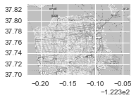
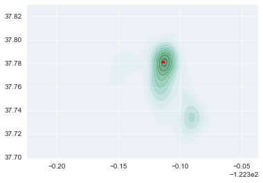
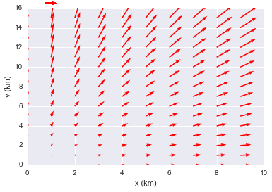
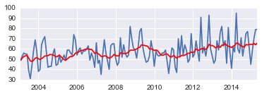
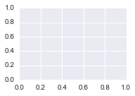
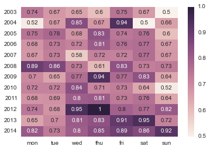

#A history of crime by Simon in San Francisco Crime Classification 
### https://www.kaggle.com/swbevan/sf-crime/a-history-of-crime-python
### 7월 캐글뽀개기 파이썬 시각화 예제 

    from datetime import datetime
    import numpy as np
    import matplotlib.pyplot as plt
    from time import time
    import seaborn as sns
    import pandas as pd
    import scipy
    import zipfile
    from matplotlib.backends.backend_pdf import PdfPages
    %matplotlib inline

    lon_lat_box = (-122.5247, -122.3366, 37.699, 37.8299)
    clipsize = [[-122.5247, -122.3366],[ 37.699, 37.8299]]

    train = pd.read_csv('train.csv')

    cats = list(set(train.Category))
    mapdata = np.loadtxt("sf_map_copyright_openstreetmap_contributors.txt")

    dates = []
    datesAll = np.array([datetime.strptime(date, '%Y-%m-%d %H:%M:%S') for date in train.Dates])

    datesAll

    array([datetime.datetime(2015, 5, 13, 23, 53),
           datetime.datetime(2015, 5, 13, 23, 53),
           datetime.datetime(2015, 5, 13, 23, 33), ...,
           datetime.datetime(2003, 1, 6, 0, 1),
           datetime.datetime(2003, 1, 6, 0, 1),
           datetime.datetime(2003, 1, 6, 0, 1)], dtype=object)

    startDate = (np.min(datesAll)).date()
    endDate = (np.max(datesAll)).date()
    alldates = pd.bdate_range(startDate, endDate, freq="m")
    dayDF = pd.DataFrame(np.NAN, index=alldates, columns=['x'])
    subCats = ['KIDNAPPING','PROSTITUTION','VEHICLE THEFT','LOITERING','SUICIDE','FORGERY/COUNTERFEITING','DRUNKENNESS','DRUG/NARCOTIC','LARCENY/THEFT']   

    alldates

    DatetimeIndex(['2003-01-31', '2003-02-28', '2003-03-31', '2003-04-30',
                   '2003-05-31', '2003-06-30', '2003-07-31', '2003-08-31',
                   '2003-09-30', '2003-10-31', 
                   ...
                   '2014-07-31', '2014-08-31', '2014-09-30', '2014-10-31',
                   '2014-11-30', '2014-12-31', '2015-01-31', '2015-02-28',
                   '2015-03-31', '2015-04-30'],
                  dtype='datetime64[ns]', length=148, freq='M', tz=None)

    pLoop = 1

    cats

    ['KIDNAPPING',
     'WEAPON LAWS',
     'SECONDARY CODES',
     'WARRANTS',
     'PROSTITUTION',
     'EMBEZZLEMENT',
     'LOITERING',
     'SUICIDE',
     'DRIVING UNDER THE INFLUENCE',
     'SEX OFFENSES FORCIBLE',
     'ROBBERY',
     'BURGLARY',
     'SUSPICIOUS OCC',
     'FAMILY OFFENSES',
     'BRIBERY',
     'FORGERY/COUNTERFEITING',
     'BAD CHECKS',
     'DRUNKENNESS',
     'GAMBLING',
     'OTHER OFFENSES',
     'RECOVERED VEHICLE',
     'FRAUD',
     'ARSON',
     'DRUG/NARCOTIC',
     'TRESPASS',
     'LARCENY/THEFT',
     'VANDALISM',
     'NON-CRIMINAL',
     'EXTORTION',
     'PORNOGRAPHY/OBSCENE MAT',
     'LIQUOR LAWS',
     'SEX OFFENSES NON FORCIBLE',
     'TREA',
     'VEHICLE THEFT',
     'STOLEN PROPERTY',
     'ASSAULT',
     'MISSING PERSON',
     'DISORDERLY CONDUCT',
     'RUNAWAY']

    for cat in cats:
            saveFile = cat+'.png'
            print(saveFile)
            #just subset for display purposes
            if cat in subCats:
                try:
                    fig = plt.figure(figsize = (11.69, 8.27))
                    plt.title(cat)
                    
                    #plot image
                    ax = plt.subplot(2,2,1)
                    ax.imshow(mapdata, cmap=plt.get_cmap('gray'), 
                          extent=lon_lat_box)
        
                    lineNum = 0
                    crime  = cat
                    Xcoord = (train[train.Category==cat].X).values
                    Ycoord = (train[train.Category==cat].Y).values
                    dates = datesAll[np.where(train.Category==cat)]
                    Z = np.ones([len(Xcoord),1])
                    
                        
                    #create dataframe
                    df = pd.DataFrame([ [ Z[row][0],Xcoord[row],Ycoord[row]  ] for row in range(len(Z))],
                           index=[dates[row] for row in range(len(dates))],
                           columns=['z','xcoord','ycoord']) 
                     
                    #resample to sum by month
                    df2 = df.resample('m', how='sum')
                    
                    #create uniform time series
                    allTimes = dayDF \
                    .join(df2) \
                    .drop('x', axis=1) \
                    .fillna(0)
                
                    movAv = pd.rolling_mean(allTimes['z'],window=12,min_periods=1)
                
                    #kde plot by year
                    kdeMaxX = []
                    kdeMaxY = []
                    for yLoop in range(2003,2015):
                        allData2 = df[(df.index.year == yLoop)]
                       
                        kde = scipy.stats.gaussian_kde(np.array(allData2['xcoord']))
                        density = kde(np.array(allData2['xcoord']))
                        kde2 = scipy.stats.gaussian_kde(np.array(allData2['ycoord']))
                        density2 = kde2(np.array(allData2['ycoord']))
                        kdeMaxX.append((allData2['xcoord'][density==np.max(density)]).values[0])
                        kdeMaxY.append((allData2['ycoord'][density2==np.max(density2)]).values[0])
                        
                    
                    #create a quiver plot to show movement of centre of KDE per year
                    kdeOut = sns.kdeplot(np.array(allData2['xcoord']), np.array(allData2['ycoord']),shade=True, cut=10, clip=clipsize,alpha=0.5)
                    kdeMaxX = np.array(kdeMaxX)
                    kdeMaxY = np.array(kdeMaxY)
                    plt.quiver(kdeMaxX[:-1], kdeMaxY[:-1], kdeMaxX[1:]-kdeMaxX[:-1], kdeMaxY[1:]-kdeMaxY[:-1], scale_units='xy', angles='xy', scale=1,color='r')
        
                    #time series plot with 12 month moving average
                    ax = plt.subplot(2,1,2)
                    plt.plot(allTimes.index,allTimes['z'])
                    plt.plot(allTimes.index,movAv,'r')
                    
                    #heatmap to look how data varies by day of week
                    ax = plt.subplot(2,2,2)
                    heatData = []
                    yLoopCount=0
                    yearName = []
                    weekName = ['mon','tue','wed','thu','fri','sat','sun']
                    yearName = ['2003','2004','2005','2006','2007','2008','2009','2010','2011','2012','2013','2014']
                    for yLoop in range(2003,2015):
                        heatData.append([])
                        for dLoop in range(7):
                            allData2 = df[(df.index.year == yLoop) & (df.index.weekday == dLoop)]
                            heatData[yLoopCount].append(sum(allData2['z'].values))
                        yLoopCount+=1
                    
                    #normlise
                    heatData = np.array(heatData)/np.max(np.array(heatData))
                    sns.heatmap(heatData, annot=True,xticklabels=weekName,yticklabels=yearName);
                    
                    plt.title(cat)
                    plt.savefig(saveFile)
                    #pdf_pages.savefig(fig)
                
                except:
                    print("error: " + cat)
                
            pLoop+=1

    KIDNAPPING.png
    WEAPON LAWS.png
    SECONDARY CODES.png
    WARRANTS.png
    PROSTITUTION.png
    EMBEZZLEMENT.png
    LOITERING.png
    SUICIDE.png
    DRIVING UNDER THE INFLUENCE.png
    SEX OFFENSES FORCIBLE.png
    ROBBERY.png
    BURGLARY.png
    SUSPICIOUS OCC.png
    FAMILY OFFENSES.png
    BRIBERY.png
    FORGERY/COUNTERFEITING.png
    error: FORGERY/COUNTERFEITING
    BAD CHECKS.png
    DRUNKENNESS.png
    GAMBLING.png
    OTHER OFFENSES.png
    RECOVERED VEHICLE.png
    FRAUD.png
    ARSON.png
    DRUG/NARCOTIC.png
    error: DRUG/NARCOTIC
    TRESPASS.png
    LARCENY/THEFT.png
    error: LARCENY/THEFT
    VANDALISM.png
    NON-CRIMINAL.png
    EXTORTION.png
    PORNOGRAPHY/OBSCENE MAT.png
    LIQUOR LAWS.png
    SEX OFFENSES NON FORCIBLE.png
    TREA.png
    VEHICLE THEFT.png
    STOLEN PROPERTY.png
    ASSAULT.png
    MISSING PERSON.png
    DISORDERLY CONDUCT.png
    RUNAWAY.png
    

    ax = plt.subplot(2,2,1)
    ax.imshow(mapdata, cmap=plt.get_cmap('gray'), extent=lon_lat_box)

    <matplotlib.image.AxesImage at 0x252b9390>

    lineNum = 0
    Xcoord = (train[train.Category==cats[1]].X).values
    Ycoord = (train[train.Category==cats[1]].Y).values
    dates = datesAll[np.where(train.Category==cats[1])]
    Z = np.ones([len(Xcoord),1])

    df = pd.DataFrame([ [ Z[row][0],Xcoord[row],Ycoord[row]  ] for row in range(len(Z))],
                           index=[dates[row] for row in range(len(dates))],
                           columns=['z','xcoord','ycoord']) 

    df

<table border="1" class="dataframe">
  <thead>
    <tr style="text-align: right;">
      <th></th>
      <th>z</th>
      <th>xcoord</th>
      <th>ycoord</th>
    </tr>
  </thead>
  <tbody>
    <tr>
      <th>2015-05-13 20:29:00</th>
      <td>1</td>
      <td>-122.473182</td>
      <td>37.721565</td>
    </tr>
    <tr>
      <th>2015-05-13 18:42:00</th>
      <td>1</td>
      <td>-122.421427</td>
      <td>37.794603</td>
    </tr>
    <tr>
      <th>2015-05-12 23:30:00</th>
      <td>1</td>
      <td>-122.397202</td>
      <td>37.753535</td>
    </tr>
    <tr>
      <th>2015-05-11 22:23:00</th>
      <td>1</td>
      <td>-122.405248</td>
      <td>37.711723</td>
    </tr>
    <tr>
      <th>2015-05-11 20:45:00</th>
      <td>1</td>
      <td>-122.419208</td>
      <td>37.760234</td>
    </tr>
    <tr>
      <th>2015-05-11 20:45:00</th>
      <td>1</td>
      <td>-122.419208</td>
      <td>37.760234</td>
    </tr>
    <tr>
      <th>2015-05-11 19:07:00</th>
      <td>1</td>
      <td>-122.386594</td>
      <td>37.727818</td>
    </tr>
    <tr>
      <th>2015-05-11 19:07:00</th>
      <td>1</td>
      <td>-122.386594</td>
      <td>37.727818</td>
    </tr>
    <tr>
      <th>2015-05-11 19:07:00</th>
      <td>1</td>
      <td>-122.386594</td>
      <td>37.727818</td>
    </tr>
    <tr>
      <th>2015-05-11 18:58:00</th>
      <td>1</td>
      <td>-122.440462</td>
      <td>37.718027</td>
    </tr>
    <tr>
      <th>2015-05-11 18:58:00</th>
      <td>1</td>
      <td>-122.440462</td>
      <td>37.718027</td>
    </tr>
    <tr>
      <th>2015-05-11 17:44:00</th>
      <td>1</td>
      <td>-122.405468</td>
      <td>37.781924</td>
    </tr>
    <tr>
      <th>2015-05-11 10:12:00</th>
      <td>1</td>
      <td>-122.406539</td>
      <td>37.756486</td>
    </tr>
    <tr>
      <th>2015-05-11 01:15:00</th>
      <td>1</td>
      <td>-122.411359</td>
      <td>37.776494</td>
    </tr>
    <tr>
      <th>2015-05-03 23:35:00</th>
      <td>1</td>
      <td>-122.379214</td>
      <td>37.732369</td>
    </tr>
    <tr>
      <th>2015-05-03 19:55:00</th>
      <td>1</td>
      <td>-122.413609</td>
      <td>37.784697</td>
    </tr>
    <tr>
      <th>2015-05-03 19:55:00</th>
      <td>1</td>
      <td>-122.413609</td>
      <td>37.784697</td>
    </tr>
    <tr>
      <th>2015-05-03 16:12:00</th>
      <td>1</td>
      <td>-122.398365</td>
      <td>37.737193</td>
    </tr>
    <tr>
      <th>2015-05-02 18:40:00</th>
      <td>1</td>
      <td>-122.417556</td>
      <td>37.792139</td>
    </tr>
    <tr>
      <th>2015-05-02 18:25:00</th>
      <td>1</td>
      <td>-122.386619</td>
      <td>37.732467</td>
    </tr>
    <tr>
      <th>2015-05-02 18:25:00</th>
      <td>1</td>
      <td>-122.386619</td>
      <td>37.732467</td>
    </tr>
    <tr>
      <th>2015-05-02 18:24:00</th>
      <td>1</td>
      <td>-122.385122</td>
      <td>37.727860</td>
    </tr>
    <tr>
      <th>2015-05-02 17:15:00</th>
      <td>1</td>
      <td>-122.435774</td>
      <td>37.762459</td>
    </tr>
    <tr>
      <th>2015-05-02 09:45:00</th>
      <td>1</td>
      <td>-122.472008</td>
      <td>37.716673</td>
    </tr>
    <tr>
      <th>2015-05-01 21:15:00</th>
      <td>1</td>
      <td>-122.416578</td>
      <td>37.780615</td>
    </tr>
    <tr>
      <th>2015-05-01 16:44:00</th>
      <td>1</td>
      <td>-122.476096</td>
      <td>37.751433</td>
    </tr>
    <tr>
      <th>2015-05-01 09:30:00</th>
      <td>1</td>
      <td>-122.490093</td>
      <td>37.780792</td>
    </tr>
    <tr>
      <th>2015-04-30 19:13:00</th>
      <td>1</td>
      <td>-122.416375</td>
      <td>37.764423</td>
    </tr>
    <tr>
      <th>2015-04-30 11:00:00</th>
      <td>1</td>
      <td>-122.415672</td>
      <td>37.722665</td>
    </tr>
    <tr>
      <th>2015-04-30 09:22:00</th>
      <td>1</td>
      <td>-122.421058</td>
      <td>37.766599</td>
    </tr>
    <tr>
      <th>...</th>
      <td>...</td>
      <td>...</td>
      <td>...</td>
    </tr>
    <tr>
      <th>2003-01-20 18:00:00</th>
      <td>1</td>
      <td>-122.450451</td>
      <td>37.711448</td>
    </tr>
    <tr>
      <th>2003-01-20 17:20:00</th>
      <td>1</td>
      <td>-122.478195</td>
      <td>37.768675</td>
    </tr>
    <tr>
      <th>2003-01-20 17:01:00</th>
      <td>1</td>
      <td>-122.409420</td>
      <td>37.781615</td>
    </tr>
    <tr>
      <th>2003-01-20 11:00:00</th>
      <td>1</td>
      <td>-122.490032</td>
      <td>37.740490</td>
    </tr>
    <tr>
      <th>2003-01-20 05:02:00</th>
      <td>1</td>
      <td>-122.408030</td>
      <td>37.779129</td>
    </tr>
    <tr>
      <th>2003-01-20 04:18:00</th>
      <td>1</td>
      <td>-122.466449</td>
      <td>37.740333</td>
    </tr>
    <tr>
      <th>2003-01-20 02:20:00</th>
      <td>1</td>
      <td>-122.491458</td>
      <td>37.737282</td>
    </tr>
    <tr>
      <th>2003-01-12 00:21:00</th>
      <td>1</td>
      <td>-122.417803</td>
      <td>37.756282</td>
    </tr>
    <tr>
      <th>2003-01-11 20:30:00</th>
      <td>1</td>
      <td>-122.464480</td>
      <td>37.715227</td>
    </tr>
    <tr>
      <th>2003-01-11 17:15:00</th>
      <td>1</td>
      <td>-122.412515</td>
      <td>37.780478</td>
    </tr>
    <tr>
      <th>2003-01-10 21:15:00</th>
      <td>1</td>
      <td>-122.385773</td>
      <td>37.735785</td>
    </tr>
    <tr>
      <th>2003-01-10 21:00:00</th>
      <td>1</td>
      <td>-122.390698</td>
      <td>37.734797</td>
    </tr>
    <tr>
      <th>2003-01-10 18:07:00</th>
      <td>1</td>
      <td>-122.392236</td>
      <td>37.733918</td>
    </tr>
    <tr>
      <th>2003-01-10 10:30:00</th>
      <td>1</td>
      <td>-122.437674</td>
      <td>37.783209</td>
    </tr>
    <tr>
      <th>2003-01-10 02:00:00</th>
      <td>1</td>
      <td>-122.399129</td>
      <td>37.714532</td>
    </tr>
    <tr>
      <th>2003-01-09 16:30:00</th>
      <td>1</td>
      <td>-122.437674</td>
      <td>37.783209</td>
    </tr>
    <tr>
      <th>2003-01-09 14:55:00</th>
      <td>1</td>
      <td>-122.428223</td>
      <td>37.781896</td>
    </tr>
    <tr>
      <th>2003-01-09 14:00:00</th>
      <td>1</td>
      <td>-122.425920</td>
      <td>37.759828</td>
    </tr>
    <tr>
      <th>2003-01-09 09:30:00</th>
      <td>1</td>
      <td>-122.431747</td>
      <td>37.749425</td>
    </tr>
    <tr>
      <th>2003-01-08 19:43:00</th>
      <td>1</td>
      <td>-122.415174</td>
      <td>37.752441</td>
    </tr>
    <tr>
      <th>2003-01-08 19:27:00</th>
      <td>1</td>
      <td>-122.399689</td>
      <td>37.797807</td>
    </tr>
    <tr>
      <th>2003-01-08 09:20:00</th>
      <td>1</td>
      <td>-122.422535</td>
      <td>37.734162</td>
    </tr>
    <tr>
      <th>2003-01-07 21:20:00</th>
      <td>1</td>
      <td>-122.412386</td>
      <td>37.782539</td>
    </tr>
    <tr>
      <th>2003-01-07 21:20:00</th>
      <td>1</td>
      <td>-122.412386</td>
      <td>37.782539</td>
    </tr>
    <tr>
      <th>2003-01-07 20:00:00</th>
      <td>1</td>
      <td>-122.457578</td>
      <td>37.714121</td>
    </tr>
    <tr>
      <th>2003-01-07 09:49:00</th>
      <td>1</td>
      <td>-122.417713</td>
      <td>37.768802</td>
    </tr>
    <tr>
      <th>2003-01-06 18:11:00</th>
      <td>1</td>
      <td>-122.382889</td>
      <td>37.730343</td>
    </tr>
    <tr>
      <th>2003-01-06 18:11:00</th>
      <td>1</td>
      <td>-122.382889</td>
      <td>37.730343</td>
    </tr>
    <tr>
      <th>2003-01-06 11:35:00</th>
      <td>1</td>
      <td>-122.414318</td>
      <td>37.779944</td>
    </tr>
    <tr>
      <th>2003-01-06 11:20:00</th>
      <td>1</td>
      <td>-122.414318</td>
      <td>37.779944</td>
    </tr>
  </tbody>
</table>

8555 rows × 3 columns

    df2 = df.resample('m', how='sum')

    df2

<table border="1" class="dataframe">
  <thead>
    <tr style="text-align: right;">
      <th></th>
      <th>z</th>
      <th>xcoord</th>
      <th>ycoord</th>
    </tr>
  </thead>
  <tbody>
    <tr>
      <th>2003-01-31</th>
      <td>49</td>
      <td>-5998.746013</td>
      <td>1850.127966</td>
    </tr>
    <tr>
      <th>2003-02-28</th>
      <td>53</td>
      <td>-6488.111587</td>
      <td>2001.301356</td>
    </tr>
    <tr>
      <th>2003-03-31</th>
      <td>56</td>
      <td>-6855.943643</td>
      <td>2114.169846</td>
    </tr>
    <tr>
      <th>2003-04-30</th>
      <td>55</td>
      <td>-6733.508267</td>
      <td>2076.737272</td>
    </tr>
    <tr>
      <th>2003-05-31</th>
      <td>55</td>
      <td>-6733.094850</td>
      <td>2076.691216</td>
    </tr>
    <tr>
      <th>2003-06-30</th>
      <td>39</td>
      <td>-4774.376713</td>
      <td>1472.261416</td>
    </tr>
    <tr>
      <th>2003-07-31</th>
      <td>31</td>
      <td>-3795.148967</td>
      <td>1170.414600</td>
    </tr>
    <tr>
      <th>2003-08-31</th>
      <td>44</td>
      <td>-5386.442811</td>
      <td>1661.414577</td>
    </tr>
    <tr>
      <th>2003-09-30</th>
      <td>58</td>
      <td>-7100.499257</td>
      <td>2189.902609</td>
    </tr>
    <tr>
      <th>2003-10-31</th>
      <td>69</td>
      <td>-8447.329393</td>
      <td>2605.539767</td>
    </tr>
    <tr>
      <th>2003-11-30</th>
      <td>58</td>
      <td>-7100.414625</td>
      <td>2190.090112</td>
    </tr>
    <tr>
      <th>2003-12-31</th>
      <td>38</td>
      <td>-4652.457668</td>
      <td>1434.901113</td>
    </tr>
    <tr>
      <th>2004-01-31</th>
      <td>40</td>
      <td>-4896.399260</td>
      <td>1510.213607</td>
    </tr>
    <tr>
      <th>2004-02-29</th>
      <td>64</td>
      <td>-7834.903267</td>
      <td>2416.924020</td>
    </tr>
    <tr>
      <th>2004-03-31</th>
      <td>69</td>
      <td>-8447.276872</td>
      <td>2604.954986</td>
    </tr>
    <tr>
      <th>2004-04-30</th>
      <td>72</td>
      <td>-8813.876141</td>
      <td>2718.523122</td>
    </tr>
    <tr>
      <th>2004-05-31</th>
      <td>57</td>
      <td>-6978.085273</td>
      <td>2152.384309</td>
    </tr>
    <tr>
      <th>2004-06-30</th>
      <td>42</td>
      <td>-5141.412660</td>
      <td>1585.109139</td>
    </tr>
    <tr>
      <th>2004-07-31</th>
      <td>43</td>
      <td>-5263.961990</td>
      <td>1623.474911</td>
    </tr>
    <tr>
      <th>2004-08-31</th>
      <td>43</td>
      <td>-5264.093978</td>
      <td>1623.543209</td>
    </tr>
    <tr>
      <th>2004-09-30</th>
      <td>55</td>
      <td>-6733.290921</td>
      <td>2076.709681</td>
    </tr>
    <tr>
      <th>2004-10-31</th>
      <td>60</td>
      <td>-7344.826338</td>
      <td>2265.243955</td>
    </tr>
    <tr>
      <th>2004-11-30</th>
      <td>44</td>
      <td>-5386.320371</td>
      <td>1661.704943</td>
    </tr>
    <tr>
      <th>2004-12-31</th>
      <td>45</td>
      <td>-5508.800091</td>
      <td>1699.183332</td>
    </tr>
    <tr>
      <th>2005-01-31</th>
      <td>54</td>
      <td>-6610.646273</td>
      <td>2038.979296</td>
    </tr>
    <tr>
      <th>2005-02-28</th>
      <td>47</td>
      <td>-5753.730516</td>
      <td>1775.067572</td>
    </tr>
    <tr>
      <th>2005-03-31</th>
      <td>50</td>
      <td>-6121.148079</td>
      <td>1887.917231</td>
    </tr>
    <tr>
      <th>2005-04-30</th>
      <td>54</td>
      <td>-6610.626391</td>
      <td>2039.354483</td>
    </tr>
    <tr>
      <th>2005-05-31</th>
      <td>49</td>
      <td>-5998.273283</td>
      <td>1849.988912</td>
    </tr>
    <tr>
      <th>2005-06-30</th>
      <td>59</td>
      <td>-7222.868155</td>
      <td>2227.779838</td>
    </tr>
    <tr>
      <th>...</th>
      <td>...</td>
      <td>...</td>
      <td>...</td>
    </tr>
    <tr>
      <th>2012-12-31</th>
      <td>53</td>
      <td>-6488.079379</td>
      <td>2001.374516</td>
    </tr>
    <tr>
      <th>2013-01-31</th>
      <td>46</td>
      <td>-5631.380611</td>
      <td>1736.656977</td>
    </tr>
    <tr>
      <th>2013-02-28</th>
      <td>49</td>
      <td>-5998.655905</td>
      <td>1850.177778</td>
    </tr>
    <tr>
      <th>2013-03-31</th>
      <td>68</td>
      <td>-8324.092019</td>
      <td>2567.233869</td>
    </tr>
    <tr>
      <th>2013-04-30</th>
      <td>59</td>
      <td>-7222.423467</td>
      <td>2227.630411</td>
    </tr>
    <tr>
      <th>2013-05-31</th>
      <td>76</td>
      <td>-9304.084691</td>
      <td>2869.943687</td>
    </tr>
    <tr>
      <th>2013-06-30</th>
      <td>82</td>
      <td>-10038.007807</td>
      <td>3096.475276</td>
    </tr>
    <tr>
      <th>2013-07-31</th>
      <td>63</td>
      <td>-7712.114957</td>
      <td>2379.108426</td>
    </tr>
    <tr>
      <th>2013-08-31</th>
      <td>68</td>
      <td>-8324.679111</td>
      <td>2567.992892</td>
    </tr>
    <tr>
      <th>2013-09-30</th>
      <td>46</td>
      <td>-5631.073065</td>
      <td>1736.859606</td>
    </tr>
    <tr>
      <th>2013-10-31</th>
      <td>81</td>
      <td>-9915.598015</td>
      <td>3058.299539</td>
    </tr>
    <tr>
      <th>2013-11-30</th>
      <td>57</td>
      <td>-6977.558353</td>
      <td>2152.631003</td>
    </tr>
    <tr>
      <th>2013-12-31</th>
      <td>41</td>
      <td>-5019.021317</td>
      <td>1548.121787</td>
    </tr>
    <tr>
      <th>2014-01-31</th>
      <td>62</td>
      <td>-7589.781412</td>
      <td>2341.223121</td>
    </tr>
    <tr>
      <th>2014-02-28</th>
      <td>57</td>
      <td>-6977.726565</td>
      <td>2152.308931</td>
    </tr>
    <tr>
      <th>2014-03-31</th>
      <td>95</td>
      <td>-11629.632673</td>
      <td>3586.476560</td>
    </tr>
    <tr>
      <th>2014-04-30</th>
      <td>60</td>
      <td>-7345.347207</td>
      <td>2265.335070</td>
    </tr>
    <tr>
      <th>2014-05-31</th>
      <td>56</td>
      <td>-6855.055102</td>
      <td>2114.438897</td>
    </tr>
    <tr>
      <th>2014-06-30</th>
      <td>71</td>
      <td>-8691.392839</td>
      <td>2681.299323</td>
    </tr>
    <tr>
      <th>2014-07-31</th>
      <td>53</td>
      <td>-6487.845112</td>
      <td>2001.207629</td>
    </tr>
    <tr>
      <th>2014-08-31</th>
      <td>63</td>
      <td>-7712.546602</td>
      <td>2378.950254</td>
    </tr>
    <tr>
      <th>2014-09-30</th>
      <td>75</td>
      <td>-9181.168813</td>
      <td>2831.617647</td>
    </tr>
    <tr>
      <th>2014-10-31</th>
      <td>77</td>
      <td>-9426.182233</td>
      <td>2907.817258</td>
    </tr>
    <tr>
      <th>2014-11-30</th>
      <td>61</td>
      <td>-7467.252287</td>
      <td>2303.348549</td>
    </tr>
    <tr>
      <th>2014-12-31</th>
      <td>45</td>
      <td>-5508.934441</td>
      <td>1699.291155</td>
    </tr>
    <tr>
      <th>2015-01-31</th>
      <td>59</td>
      <td>-7222.487786</td>
      <td>2227.704791</td>
    </tr>
    <tr>
      <th>2015-02-28</th>
      <td>70</td>
      <td>-8568.994745</td>
      <td>2643.249044</td>
    </tr>
    <tr>
      <th>2015-03-31</th>
      <td>79</td>
      <td>-9670.740294</td>
      <td>2983.252125</td>
    </tr>
    <tr>
      <th>2015-04-30</th>
      <td>79</td>
      <td>-9670.803453</td>
      <td>2983.184301</td>
    </tr>
    <tr>
      <th>2015-05-31</th>
      <td>27</td>
      <td>-3305.270811</td>
      <td>1019.252169</td>
    </tr>
  </tbody>
</table>

149 rows × 3 columns

    allTimes = dayDF \
                    .join(df2) \
                    .drop('x', axis=1) \
                    .fillna(0)

    allTimes

<table border="1" class="dataframe">
  <thead>
    <tr style="text-align: right;">
      <th></th>
      <th>z</th>
      <th>xcoord</th>
      <th>ycoord</th>
    </tr>
  </thead>
  <tbody>
    <tr>
      <th>2003-01-31</th>
      <td>49</td>
      <td>-5998.746013</td>
      <td>1850.127966</td>
    </tr>
    <tr>
      <th>2003-02-28</th>
      <td>53</td>
      <td>-6488.111587</td>
      <td>2001.301356</td>
    </tr>
    <tr>
      <th>2003-03-31</th>
      <td>56</td>
      <td>-6855.943643</td>
      <td>2114.169846</td>
    </tr>
    <tr>
      <th>2003-04-30</th>
      <td>55</td>
      <td>-6733.508267</td>
      <td>2076.737272</td>
    </tr>
    <tr>
      <th>2003-05-31</th>
      <td>55</td>
      <td>-6733.094850</td>
      <td>2076.691216</td>
    </tr>
    <tr>
      <th>2003-06-30</th>
      <td>39</td>
      <td>-4774.376713</td>
      <td>1472.261416</td>
    </tr>
    <tr>
      <th>2003-07-31</th>
      <td>31</td>
      <td>-3795.148967</td>
      <td>1170.414600</td>
    </tr>
    <tr>
      <th>2003-08-31</th>
      <td>44</td>
      <td>-5386.442811</td>
      <td>1661.414577</td>
    </tr>
    <tr>
      <th>2003-09-30</th>
      <td>58</td>
      <td>-7100.499257</td>
      <td>2189.902609</td>
    </tr>
    <tr>
      <th>2003-10-31</th>
      <td>69</td>
      <td>-8447.329393</td>
      <td>2605.539767</td>
    </tr>
    <tr>
      <th>2003-11-30</th>
      <td>58</td>
      <td>-7100.414625</td>
      <td>2190.090112</td>
    </tr>
    <tr>
      <th>2003-12-31</th>
      <td>38</td>
      <td>-4652.457668</td>
      <td>1434.901113</td>
    </tr>
    <tr>
      <th>2004-01-31</th>
      <td>40</td>
      <td>-4896.399260</td>
      <td>1510.213607</td>
    </tr>
    <tr>
      <th>2004-02-29</th>
      <td>64</td>
      <td>-7834.903267</td>
      <td>2416.924020</td>
    </tr>
    <tr>
      <th>2004-03-31</th>
      <td>69</td>
      <td>-8447.276872</td>
      <td>2604.954986</td>
    </tr>
    <tr>
      <th>2004-04-30</th>
      <td>72</td>
      <td>-8813.876141</td>
      <td>2718.523122</td>
    </tr>
    <tr>
      <th>2004-05-31</th>
      <td>57</td>
      <td>-6978.085273</td>
      <td>2152.384309</td>
    </tr>
    <tr>
      <th>2004-06-30</th>
      <td>42</td>
      <td>-5141.412660</td>
      <td>1585.109139</td>
    </tr>
    <tr>
      <th>2004-07-31</th>
      <td>43</td>
      <td>-5263.961990</td>
      <td>1623.474911</td>
    </tr>
    <tr>
      <th>2004-08-31</th>
      <td>43</td>
      <td>-5264.093978</td>
      <td>1623.543209</td>
    </tr>
    <tr>
      <th>2004-09-30</th>
      <td>55</td>
      <td>-6733.290921</td>
      <td>2076.709681</td>
    </tr>
    <tr>
      <th>2004-10-31</th>
      <td>60</td>
      <td>-7344.826338</td>
      <td>2265.243955</td>
    </tr>
    <tr>
      <th>2004-11-30</th>
      <td>44</td>
      <td>-5386.320371</td>
      <td>1661.704943</td>
    </tr>
    <tr>
      <th>2004-12-31</th>
      <td>45</td>
      <td>-5508.800091</td>
      <td>1699.183332</td>
    </tr>
    <tr>
      <th>2005-01-31</th>
      <td>54</td>
      <td>-6610.646273</td>
      <td>2038.979296</td>
    </tr>
    <tr>
      <th>2005-02-28</th>
      <td>47</td>
      <td>-5753.730516</td>
      <td>1775.067572</td>
    </tr>
    <tr>
      <th>2005-03-31</th>
      <td>50</td>
      <td>-6121.148079</td>
      <td>1887.917231</td>
    </tr>
    <tr>
      <th>2005-04-30</th>
      <td>54</td>
      <td>-6610.626391</td>
      <td>2039.354483</td>
    </tr>
    <tr>
      <th>2005-05-31</th>
      <td>49</td>
      <td>-5998.273283</td>
      <td>1849.988912</td>
    </tr>
    <tr>
      <th>2005-06-30</th>
      <td>59</td>
      <td>-7222.868155</td>
      <td>2227.779838</td>
    </tr>
    <tr>
      <th>...</th>
      <td>...</td>
      <td>...</td>
      <td>...</td>
    </tr>
    <tr>
      <th>2012-11-30</th>
      <td>60</td>
      <td>-7345.436343</td>
      <td>2266.009024</td>
    </tr>
    <tr>
      <th>2012-12-31</th>
      <td>53</td>
      <td>-6488.079379</td>
      <td>2001.374516</td>
    </tr>
    <tr>
      <th>2013-01-31</th>
      <td>46</td>
      <td>-5631.380611</td>
      <td>1736.656977</td>
    </tr>
    <tr>
      <th>2013-02-28</th>
      <td>49</td>
      <td>-5998.655905</td>
      <td>1850.177778</td>
    </tr>
    <tr>
      <th>2013-03-31</th>
      <td>68</td>
      <td>-8324.092019</td>
      <td>2567.233869</td>
    </tr>
    <tr>
      <th>2013-04-30</th>
      <td>59</td>
      <td>-7222.423467</td>
      <td>2227.630411</td>
    </tr>
    <tr>
      <th>2013-05-31</th>
      <td>76</td>
      <td>-9304.084691</td>
      <td>2869.943687</td>
    </tr>
    <tr>
      <th>2013-06-30</th>
      <td>82</td>
      <td>-10038.007807</td>
      <td>3096.475276</td>
    </tr>
    <tr>
      <th>2013-07-31</th>
      <td>63</td>
      <td>-7712.114957</td>
      <td>2379.108426</td>
    </tr>
    <tr>
      <th>2013-08-31</th>
      <td>68</td>
      <td>-8324.679111</td>
      <td>2567.992892</td>
    </tr>
    <tr>
      <th>2013-09-30</th>
      <td>46</td>
      <td>-5631.073065</td>
      <td>1736.859606</td>
    </tr>
    <tr>
      <th>2013-10-31</th>
      <td>81</td>
      <td>-9915.598015</td>
      <td>3058.299539</td>
    </tr>
    <tr>
      <th>2013-11-30</th>
      <td>57</td>
      <td>-6977.558353</td>
      <td>2152.631003</td>
    </tr>
    <tr>
      <th>2013-12-31</th>
      <td>41</td>
      <td>-5019.021317</td>
      <td>1548.121787</td>
    </tr>
    <tr>
      <th>2014-01-31</th>
      <td>62</td>
      <td>-7589.781412</td>
      <td>2341.223121</td>
    </tr>
    <tr>
      <th>2014-02-28</th>
      <td>57</td>
      <td>-6977.726565</td>
      <td>2152.308931</td>
    </tr>
    <tr>
      <th>2014-03-31</th>
      <td>95</td>
      <td>-11629.632673</td>
      <td>3586.476560</td>
    </tr>
    <tr>
      <th>2014-04-30</th>
      <td>60</td>
      <td>-7345.347207</td>
      <td>2265.335070</td>
    </tr>
    <tr>
      <th>2014-05-31</th>
      <td>56</td>
      <td>-6855.055102</td>
      <td>2114.438897</td>
    </tr>
    <tr>
      <th>2014-06-30</th>
      <td>71</td>
      <td>-8691.392839</td>
      <td>2681.299323</td>
    </tr>
    <tr>
      <th>2014-07-31</th>
      <td>53</td>
      <td>-6487.845112</td>
      <td>2001.207629</td>
    </tr>
    <tr>
      <th>2014-08-31</th>
      <td>63</td>
      <td>-7712.546602</td>
      <td>2378.950254</td>
    </tr>
    <tr>
      <th>2014-09-30</th>
      <td>75</td>
      <td>-9181.168813</td>
      <td>2831.617647</td>
    </tr>
    <tr>
      <th>2014-10-31</th>
      <td>77</td>
      <td>-9426.182233</td>
      <td>2907.817258</td>
    </tr>
    <tr>
      <th>2014-11-30</th>
      <td>61</td>
      <td>-7467.252287</td>
      <td>2303.348549</td>
    </tr>
    <tr>
      <th>2014-12-31</th>
      <td>45</td>
      <td>-5508.934441</td>
      <td>1699.291155</td>
    </tr>
    <tr>
      <th>2015-01-31</th>
      <td>59</td>
      <td>-7222.487786</td>
      <td>2227.704791</td>
    </tr>
    <tr>
      <th>2015-02-28</th>
      <td>70</td>
      <td>-8568.994745</td>
      <td>2643.249044</td>
    </tr>
    <tr>
      <th>2015-03-31</th>
      <td>79</td>
      <td>-9670.740294</td>
      <td>2983.252125</td>
    </tr>
    <tr>
      <th>2015-04-30</th>
      <td>79</td>
      <td>-9670.803453</td>
      <td>2983.184301</td>
    </tr>
  </tbody>
</table>

148 rows × 3 columns

    movAv = pd.rolling_mean(allTimes['z'],window=12,min_periods=1)

    movAv

    2003-01-31    49.000000
    2003-02-28    51.000000
    2003-03-31    52.666667
    2003-04-30    53.250000
    2003-05-31    53.600000
    2003-06-30    51.166667
    2003-07-31    48.285714
    2003-08-31    47.750000
    2003-09-30    48.888889
    2003-10-31    50.900000
    2003-11-30    51.545455
    2003-12-31    50.416667
    2004-01-31    49.666667
    2004-02-29    50.583333
    2004-03-31    51.666667
    2004-04-30    53.083333
    2004-05-31    53.250000
    2004-06-30    53.500000
    2004-07-31    54.500000
    2004-08-31    54.416667
    2004-09-30    54.166667
    2004-10-31    53.416667
    2004-11-30    52.250000
    2004-12-31    52.833333
    2005-01-31    54.000000
    2005-02-28    52.583333
    2005-03-31    51.000000
    2005-04-30    49.500000
    2005-05-31    48.833333
    2005-06-30    50.250000
                    ...    
    2012-11-30    63.250000
    2012-12-31    63.333333
    2013-01-31    62.583333
    2013-02-28    61.000000
    2013-03-31    61.833333
    2013-04-30    62.750000
    2013-05-31    61.500000
    2013-06-30    63.666667
    2013-07-31    63.750000
    2013-08-31    65.000000
    2013-09-30    63.583333
    2013-10-31    62.583333
    2013-11-30    62.333333
    2013-12-31    61.333333
    2014-01-31    62.666667
    2014-02-28    63.333333
    2014-03-31    65.583333
    2014-04-30    65.666667
    2014-05-31    64.000000
    2014-06-30    63.083333
    2014-07-31    62.250000
    2014-08-31    61.833333
    2014-09-30    64.250000
    2014-10-31    63.916667
    2014-11-30    64.250000
    2014-12-31    64.583333
    2015-01-31    64.333333
    2015-02-28    65.416667
    2015-03-31    64.083333
    2015-04-30    65.666667
    Freq: M, dtype: float64

    kdeMaxX = []
    kdeMaxY = []
    for yLoop in range(2003,2015):
        allData2 = df[(df.index.year == yLoop)]
        kde = scipy.stats.gaussian_kde(np.array(allData2['xcoord']))
        density = kde(np.array(allData2['xcoord']))
        kde2 = scipy.stats.gaussian_kde(np.array(allData2['ycoord']))
        density2 = kde2(np.array(allData2['ycoord']))
        kdeMaxX.append((allData2['xcoord'][density==np.max(density)]).values[0])
        kdeMaxY.append((allData2['ycoord'][density2==np.max(density2)]).values[0])

    kdeMaxY

    array([ 37.78090397,  37.78077843,  37.7808866 ,  37.78139873,
            37.78079208,  37.78152627,  37.78186219,  37.78053454,
            37.78097067,  37.78149872,  37.78084932,  37.78105784])

    kdeOut = sns.kdeplot(np.array(allData2['xcoord']), np.array(allData2['ycoord']),shade=True, cut=10, clip=clipsize,alpha=0.5)
    kdeMaxX = np.array(kdeMaxX)
    kdeMaxY = np.array(kdeMaxY)
    plt.quiver(kdeMaxX[:-1], kdeMaxY[:-1], kdeMaxX[1:]-kdeMaxX[:-1], kdeMaxY[1:]-kdeMaxY[:-1], scale_units='xy', angles='xy', scale=1,color='r')  

    <matplotlib.quiver.Quiver at 0x2554ceb8>

    kdeMaxX[:-1]

    array([-122.41407067, -122.41474384, -122.41367938, -122.41461526,
           -122.41363125, -122.41363125, -122.414089  , -122.41323759,
           -122.41289925, -122.41356409, -122.41431786])

    kdeMaxY[:-1]

    array([ 37.78090397,  37.78077843,  37.7808866 ,  37.78139873,
            37.78079208,  37.78152627,  37.78186219,  37.78053454,
            37.78097067,  37.78149872,  37.78084932])

    kdeMaxX[1:]-kdeMaxX[:-1]

    array([-0.00067317,  0.00106446, -0.00093589,  0.00098401,  0.        ,
           -0.00045775,  0.00085141,  0.00033834, -0.00066484, -0.00075377,
            0.00017288])

    kdeMaxY[1:]-kdeMaxY[:-1]

    array([-0.00012554,  0.00010818,  0.00051213, -0.00060665,  0.00073419,
            0.00033592, -0.00132765,  0.00043613,  0.00052805, -0.0006494 ,
            0.00020851])

    x = np.linspace(0,10,11)
    y = np.linspace(0,15,16)
    (X,Y) = np.meshgrid(x,y)
    u = 5*X
    v = 5*Y
    q = plt.quiver(X,Y,u,v,angles='xy',scale=1000,color='r')
    p = plt.quiverkey(q,1,16.5,50,"50 m/s",coordinates='data',color='r')
    xl = plt.xlabel("x (km)")
    yl = plt.ylabel("y (km)")
    plt.show()

    ax = plt.subplot(2,1,2)
    plt.plot(allTimes.index,allTimes['z'])
    plt.plot(allTimes.index,movAv,'r')

    [<matplotlib.lines.Line2D at 0x25ef3dd8>]

    ax = plt.subplot(2,2,2)
    heatData = []
    yLoopCount=0
    yearName = []
    weekName = ['mon','tue','wed','thu','fri','sat','sun']
    yearName = ['2003','2004','2005','2006','2007','2008','2009','2010','2011','2012','2013','2014']
    for yLoop in range(2003,2015):
        heatData.append([])
        for dLoop in range(7):
            allData2 = df[(df.index.year == yLoop) & (df.index.weekday == dLoop)]
            heatData[yLoopCount].append(sum(allData2['z'].values))
        yLoopCount+=1

    heatData

    [[98.0, 89.0, 86.0, 79.0, 99.0, 88.0, 66.0],
     [68.0, 88.0, 112.0, 89.0, 124.0, 66.0, 87.0],
     [99.0, 103.0, 90.0, 110.0, 98.0, 100.0, 79.0],
     [90.0, 97.0, 95.0, 107.0, 100.0, 101.0, 88.0],
     [89.0, 96.0, 76.0, 95.0, 95.0, 101.0, 89.0],
     [118.0, 114.0, 97.0, 80.0, 110.0, 96.0, 97.0],
     [93.0, 86.0, 101.0, 124.0, 102.0, 110.0, 85.0],
     [95.0, 95.0, 111.0, 94.0, 96.0, 85.0, 68.0],
     [90.0, 91.0, 106.0, 107.0, 97.0, 100.0, 85.0],
     [98.0, 90.0, 125.0, 132.0, 105.0, 102.0, 108.0],
     [86.0, 93.0, 107.0, 110.0, 120.0, 125.0, 95.0],
     [108.0, 97.0, 106.0, 112.0, 117.0, 113.0, 122.0]]

    heatData = np.array(heatData)/np.max(np.array(heatData))

    heatData

    array([[ 0.74242424,  0.67424242,  0.65151515,  0.59848485,  0.75      ,
             0.66666667,  0.5       ],
           [ 0.51515152,  0.66666667,  0.84848485,  0.67424242,  0.93939394,
             0.5       ,  0.65909091],
           [ 0.75      ,  0.78030303,  0.68181818,  0.83333333,  0.74242424,
             0.75757576,  0.59848485],
           [ 0.68181818,  0.73484848,  0.71969697,  0.81060606,  0.75757576,
             0.76515152,  0.66666667],
           [ 0.67424242,  0.72727273,  0.57575758,  0.71969697,  0.71969697,
             0.76515152,  0.67424242],
           [ 0.89393939,  0.86363636,  0.73484848,  0.60606061,  0.83333333,
             0.72727273,  0.73484848],
           [ 0.70454545,  0.65151515,  0.76515152,  0.93939394,  0.77272727,
             0.83333333,  0.64393939],
           [ 0.71969697,  0.71969697,  0.84090909,  0.71212121,  0.72727273,
             0.64393939,  0.51515152],
           [ 0.68181818,  0.68939394,  0.8030303 ,  0.81060606,  0.73484848,
             0.75757576,  0.64393939],
           [ 0.74242424,  0.68181818,  0.9469697 ,  1.        ,  0.79545455,
             0.77272727,  0.81818182],
           [ 0.65151515,  0.70454545,  0.81060606,  0.83333333,  0.90909091,
             0.9469697 ,  0.71969697],
           [ 0.81818182,  0.73484848,  0.8030303 ,  0.84848485,  0.88636364,
             0.85606061,  0.92424242]])

    heatData = np.array(heatData)/np.max(np.array(heatData))
    sns.heatmap(heatData, annot=True,xticklabels=weekName,yticklabels=yearName);

